# Fieldset: General Information {#_e83cc012-9c78-405c-b895-ce2d14da3059 .concept}

A fieldset is a control that is a container of fields—that is, it displays one field or multiple fields.

A fieldset is defined by the [qp-fieldset](https://help.acumatica.com/(W(1))/Help?ScreenId=ShowWiki&pageid=276007df-a4d4-abce-a6aa-5c423f085a4f) tag and contains any number of field tags or, in rare cases, [qp-field](https://help.acumatica.com/(W(1))/Help?ScreenId=ShowWiki&pageid=019e98e4-5965-0417-f2e3-1ccbc23b8018) tags. The control does not have an analog in the Classic UI.

## Learning Objectives { .section}

In this chapter, you will learn the following about fieldsets:

-   The design guidelines for a fieldset, including the naming conventions and layout recommendations
-   Examples of fieldsets for particular layouts

## Applicable Scenarios { .section}

You configure a fieldset when you want to display any number of fields.

## Overview of a Fieldset and Its Contents { .section}

A fieldset can represent any group of fields in the UI, such as a column of fields in the Summary area, a framed section with a title, or fields inside a dialog box.

A fieldset is also used to organize layout—that is, it can be used as a slot of a qp-template tag. For details, see [Form Layout: Predefined Templates](UIDev_DesigningLayout_Templates.md).

A fieldset can include one field or multiple fields. You use the field tag to define a field inside qp-fieldset.

**Note:** Fields defined in the HTML code of the form by using field tags are displayed by default. You can remove fields from a fieldset or add fields to one by using the **Section Configuration** dialog box. You open this dialog box by clicking **UI Configuration** on the Settings menu and then clicking the Settings icon in the upper right corner of the fieldset.

When you use the field tag, the system will display the control that corresponds to the DAC field specified in the name attribute. If you need to add another control, you need to specify it manually inside the field tag.

The following example shows a definition of a fieldset with three fields inside it.

```
<qp-fieldset slot="A" id="fsFinancial" view.bind="CurrentDocument" caption="Financial Information">
  <field name="BranchID"></field>
  <field name="BranchBaseCuryID"></field>
  <field name="DisableAutomaticTaxCalculation"></field>
</qp-fieldset>
```

## Fieldset ID { .section}

An ID of a fieldset in HTML consists of two parts, the `fs` prefix and the semantic name. The ID depends on purpose of the fieldset:

-   For a fieldset that represents a column of fields \(such as in the Summary area\), the ID has the following structure: `fsColumnN-<SemanticName>` where `N` is the name of the slot in the template. The semantic name describes the purpose of the element and should be the same for all columns of the template. An example of the fieldsets for three columns is shown in the following code.

    ```
    <qp-template name="7-10-7" id="document_form" wg-container 
       qp-collapsible class="equal-height">
       <qp-fieldset slot="A" id="fsColumnA-Order" view.bind="Document">
       ...
       </qp-fieldset>
       <qp-fieldset slot="B" id="fsColumnB-Order" view.bind="Document">
       ...
       </qp-fieldset>
       <qp-fieldset slot="C" label-size="col-lg-6" id="fsColumnC-Order" 
          view.bind="Document" class="highlights-section">
       ...
       </qp-fieldset>
       </qp-template>
    ```

-   For all other fieldsets, the ID has the following structure: `fs<SematicName>`, such as `fsShipToAddress`. If a fieldset has a title specified in the caption attribute, the semantic name should repeat the title without spaces.

## UI Naming Conventions { .section}

A fieldset can have a title that is specified using the caption attribute. If a fieldset represents a column, it can have an optional title that a user can change in the **Section Configuration** dialog box. The following table shows the UI naming conventions for the title of a fieldset.

|Naming Convention|Example|
|-----------------|-------|
|Use noun phrases.

 Avoid using *Settings* in section names.

 Title-style capitalization is used for section names. \(In the Classic UI, section names are displayed in uppercase.\)

|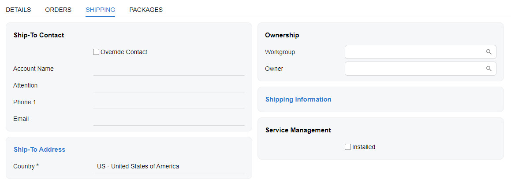|

## Recommendations for Organizing the Layout Inside a Fieldset {#section_vv2_1y4_y4b .section}

The following table shows recommendations for organizing the layout of the fieldset.

|Correct|Incorrect|
|-------|---------|
|Inside the fieldset, you can put check boxes, fields, and buttons right after a field. For details, see [Form Layout: An Element Next to Another Element](UIDev_DesigningLayout_AddControlNextToField.md).

 Do not put two or more sets of a label and a control in the same row.

|
|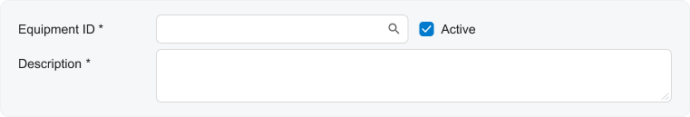

 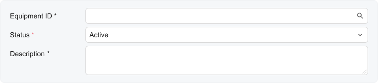

|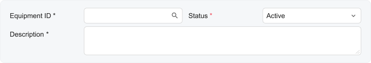|
|Allocate more space for long labels and fields by using the following approaches:

 -   Use a proper template that has a wider section for your controls
-   Specify the length of labels and fields by using the following CSS classes \(for details on these classes, see [Form Layout: CSS Classes](UIDev_DesigningLayout_CSSClasses.md)\):
    -   `class="label-size-<SIZE>"` for the length of labels
    -   `class="col-lg-XX"` or `class="col-md-XX"` for the length of fields

 Do not use narrow templates for wide labels and fields.

|
|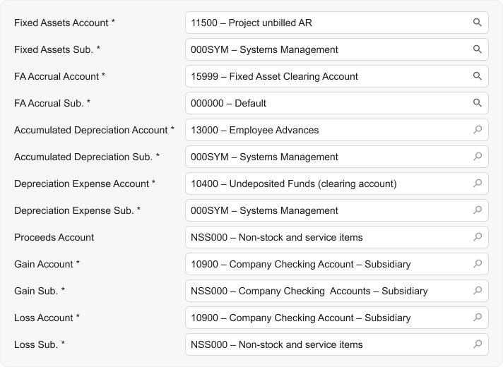||
|When you need to use a combo box, a check box, or a radio button as a label for a field, align them as labels.

 For the field to be used as a label, specify `slot="label"`.

 Do not use combo boxes, check boxes, or radio buttons along with other fields when they are used as labels.

|
|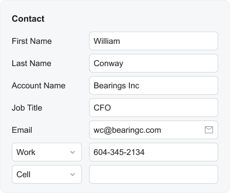|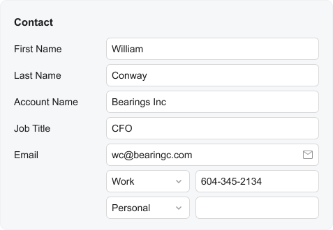|
|When a fieldset contains only check boxes and does not have a title, align check boxes without a left padding.

 To remove left padding, specify `class="no-label"` in `qp-fieldset`. See [Check Box](UIDevRef_CheckBox_Mapref.md).

 Do not leave the default left padding for check boxes or radio buttons when there are no other controls in the fieldset and there is no title.

|
|

 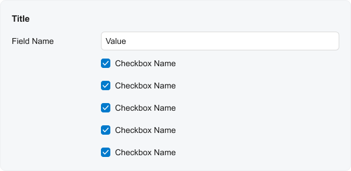

||
|In a single fieldset, make sure that the length of all labels is the same and the length of all fields is the same.

 In a single fieldset, do not specify different sizes of labels and different sizes of fields.

|
|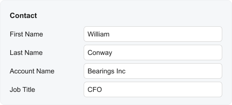|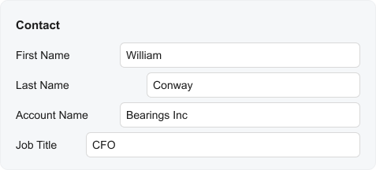|
|Configure two or three lines in a text box for the description, summary, subject, or other similar field.

 For details about how to create a multiline text box, see [Text Box: Multiline Text Box](UIDevRef_TextBox_MultilineTextBox.md).

 Do not use a single-line text box for the description, summary, subject, or similar field for data entry forms. Do not span the text box over multiple columns as was done in ASPX.

|
|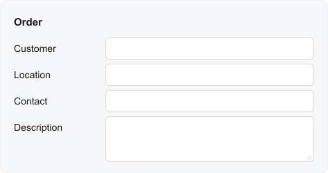

 You can also make the whole fieldset longer.

 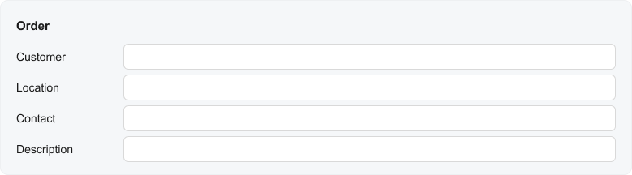

|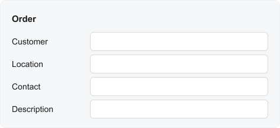|
|On processing forms, use a single `field` with the **Date Range** label and two date and time controls for the selection of the start date and the end date.

 Do not use two separate fields in a fieldset for **Start Date** and **End Date** boxes on processing forms.

|
||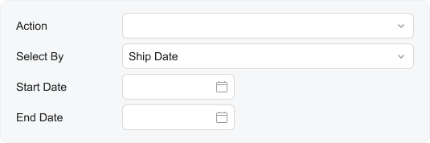|

## Recommendations for Organizing the Layout of Multiple Fieldsets { .section}

The following table shows recommendations for organizing a layout that includes multiple fieldsets.

|Correct|Incorrect|
|-------|---------|
|Try to occupy slot A and slot B equally in order to balance the form.

 Do not put far more fieldsets into slot A as compared to slot B and the other way round.

|
|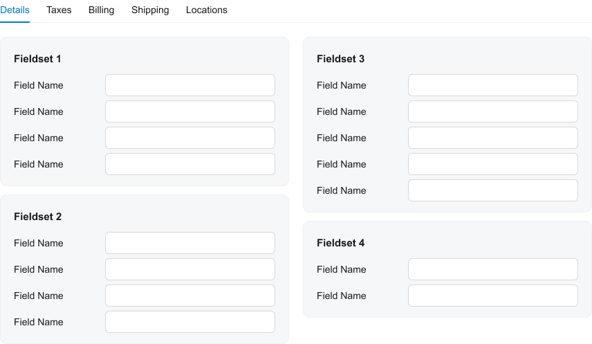|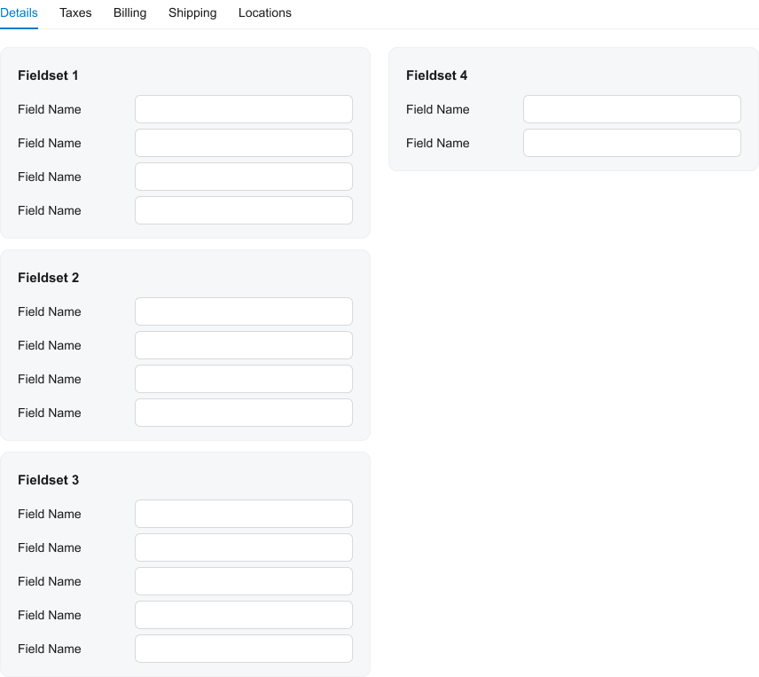|
|Use a caption instead of showing a single tab.

 Do not confuse the table caption and template caption.

 Do not show a single tab when you can replace it with a grid caption.

|
|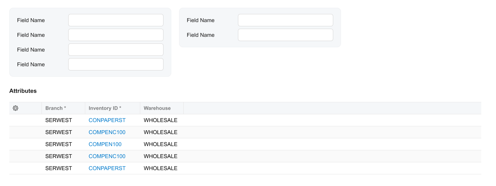

 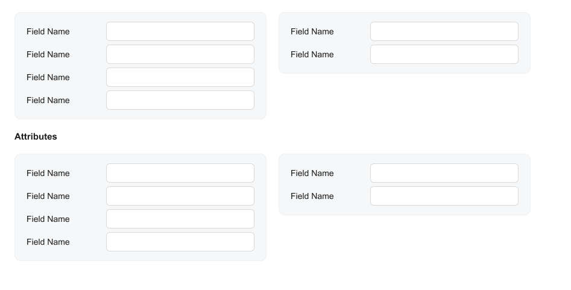

|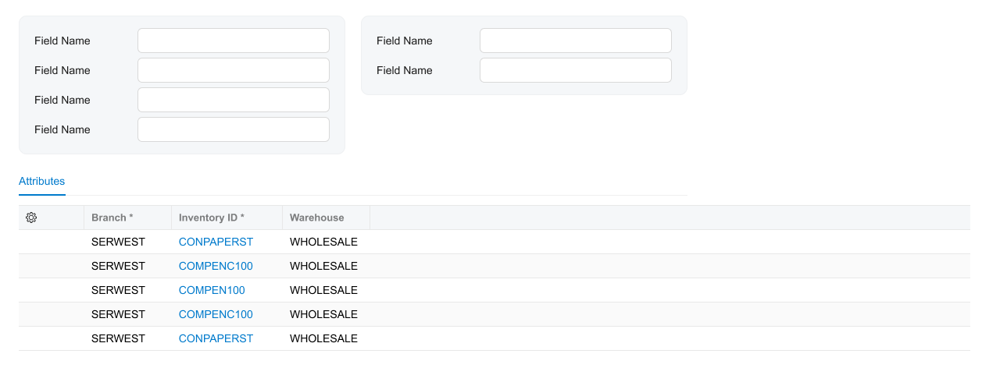

 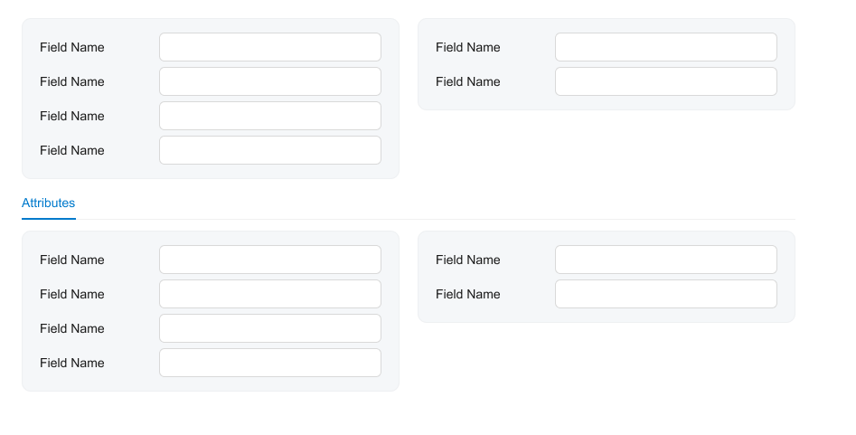

|
|Stretch sections that are above tabs vertically so that their heights become similar.

 Do not leave sections with different heights above tabs.

|
|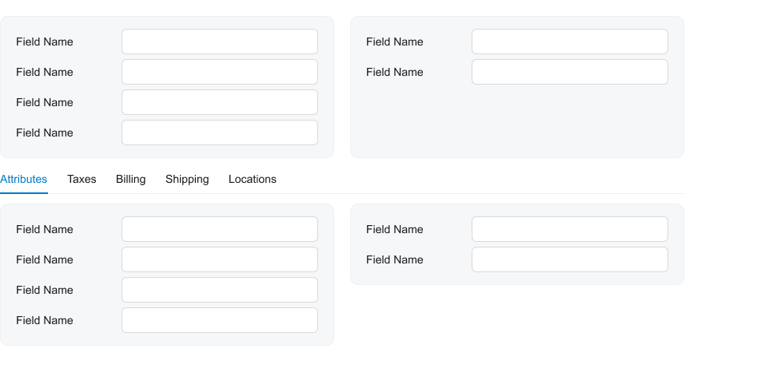|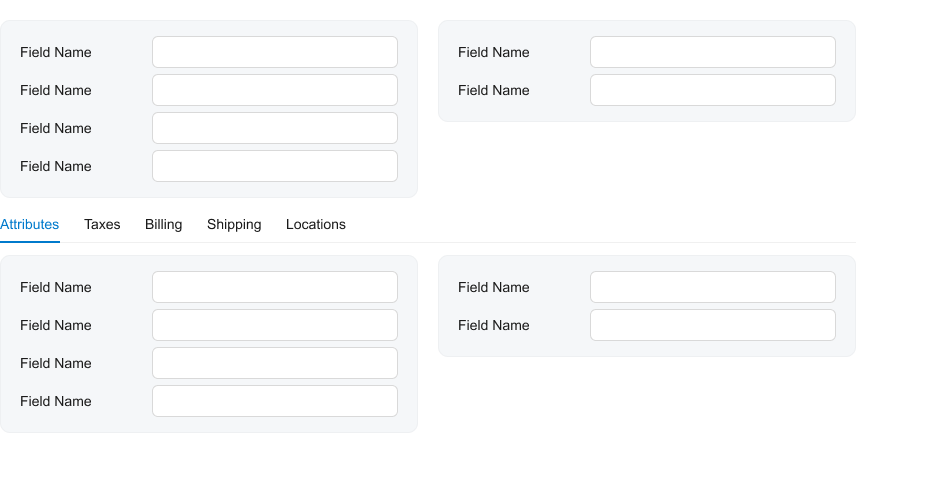|
|In the Summary area, put statistical data, such as totals, in a highlighted section \(`class="highlights-section"`\).

 Do not show the highlights in a gray section.

|
|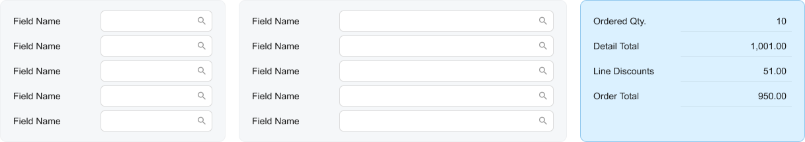|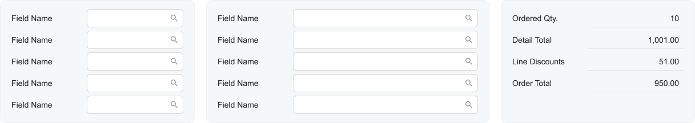|
|In gray sections, show selectors, combo boxes, and other fields that do not represent total values.

 Do not put fields—such as selectors, combo boxes, or other fields that do not represent total values—in the highlighted section.

|
|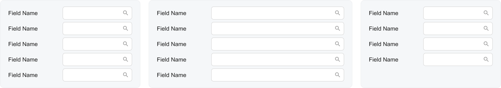|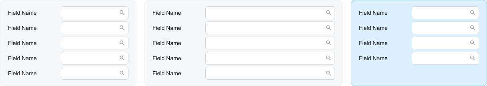|

**Parent topic:**[Fieldset](../DeveloperGuide/UIDevRef_Fieldset_Mapref.md)

