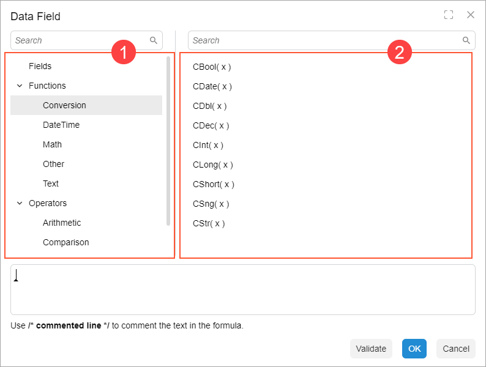

# Formula Editor: Implementation of Custom Option Providers {#_3c9e515e-7a3f-499a-8353-37bf208f15a9 .concept}

In the Formula Editor dialog box, you can add options that are dependent on the logic in the graph \(such as a list of available fields\). To do this, you need to define a *custom option provider* and apply it to the DAC field by using the `CacheAttached` event handler.

To define a custom option provider, you do the following:

1.  In the graph, define the option provider as a nested class of the graph.

    The class should inherit from `PXFormulaEditor.OptionsProviderAttribute`, as shown in the following example. Also, the class should be defined inside the graph. This way, you make sure that the option provider will not be used outside the graph. Later, the new class will be used as an attribute on the `CacheAttached` event handler.

    ```language-csharp
    public class GenericInquiryDesigner : PXGraph<GenericInquiryDesigner>
    {
      ...
      public class PXFormulaEditor_AddFieldsAttribute : 
        PXFormulaEditor.OptionsProviderAttribute
      {
      }
    }
    ```

2.  In the new class, override the ChangeOptionsSet\(PXGraph graph, ISet options\) method.
3.  In the ChangeOptionsSet method, populate the array of options. Each element of the array is an object of the FormulaObject type that has two fields: Category and Value. Value is the actual component of the formula \(operand or operator\), and Category is the path to the component in the tree. In the following screenshot, the Category values are shown in Item 1, and Value values are shown in Item 2.

    

    The Category field should have the following structure: &lt;Option\_name&gt;/&lt;Category\_name&gt;. For example, if you are defining the set of fields for the formula editor, the Category value is `"Fields/<Table_name>"`.

    **Tip:** The order of categories is determined by the system: All categories are sorted in alphabetic order. You cannot change the order of categories in the code.

    The following example from the `GenericInquiryDesigner` class shows how to add a set of parameters from multiple tables.

    ```language-csharp
    public class PXFormulaEditor_AddParametersAttribute : 
      PXFormulaEditor.OptionsProviderAttribute
    {
      public string CategoryName { get; set; }
      public override void ChangeOptionsSet(PXGraph graph, ISet<FormulaOption> options)
      {
        var designer = (GenericInquiryDesigner)graph; 
        var parameters = designer.GetAllParameters();
        var fields = designer.GetAllFields();
    
        foreach (var parameter in parameters.Concat(fields))
        {
          options.Add(new FormulaOption
          {
            Category = CategoryName,
            Value = parameter
          });
        }
      }
    }
    ```

4.  Connect the option provider by using the CacheAttached mechanism to the DAC field in the graph. To do that, in the graph, define the CacheAttached event handler for the field where you want to configure the formula editor. On the event handler, add the PXMergeAttributes attribute and the new attribute you defined in the nested class.

    ```language-csharp
    public class GenericInquiryDesigner : PXGraph<GenericInquiryDesigner>
    {
      public class PXFormulaEditor_AddParametersAttribute : 
        PXFormulaEditor.OptionsProviderAttribute {...}
    
      [PXMergeAttributes]
      [PXFormulaEditor_AddParameters(CategoryName = "Fields")]
      protected virtual void _(Events.CacheAttached<GIDesign.rowStyleFormula> e) { }
    }
    ```


**Parent topic:**[Formula Editor](../DeveloperGuide/UIDevRef_FormulaEditor_Mapref.md)

