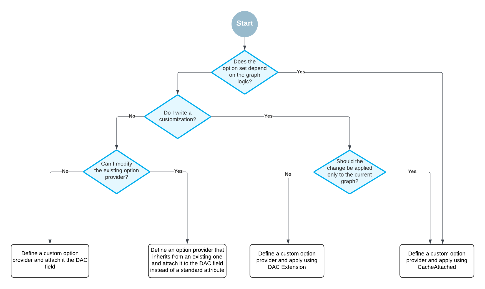

# Formula Editor: Customization of Option Providers {#_d359a2a1-e5d0-4999-833b-bb9304004fff .concept}

You can customize the option sets provided by the AddFunctions, AddOperators, and AddStyles attributes by doing one of the following:

-   Defining a custom option provider that inherits from PXFormulaEditor.OptionsProviderAttribute and defining the option set, as described in [Formula Editor: Implementation of Custom Option Providers](UIDevRef_FormulaEditor_CustomOptionProviders.md).
-   Defining a custom option provider that inherits from one of the existing attributes and modifying the existing option set. You do this by adding, updating, or deleting options from the set.

    **Tip:** Do not use both the custom option provider and its parent attribute \(AddFunctions, AddOperator, or AddStyles\) together. This could cause the changes to be applied unpredictably in the child attribute.

    You can use any combination of standard attributes and descendants of PXFormulaEditor.OptionsProviderAttribute together.

    For example, you can use this approach to remove multiple values from the AddStyles attribute, as shown in the following code.

    ```
    public class RemoveRedStylesAttribute : OptionsProviderAttribute
    {
        public override void ChangeOptionsSet(PXGraph graph, ISet<FormulaOption> options)
        {
            options.Remove(DefaultFormulaOptions.Styles.Red);
            options.Remove(DefaultFormulaOptions.Styles.Red60);
            options.Remove(DefaultFormulaOptions.Styles.Red40);
            options.Remove(DefaultFormulaOptions.Styles.Red20);
            options.Remove(DefaultFormulaOptions.Styles.Red00);
        }
    }
    ```


You can attach a custom option provider in the following places:

-   On the DAC field in the DAC definition.

    We recommend this approach when you write original code and the option set does not depend on the graph logic.

-   On the CacheAttached event handler in the graph code.

    We recommend this approach when you customize existing code and the option set depends on the graph logic.

-   On the DAC extension.

    We recommend this approachwhen the change should be applied to the DAC regardless of where it is used.


The following diagram shows how you should select the approach to define a custom option provider.



**Parent topic:**[Formula Editor](../DeveloperGuide/UIDevRef_FormulaEditor_Mapref.md)

