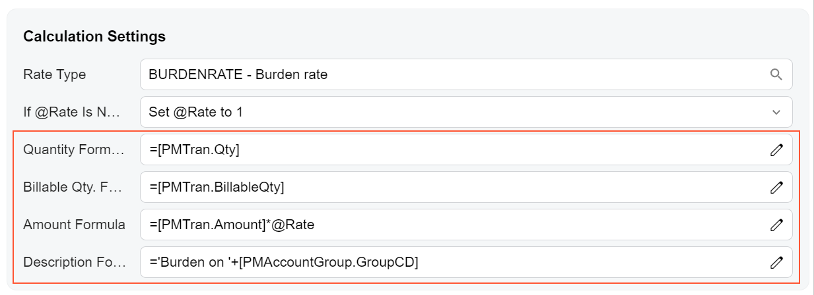
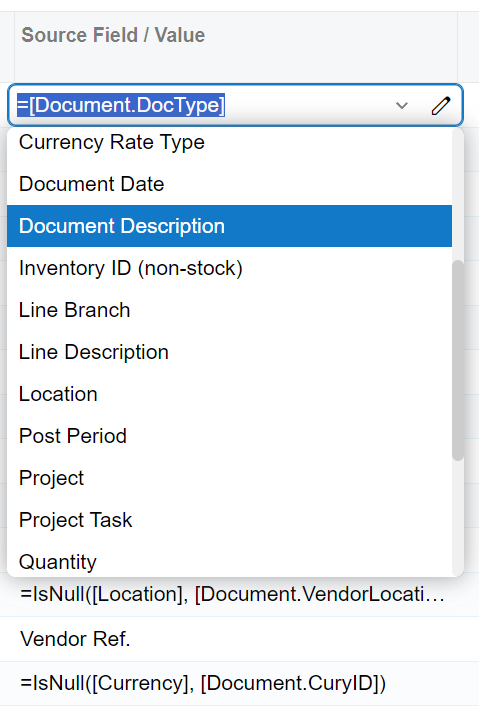
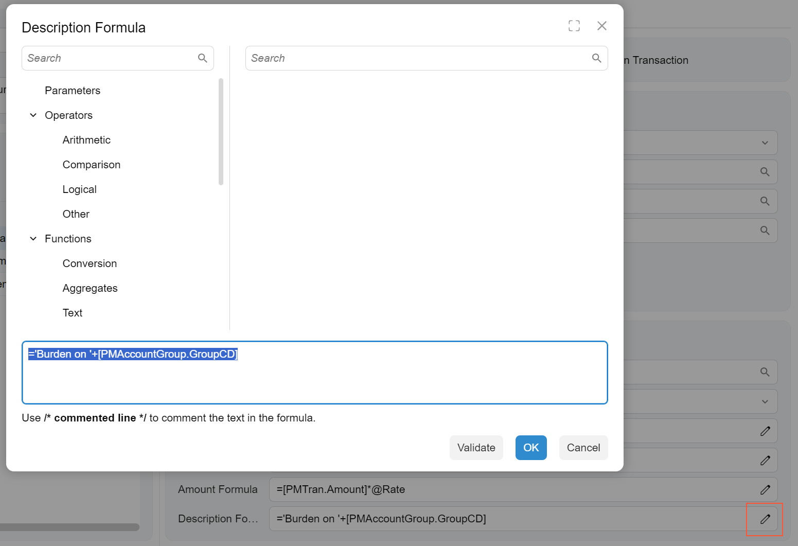

# Formula Editor: General Information {#_f9b43e45-2b10-4bc1-8061-0667c4fabfa2 .concept}

The formula editor is a control that gives a user the ability to select or compose a formula. The formula editor control is composed of a*formula box* and *Formula Editor dialog box*.

The formula editor control is implemented with the [qp-formula-editor](https://help.acumatica.com/(W(1))/Help?ScreenId=ShowWiki&pageid=65e8ca2c-720b-34a2-0787-8c6bbf50b119) control in the Modern UIand replaces the following controls from the Classic UI:

-   CTFormulaInvoiceEditor
-   CTFormulaTransactionEditor
-   RMFormulaEditor
-   PMFormulaEditor
-   PXFormulaEditor
-   PXFormulaCombo

## Learning Objectives { .section}

In this chapter, you will learn the following about the formula editor:

-   The design guidelines for the formula editor, including the naming conventions and layout recommendations
-   The proper configuration of the formula editor for specific cases, such as custom options in the Formula Editor dialog box

## Applicable Scenarios { .section}

You configure the formula editor in the following cases:

-   You need to give users the ability to select an existing formula from a combo box
-   You need to give users the ability to compose custom formulas

## Formula Box { .section}

A*formula box* is a box of the formula editor where the formula is displayed. The formula box can be added as a column or as a box in a fieldset.

The formula box can behave like a text box or a combo box depending on the attributes on the corresponding DAC field. The following screenshot shows an example of formula boxes.

In the following screenshot, you can see an example of a formula box in a column.

You can also configure the formula editor control to be displayed as a combo box, as shown in the following screenshot. For details, see [Formula Editor: Configuration of a Combo Box Field for the Formula Editor](UIDevRef_FormulaEditor_ComboBox_Concept.md).

## Formula Editor Dialog Box { .section}

A *Formula Editor dialog box* is a dialog box where a user can compose a formula. The dialog box \(see the following screenshot\) opens when a user clicks the Edit button in a formula box.

The formula editor can be implemented with the following tags:

-   qp-formula-dialog for a text box and a formula editor dialog box
-   qp-formula-combo for a drop-down control and a formula editor dialog box

However, you do not need to add these tags to the HTML template; the dialog box is displayed by default.

## Configuration of a Formula Editor { .section}

You can configure the formula box and Formula Editor dialog box in the following locations:

-   In the DAC field attributes—specifically, by using the [PXFormulaEditor](https://help.acumatica.com/(W(1))/Help?ScreenId=ShowWiki&pageid=ed3fd9ca-44e4-9cc5-eb27-b681139451bc) attribute.

    **Attention:** We recommend that you configure the control by using DAC field attributes. For details, see [Formula Editor: Implementation of a Standard Formula Editor](UIDevRef_FormulaEditor_Standard_Concept.md).

-   In TypeScript, in the [columnConfig](https://help.acumatica.com/(W(1))/Help?ScreenId=ShowWiki&pageid=174c3931-2148-bc0c-ee45-705f27e1aec6) or [fieldConfig](https://help.acumatica.com/(W(1))/Help?ScreenId=ShowWiki&pageid=a1284c74-b44a-cdf3-6d8f-3ebd9938f5fa) decorator.
-   In HTML template, in the config attributes.

If you have used the PXFormulaEditor attribute, you do not need to specify the control type anywhere. It will be determined automatically as "qp-formula-editor". In case the control has a formula editor functionality configured using the attributes and a list of combo box values \(for example, configured by using the PXStringList attribute\), the type of the control is determined automatically as "qp-formula-combo".

If you do not use the PXFormulaEditor attribute on a DAC field, to add the formula editor, you need to specify the type of the control in the view definition in TypeScript as follows:

-   If the control is a fieldset, in the fieldConfig decorator, specify `control-type="qp-formula-editor"`.
-   If the control is in a table, in the columnConfig decorator, specify `editor-type="qp-formula-editor"`.

**Parent topic:**[Formula Editor](../DeveloperGuide/UIDevRef_FormulaEditor_Mapref.md)

