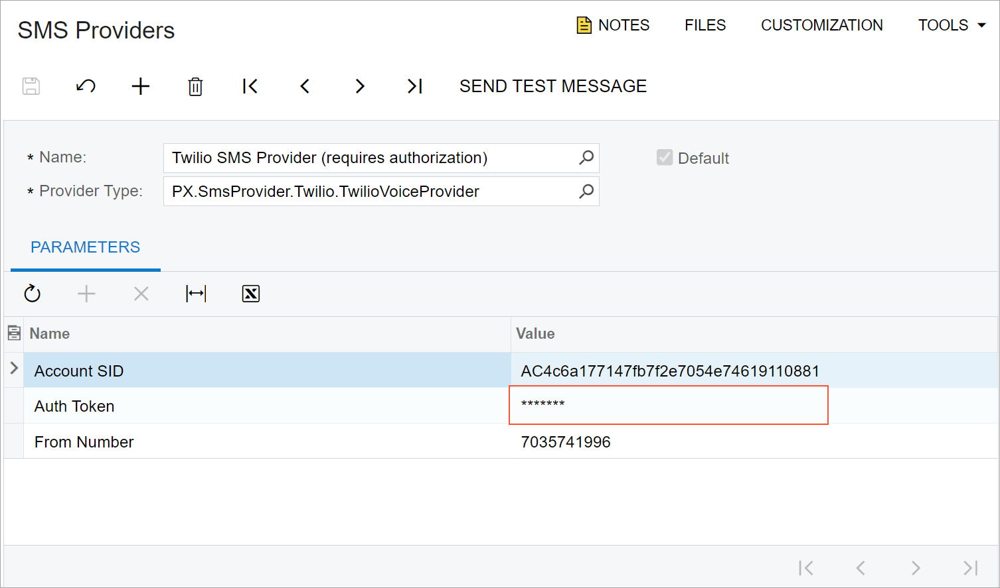

# Table \(Grid\): Configuration of the Table and Its Columns {#_ddfc4bfc-6ea5-45a2-b9fc-b45fe4c37052 .concept}

In this topic, you can learn how to configure a table and its columns.

## Table Configuration { .section}

To specify the configuration parameters of a grid, you use the gridConfig decorator in TypeScript. You put the decorator on the definition of the view class for the table, as shown in the following example.

```
@gridConfig({
  preset: GridPreset.Inquiry,
  initNewRow: true, 
  quickFilterFields: ['AccountClassID', 'Type', 'PostOption', 'CuryID']
})
export class AccountRecords extends PXView {
}
```

For each table, you must specify a preset in the preset property of the gridConfig decorator. A preset is a predefined set of properties of the gridConfig decorator that define how the table is displayed. For more information about presets, see [Form Layout: Grid Presets](UIDev_DesigningLayout_GridPresets.md).

## Table Columns { .section}

To specify the configuration parameters of a table column, you use the columnConfig decorator, as shown in the following example.

```
export class SOLine extends PXView {
    @columnConfig({ allowShowHide: GridColumnShowHideMode.Server })
    ExcludedFromExport: PXFieldState;
    IsConfigurable: PXFieldState;
    @columnConfig({ hideViewLink: true })
    BranchID: PXFieldState<PXFieldOptions.CommitChanges>;
}
```

## Configuring Password Value in Matrix Mode { .section}

Suppose that you are configuring a table in the matrix mode, and in one of the columns, a value may contain a password. In case a cell contains a password, the value should be hidden with asterisk \( \* \) symbols.



This behavior is configured only in backend: When assigning the value that contains a password \(`PXStringState`\), for example, in the `FieldSelecting` event handler, call the `IsPassword(true)` method for the value.

In frontend, the table and its view are configured as usual without any specific changes such as `config.type == "2"` \(which indicates a password value\) for the qp-text-editor control.

## Configuring a Column Footer to Show Totals { .section}

To show the totals of all the lines for particular columns in each column's footer area in the UI, you use the footerText property of a table column. The following code illustrates the property's use.

```
protected async onSummaryGridDataReadyHandler(grid: QpGridCustomElement,
   args: QpGridEventArgs) {
  if (!grid.view) return;

  const defaultTotal = "00:00";
  const fieldName = 0;
  const fieldValue = 1;
  const totals = [
     ["Sun", this.Document.SunTotal?.value],
     ["Mon", this.Document.MonTotal?.value],
     ["Tue", this.Document.TueTotal?.value],
     ["Wed", this.Document.WedTotal?.value],
     ["Thu", this.Document.ThuTotal?.value],
     ["Fri", this.Document.FriTotal?.value],
     ["Sat", this.Document.SatTotal?.value],
     ["TimeSpent", this.Document.WeekTotal?.value]
  ];
  totals.forEach((total) => {
     const column = grid.getColumn(total[fieldName]);
     if (column) column.**footerText** = this.formatTime(total[fieldValue] ?? defaultTotal);
  });
}
```

In the code above, the footerText property is set to the total value for each column of the grid that is specified in the `totals` collection.

**Parent topic:**[Table \(Grid\)](../DeveloperGuide/UIDevRef_Grid_Mapref.md)

