# Table \(Grid\): General Information {#_c215177a-0ecf-47b9-98fd-219b0a75fae4 .concept}

In a table \(or *grid*\), each row represents an object or detail,\) and each column shows a text title describing a property of the object or detail in the row. A table can be located on a tab or in a dialog box and have its own toolbar. Alternatively. a table can occupy the whole form, as shown in the screenshot below. In this case, the table toolbar is merged with the form toolbar.

A table is defined by PXGrid in the Classic UI and by [`qp-grid`](https://help.acumatica.com/(W(1))/Help?ScreenId=ShowWiki&pageid=0a8e518a-ce57-f6a1-c8ea-63762f139fd7) in the Modern UI.

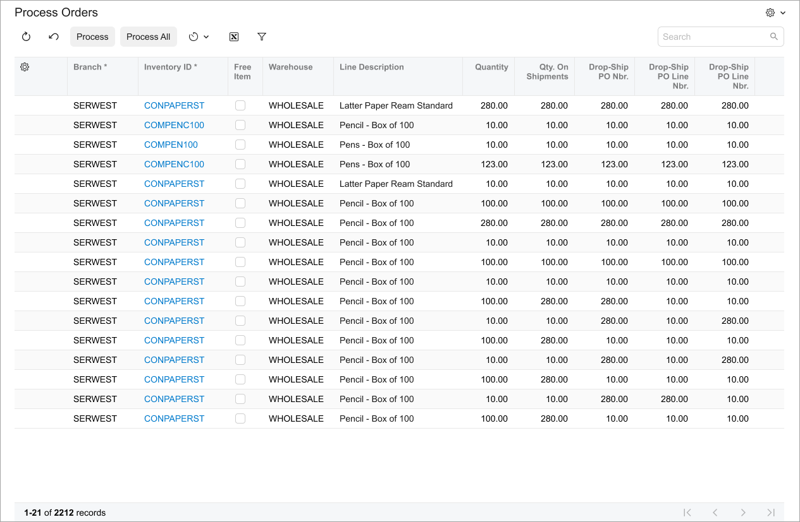

## Learning Objectives { .section}

In this chapter, you will learn the following information about a table:

-   The design guidelines for a table, including the naming conventions and layout recommendations
-   The proper configuration of a table for specific cases, such as a table with a title or a table with highlighted content
-   A detailed description of each property of API elements that are related to a table

## Applicable Scenarios { .section}

You configure a table in the following cases:

-   You need to display multiple database records on an Acumatica ERP form, such as information about inventory items included in a sales order.
-   You need users to sort and filter data easily. Users can click column headers to sort data based on that column or use filter options to narrow down the displayed information.
-   For scenarios where users need to input or edit data in a structured format, such as on the [Chart of Accounts](../UserGuide/GL_20_25_00.md) \(GL202500\) form, tables provide a familiar and efficient way to do so.

## Table ID { .section}

An ID of a table in HTML consists of two parts, the `grid` prefix and the semantic name. The semantic name describes the purpose of the element. For example, a table that shows transactions can have the `gridTransactions` ID, as the following code shows.

```language-xml
<qp-grid id="gridTransactions"></qp-grid>
```

## UI Naming Conventions { .section}

The following table shows the UI naming conventions for tables.

|Naming Convention|Example|
|-----------------|-------|
|For column names, use a noun or noun phrase \(except for the case when the column header contains a check box\). Preferably, the phrase should include no more than two words.|The **Location Name** column on the **Locations** tab of the [Customers](../UserGuide/AR_30_30_00.md) \(AR303000\) form, which is shown in the following screenshot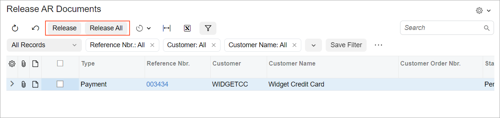

|
|For names of buttons of table toolbars, use verbs or verb phrases that describe the process initiated when the user clicks the button.|The **Release** and **Release All** buttons on the [Release AR Documents](../UserGuide/AR_50_10_00.md) \(AR501000\) form, which is shown in the following screenshot

|

## Recommendations for Organizing Layout {#section_vv2_1y4_y4b .section}

The following table shows the recommendations for organizing the layout for tables.

|Correct|Incorrect|
|-------|---------|
|Show a table without any backgrounds when the table occupies the entire width of the form or popup \(including the situation when you have two tables on the form\).|
|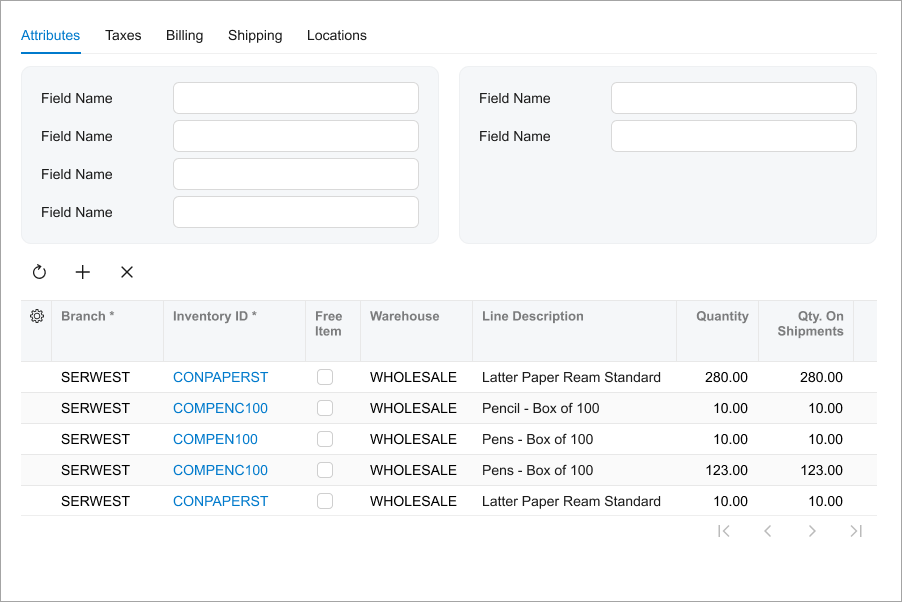

 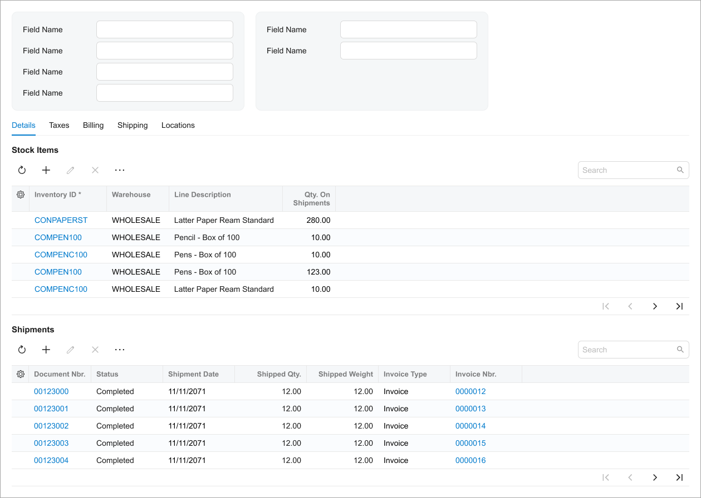

|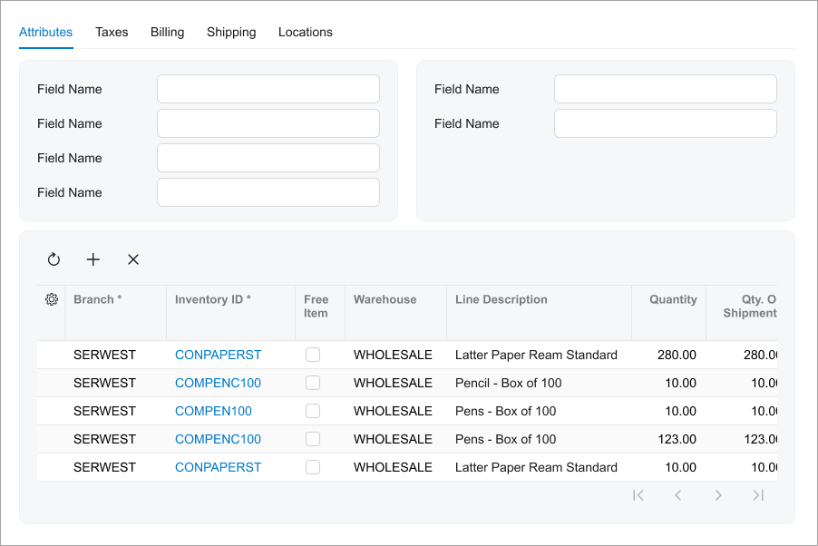

 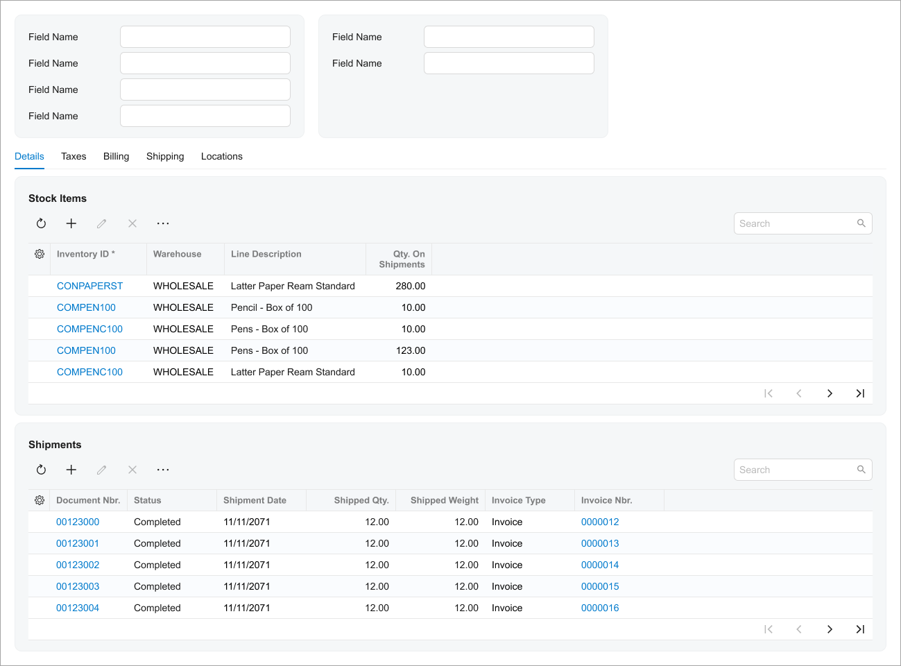

|
|Put a table in a gray section when the table is surrounded by fieldsets. To put a table in a gray section, in the `qp-grid` tag, specify `class="framed-section"`.|
|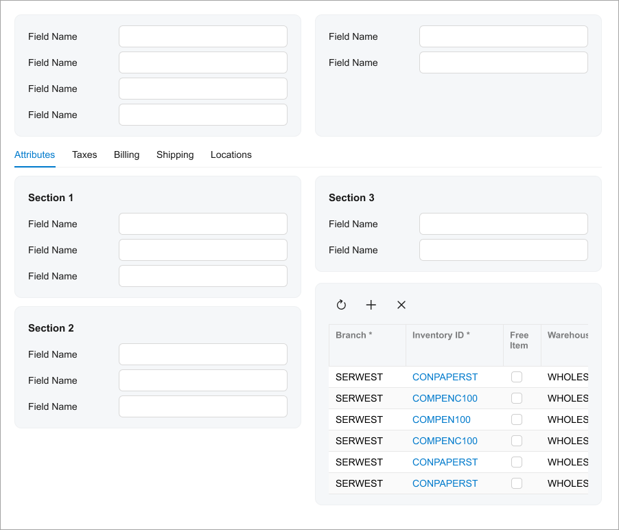|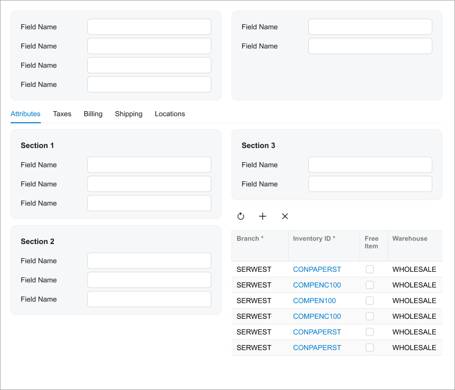|
|Show values in columns as links only for the records that are supposed to be open by a user.|
|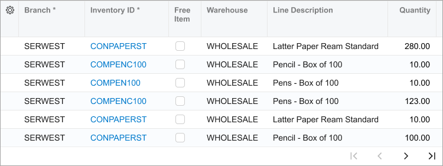|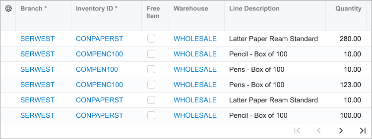|
|Show as a check box the header for the column with check boxes for selection of a row. Don't use **Selected** as a name for the column with check boxes for selection of a row.|
|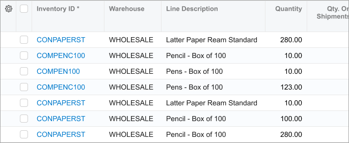|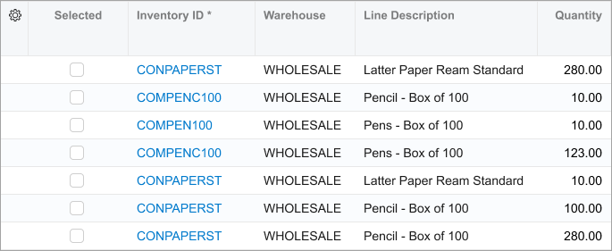|
|Make the columns with only icons or check boxes narrow.|
|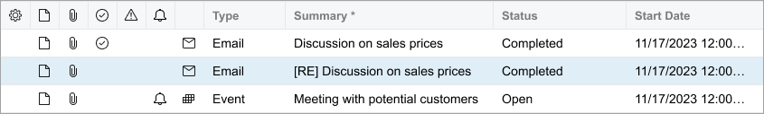|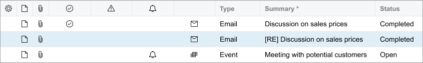|

**Parent topic:**[Table \(Grid\)](../DeveloperGuide/UIDevRef_Grid_Mapref.md)

