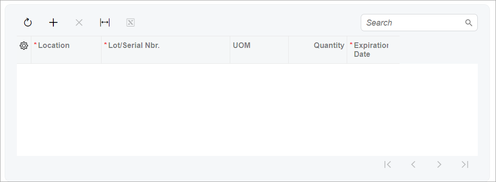
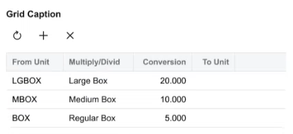
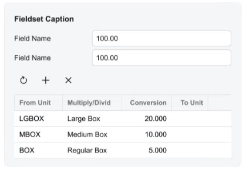
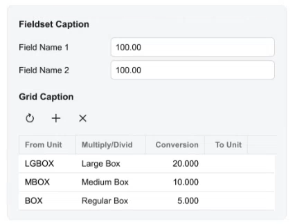

# Table \(Grid\): Layout Examples {#_7df86966-f2e2-4941-a0be-23478f14bae0 .concept}

In this topic, you can find examples of various layouts with tables.

## Table in a Gray Section { .section}

Suppose that you need to place a table in a gray section, as shown in the following screenshot.



To define a table in a gray section, you specify `class="framed-section"` for the qp-grid tag, as shown in the following code.

```language-xml
<qp-grid slot="B" id="gridSerialNumbers" 
  view.bind="MasterSplits" class="framed-section">
</qp-grid>
```

## Table with a Title {#_966685f5-5a79-43a8-93a4-90466ff32b38 .section}

Suppose that you need to define a table with a title, as shown in the following screenshot.



To define a table with a title, you specify the caption attribute in the qp-grid tag, as shown in the following code.

```language-xml
<qp-grid id="gridOrders"
  view.bind="BlanketOrderChildrenDisplayList"
  caption="Grid Caption">
</qp-grid>
```

## Table with Elements Above It in a Gray Section { .section}

Suppose that for a table in a gray section, you need to place elements, such as boxes, above the table and inside the gray section, as shown in the following screenshot.



To define a table with elements above it in a gray section, you do the following in the HTML code:

1.  Add a qp-fieldset tag.
2.  Specify the caption attribute for the qp-fieldset tag.
3.  Put the following N + 1 field tags in the qp-fieldset tag, where N is the number of elements you need to define above the table:
    -   N fields for the elements above the table
    -   One field for the table with the replace-content and unbound attributes
4.  Put the `qp-grid` tag inside the field with replace-content and unbound.

**Tip:** You do not need to specify any classes for coloring because the gray section is displayed for the entire fieldset by default.

The following code implements this approach.

```language-xml
<qp-fieldset id="groupID" view.bind="View1" caption="Fieldset Caption">
  <field name="Field1"></field>
  <field name="Field2></field>
  <field name="FakeField" replace-content unbound>
    <qp-grid id="gridSomeGrid" view.bind="View2"></qp-grid>
  </field>
</qp-fieldset>
```

**Attention:** You generally don't need to explicitly specify the width for the table. However, you may need to do so in cases where the table's width doesn't automatically match the width of its outer container. You can specify `class="col-12"` in the `qp-grid` tag to force the table to match the width of its outer container. Thus, in the preceding code example, you would specify the `qp-grid` tag as follows.

```language-xml
<qp-grid id="gridSomeGrid" view.bind="View2" class="col-12"></qp-grid>
```

## Table with a Title and Elements Above It in a Gray Section { .section}

Suppose that for a table in a gray section, you need to specify a table title; further suppose that you need to add elements above the table inside the gray section, as shown in the following screenshot.



To implement this layout, you need to do the following in HTML code:

1.  Add a qp-fieldset tag.
2.  Add the title for the fieldset by specifying the caption attribute for the qp-fieldset tag.
3.  Put the following N + 1 field tags in the qp-fieldset tag, where N is the number of elements you need to define above the table:
    -   N fields for the elements above the table
    -   One field for the table with the replace-content and unbound attributes
4.  Put the qp-grid tag inside the field with replace-content and unbound.
5.  Add the title for the table by specifying the caption attribute for the qp-grid tag.

**Tip:** You do not need to specify any classes for coloring because the gray section is displayed for the entire fieldset by default.

The following code implements this approach.

```language-xml
<qp-fieldset id="groupID" view.bind="View1" caption="Fieldset Caption">
  <field name="Field1"></field>
  <field name="Field2></field>
  <field name="FakeField" replace-content unbound>
    <qp-grid id="gridSomeGrid" view.bind="View2" caption="Grid Caption">
    </qp-grid>
  </field>
</qp-fieldset>
```

**Attention:** You generally don't need to explicitly specify the width for the table. However, you may need to do so in cases where the table's width doesn't automatically match the width of its outer container. You can specify `class="col-12"` in the `qp-grid` tag to force the table to match the width of its outer container. Thus, in the preceding code example, you would specify the `qp-grid` tag as follows.

```language-xml
<qp-grid 
  id="gridSomeGrid"
  view.bind="View2"
  caption="Grid Caption" 
  class="col-12">
</qp-grid>
```

## Table with a Fixed Height { .section}

By default, the grid is stretched over the whole width of the area. If a grid should not occupy the whole tab or form, you specify `class="fixed-height"` for it, as shown in the following example.

```language-xml
<qp-grid id="gridSomeGrid" view.bind="GridView" class="fixed-height">
</qp-grid>
```

**Parent topic:**[Table \(Grid\)](../DeveloperGuide/UIDevRef_Grid_Mapref.md)

