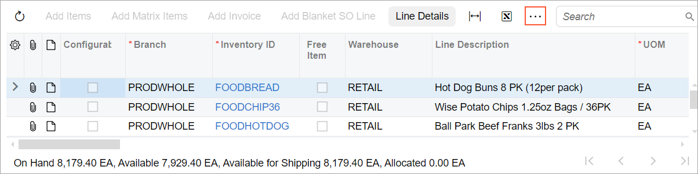
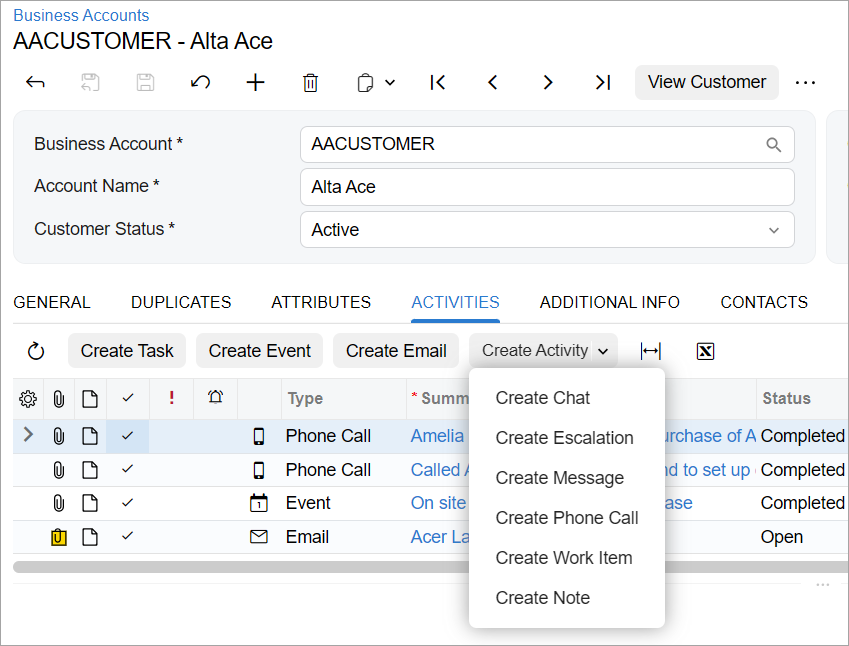

# Table \(Grid\): Configuration of the Table Toolbar {#_f9220c5c-9c83-4a59-aa77-4962bc24b373 .concept}

In this topic, you can learn how to configure actions on the table toolbar.

## Definition of Actions { .section}

The actions of the table toolbar must be defined in TypeScript. You use the PXActionState in the grid view class, which is the inheritor of the PXView class. \(See the example below.\) Actions of the table toolbar are not displayed on the form toolbar.

```language-javascript
export class SOLine extends PXView {
    AddInvoice: PXActionState;
}
```

## State and Appearance of Actions {#_d671781c-b74b-4fb1-8ab4-25de9e9d543f .section}

You can also handle the state and appearance of any action that corresponds to a button or command on the table toolbar by using the actionsConfig property of the gridConfig decorator, as shown in the following examples.

```language-javascript
// Hides the Refresh button from the table toolbar.
@gridConfig({
  actionsConfig: { refresh: { hidden: true } }
})
export class SOLine extends PXView

// Adds the Custom Refresh button.
@gridConfig({
  actionsConfig: {
    refresh: {
      renderAs: MenuItem.RENDER_TEXT,
      images: {},
      text: "Custom Refresh" }  
  }
})
export class POLine extends PXView
```

You can also use the [actionConfig](https://help.acumatica.com/Help?ScreenId=ShowWiki&pageid=674b9f3a-47ad-c975-e0ea-0707ced9c420) decorator to specify properties of an action that is explicitly defined in the view class for the table.

## More Button { .section}

If all buttons of the table toolbar cannot be displayed on the screen because of the screen’s width, you can make the system show the More button in the table toolbar, as shown in the following screenshot.



To display the More button for the table toolbar, you use the wrapToolbar property of the gridConfig decorator, as the following code shows.

```
@gridConfig({
    wrapToolbar: true
})
export class SOLine extends PXView
```

## Menu Button { .section}

You may need to group multiple commands under one menu button, as shown with the **Create Activity** menu button in the following screenshot.



If you need to configure a menu button with static commands for the table toolbar, you use the topBarItems property of the gridConfig decorator, as the following example shows.

```
@gridConfig({
  topBarItems: {
    TestMenu: {
      type: "menu-options",
      index: 1,
      config: {
        images: { 
          normal: "svg:main@external" },
        options: {
          first: {
            text: "First",
            commandName: "First"         
          },
          second: {
            text: "Second",
            commandName: "Second"
          }
        }
      }
    }
  }
})
export class SOLine extends PXView
```

If you need to define the list of menu commands dynamically, you use the PXAction.SetMenu method in the constructor of the graph or in the overridden Initialize method in the graph extension, as shown in the following example. In this case, you do not need to specify the menu commands in the topBarItems property of the gridConfig decorator.

```
public class MyGraphMaint : PXGraph<MyGraphMaint>
{
  public PXAction<MyDAC> MyMenuAction;
  private const string MenuAction1 = "FirstAction";
  private const string MenuAction2 = "SecondAction";

  public MyGraphMaint()
  {
    MyMenuAction.SetMenu(new[]
    {
      new ButtonMenu(MenuAction1, Messages.Command_MenuAction1, null),
      new ButtonMenu(MenuAction2, Messages.Command_MenuAction2, null),
    });
  }
}

[PXLocalizable]
public static class Messages
{
  public const string Command_MenuAction1 = "First Command";
  public const string Command_MenuAction2 = "Second Command";
}
```

## Table Toolbar Button That Opens a Dialog Box {#_b58e4acd-ca7b-40a5-a493-ac7a925eebd8 .section}

You can add a button that opens a dialog box to the table toolbar by using the topBarItems property of the gridConfig decorator. The action that corresponds to this button can be defined only in frontend and has no corresponding action in the graph.

To implement an action that opens a dialog box, in the topBarItems property of the gridConfig decorator, you specify the following:

1.  The internal name of the action
2.  The index of the action on the table toolbar
3.  The configuration of the action:
    -   commandName: *ExecuteCommand*
    -   popupPanel: The name of the dialog box
    -   text: The text on the button

For example, suppose that you need to define an action that opens the `PanelRef` dialog box \(which is defined with the qp-panel control in HTML\). An example of such action is shown in the following code.

```language-javascript
@gridConfig({
  topBarItems: {
    PanelRef: {
      index: 0,
      config: {
        commandName: "ExecuteCommand",
        popupPanel: "PanelRef",
        text: Labels.ReferenceDesignators,
    }
  }
  ...
})
```

For details about wrappers for such action, see [Testing of the Modern UI: Frontend Actions in Wrappers](UIDev_Testing_FrontendActions_Concept.md).

## Standard Buttons { .section}

When you define a table on the form, a set of buttons is added to the table toolbar by default. The following table lists the names of the buttons and names of corresponding actions in code.

|Button Name|Action Name|
|-----------|-----------|
|**Refresh**|refresh|
|**Add Row**|insert|
|**Delete Row**|delete|
|**Fit to Screen**|adjust|
|**Export to Excel**|exportToExcel|
|**Load Records from File**|import|
|**Filter Setting**|filter|

You can refer to a standard button by its action name in the TypeScript code, for example, to modify visibility in the actionConfig decorator. For more details, see [State and Appearance of Actions](#_d671781c-b74b-4fb1-8ab4-25de9e9d543f).

**Parent topic:**[Table \(Grid\)](../DeveloperGuide/UIDevRef_Grid_Mapref.md)

