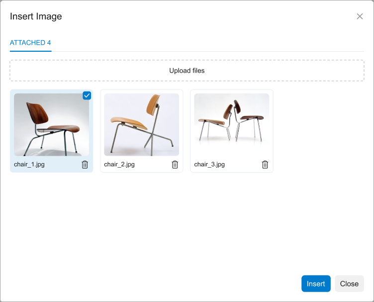

# Image Uploader: General Information {#_25d08a49-3a38-4cfe-9d1f-7f0765c86c1a .concept}

An image uploader is a control that is used to select and upload images. The following screenshot shows an example of an image uploader control.

An image uploader control is defined by PXImageUploader in the Classic UI. In the Modern UI, an image uploader control is defined by the [qp-image-uploader](https://help.acumatica.com/(W(1))/Help?ScreenId=ShowWiki&pageid=ae256cc4-9091-eb69-8242-82d742463c9c) tag.

## Learning Objectives { .section}

In this chapter, you will learn how to convert the ASPX elements of an image uploader control to HTML or TypeScript.

## Applicable Scenarios { .section}

You configure an image uploader control when a user needs to attach images to a record.

**Parent topic:**[Image Uploader](../DeveloperGuide/UIDevRef_ImageUploader_Mapref.md)

