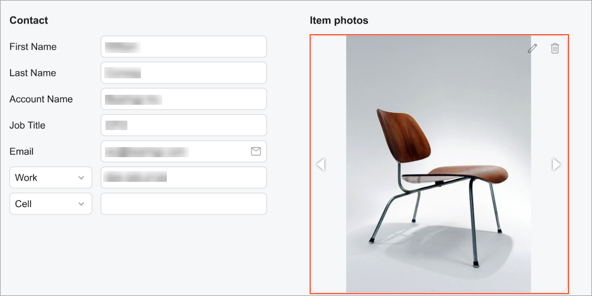

# Image Viewer: General Information {#_8e7be7c5-4350-4af9-9bb6-42b963c75623 .concept}

An image viewer is a control that is used to display an image. This control displays the image by using a URL that is stored in a field that is bound to this control. The following screenshot shown an example of an image viewer control.



An image viewer control is defined by PXImageView in the Classic UI. In the Modern UI, an image viewer control is defined by the [qp-image-view](https://help.acumatica.com/(W(1))/Help?ScreenId=ShowWiki&pageid=b104948d-ac2a-f39d-5026-de79340d3cfd) tag.

## Learning Objectives { .section}

In this chapter, you will learn the following about an image viewer control:

-   The various approaches to specifying the size of an image viewer control
-   The conversion of the ASPX elements of an image viewer control to HTML or TypeScript

## Applicable Scenarios { .section}

You configure an image viewer control when a user needs to view images that are associated with a record.

## Specifying the Size of an Image Viewer Control { .section}

You can specify the size of an image viewer control in the following ways:

-   By specifying a fixed size: You can specify the size in pixels or as a percentage. You can also specify a fixed size by using the viewport height or width. The following code shows an example with each of these units.

    ```
    <qp-image-view width="400px" height="280px">
    </qp-image-view>
    <qp-image-view width="50%" height="50vw">
    </qp-image-view>
    <qp-image-view width="100vh" height="50px">
    </qp-image-view>
    ```

-   By specifying the size proportionally based on one dimension: You can specify one dimension \(either the width or the height\) as a specific proportion of the overall size of the image that is to be displayed. Before the image is loaded and displayed in the control, the control will have a size of *0* for the dimension that was not specified. After the image is loaded, the control’s size will be based on the specified proportion of the image size. The following code shows an example.

    ```
    <qp-image-view width="400px"></qp-image-view>
    <qp-image-view height="100%"></qp-image-view>
    <qp-image-view width="100vh"></qp-image-view>
    ```

-   By specifying the size proportionally based on width and height: You can specify the proportions by using fractions, which are represented by *fr* in code. To specify the width as *400px*, and the height as *800px*, you can use the following code.

    ```
    <qp-image-view width="400px 1fr" height="2fr"></qp-image-view>
    ```

-   By specifying the size by using the aspect-ratio property: You can specify one dimension explicitly, and the other dimension will be calculated by the system based on the specified value for the aspect-ratio property. If none of the dimensions have been specified, the system will calculate the size based on the dimensions of the parent container while considering the value specified for the aspect-ratio property. The following code shows an example.

    ```
    <qp-image-view height="100%" aspect-ratio="2/3"></qp-image-view>
    ```

    In the code above, the specified the value for the height property is *100%* and the value for the aspect-ratio property is *2/3*. The number *2* represents the proportion of the width, whereas *3* represents the proportion of the height. For more details, see [aspect-ratio](https://developer.mozilla.org/en-US/docs/Web/CSS/aspect-ratio).


The values of the following properties are determined in the same way as the width and height properties are, as described in the preceding list:

-   max-width and max-height
-   min-width and min-height

You can also control the way an image is scaled inside an image viewer control by using the object-fit property. This property has the following values:

-   *contain*
-   *cover*
-   *fill*
-   *scale-down*

The following code shows an usage example.

```
<qp-image-view aspect-ratio="2/3" object-fit="cover">
</qp-image-view>
```

In the code above, the size of the control is determined by the parent control. The aspect-ratio of the dimensions is set to *2/3*. This means that the image will always cover the whole control and keep its proportions. The image will be cropped if the ratio of the dimensions is something other than *2/3*. For me details, see [object-fit](https://developer.mozilla.org/en-US/docs/Web/CSS/object-fit).

**Parent topic:**[Image Viewer](../DeveloperGuide/UIDevRef_ImageViewer_Mapref.md)

