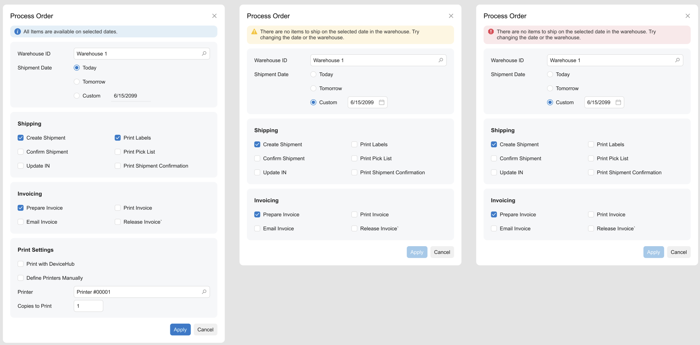
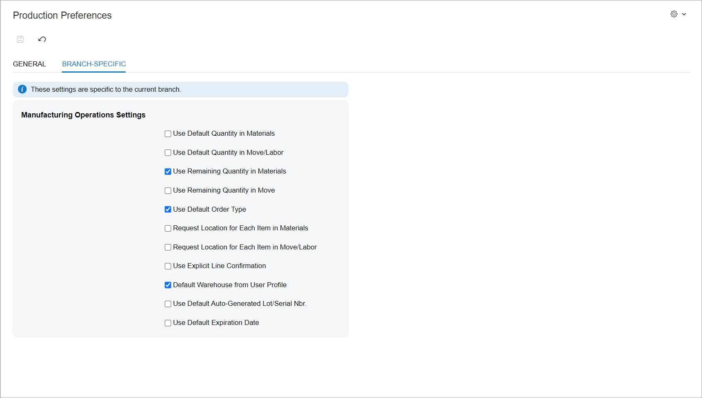
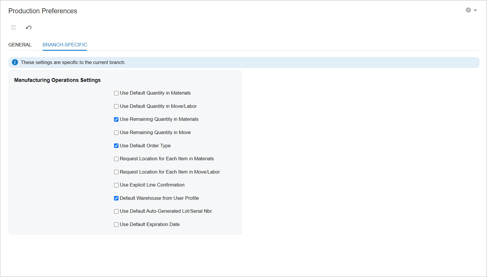

# Error, Warning, or Informational Notification: General Information {#_b7364842-e957-4f0d-9e0d-3f9dde73bb19 .concept}

A notification on an Acumatica ERP form is a control containing an error message, a warning message, or an informational message that is displayed to a user to convey important information related to the data displayed on the form. The following screenshots show examples of an informational notification, a warning notification, and an error notification.



In the Modern UI, a notification is defined by the [qp-info-box](https://help.acumatica.com/(W(1))/Help?ScreenId=ShowWiki&pageid=296216bd-7cd7-9681-9417-5263ed43b060) control. The Classic UI does not have an analog of this control.

## Learning Objectives { .section}

In this chapter, you will learn the following about error, warning, and informational notifications:

-   The guidelines for error, warning, and informational messages
-   The proper configuration of a notification for specific cases, such as a notification that appears in specific place of an Acumatica ERP form

## Applicable Scenarios { .section}

You configure an error, warning, or informational notification in the following cases:

-   An error or a warning has been generated during validation of the data that the user has entered on an Acumatica ERP form.
-   Some information related to the data displayed on an Acumatica ERP form should be shown to a user.

## Message Guidelines { .section}

The main idea of any error message is to describe the problem that is stopping the user or system from completing a task and to educate the user on how to solve this problem. Before finalizing an error message and inserting it in the code, you should consider whether your message answers the following questions:

-   What problem has occurred? \(State the problem clearly.\)
-   Why did it happen? \(Explain what has gone wrong.\)
-   How can the user solve the problem? \(Provide the user with a solution to the problem.\)

Your error message should answer at least two of these questions in a given situation. It must include enough information for the user to understand the problem and to overcome it.

In a warning message, you inform a user about a problem that could arise so that they can avoid it. Clearly state what could go wrong and how the user can avoid it. Do not include any unneeded details.

You use an informational message when you want to provide helpful information to help the user understand what is happening \(for example, informing them about the successful completion of a process\). Keep the message concise and useful; the goal is to support the user in completing the task at hand, not to slow their work with unneeded or confusing information.

In all types of messages, you should use complete sentences and the proper punctuation. Clear, concise messages enhance and smooth the user experience.

## Recommendations for Organizing the Layout {#section_vv2_1y4_y4b .section}

The following table shows the recommendations for organizing the layout with error, warning, and informational notifications.

|Correct|Incorrect|
|-------|---------|
|When a template contains fields in only one fieldset and an error, warning, or informational notification should be displayed for this fieldset, align the notification with the fieldset.Put both the qp-info-box tag and the qp-fieldset tags into a single div tag with the specified slot value, as shown below.

```
<qp-template id="scanSetupTemplate" name="1-1" class="label-size-xm">
  <div slot="A">
    <qp-info-box caption="These settings are specific to the current branch." 
      type="info"></qp-info-box>
    <qp-fieldset slot="A" id="ScanSetup_formScanSetup" 
      view.bind="ScanSetup" caption="Manufacturing Operations Settings">
    </qp-fieldset>
  </div>
</qp-template>
```

|
|||

**Parent topic:**[Error, Warning, or Informational Notification](../DeveloperGuide/UIDevRef_InfoBox_Mapref.md)

