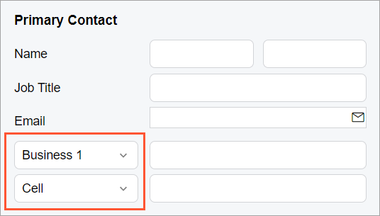

# Label: A Combo Box Control as a Label {#_0372de0c-e791-4183-85fc-8f9264ec7528 .concept}

You can define a control, such as a combo box to occupy the space of a label.

Suppose that you need to display a combo box in place of a label for another control, as shown in the following screenshot.



In the HTML template, you need to add a field for that label by using the `qp-field` tag and specify the following attributes for the field:

-   `slot="label"` to display that control in space for the label of the parent control
-   `class="no-label"` to remove the space allocated for the label part of that control

The following code shows an example that implements the layout from the screenshot above.

```
<field name="Phone1">
  <qp-field slot="label" class="no-label" 
    control-state.bind="PrimaryContactCurrent.Phone1Type">
  </qp-field>
</field>
```

Alternatively, you can add both fields explicitly, as shown in the following code.

```
<field name="groupPhone1" unbound>
  <qp-field slot="label" class="no-label" 
    control-state.bind="DefContact.Phone1Type"></qp-field>
  <qp-field class="col-12 no-label"
    control-state.bind="DefContact.Phone1" ></qp-field>
</field>
```

**Parent topic:**[Label](../DeveloperGuide/UIDevRef_Label_Mapref.md)

