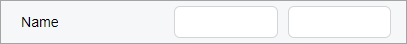

# Label: A Single Label for Multiple Controls {#_9347a807-e89b-4475-a048-e18061c3d243 .concept}

You can add a single label for multiple controls.

Suppose that you need to display a single label for two text boxes and both of these text boxes need to have equal widths, as shown in the following screenshot.



In the HTML template, you need to do the following:

-   Add the field tag for the first field, as usual
-   Add the nested qp-label tag and specify `slot="label"` for that tag
-   For the qp-label tag, specify `class="no-label"` to remove the space allocated for the label part of each control
-   Add the nested qp-field control for the second field
-   For the qp-field tag, specify `class="col-6"` so that each text box occupies 50% of the space

The following code implements the layout from the screenshot above.

```
<field name="FirstName">
  <qp-label slot="label" caption="Name" 
    if.bind="PrimaryContactCurrent.FirstName.visible == true" class="no-label">
  </qp-label>
  <qp-field control-state.bind="PrimaryContactCurrent.LastName" class="col-6">
  </qp-field>
</field>
```

The system puts the controls in the following order:

1.  The control with `slot="label"`
2.  The control from the parent `field` tag
3.  The control specified in the nested `qp-field` tag

**Parent topic:**[Label](../DeveloperGuide/UIDevRef_Label_Mapref.md)

