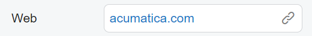
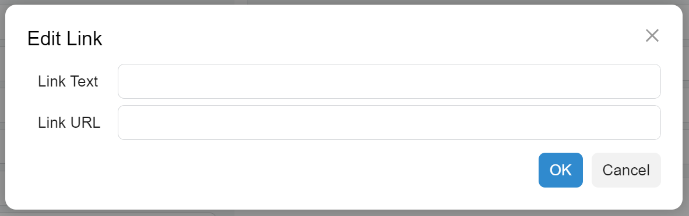
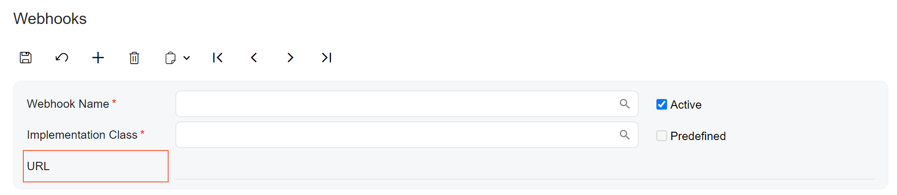

# Link Editor: General Information {#_8660aad5-0aa6-42ca-a985-531c0aac94b8 .concept}

A link editor represents a text box with a link that a user can click and be redirected to another page.

A link editor is defined by PXLinkEdit in the Classic UI. In the Modern UI, you define a link editor either by using the field or qp-field tag with the [`qp-link-editor`](https://help.acumatica.com/(W(1))/Help?ScreenId=ShowWiki&pageid=693d55e4-6461-6cae-18ff-d6d0a013c36b) control type specified or explicitly by using the `qp-link-editor` control.

## Learning Objectives { .section}

In this chapter, you will learn the following about the link editor:

-   The design guidelines for the link editor, including the naming conventions
-   The guidelines for converting the element from the Classic UI to Modern UI

## Applicable Scenarios { .section}

You configure the link editor when you want to add a control with a link that a user can click and be redirected to another page.

## Overview of the Link Editor { .section}

A link editor consists of a text box that contains the link and the dialog box where a user can specify the link name and URL. The text box part of the link editor contains a link icon at the right side of it, as shown in the following screenshot.

When a user click the link icon, the **Edit Link** dialog box opens, as shown in the following screenshot. In this dialog box, a user can specify the link text which will be displayed in the link editor, and the link URL.

After the user clicks **OK**, the link text is displayed in the link editor text box.

## UI Naming Convention { .section}

The following table shows the UI naming convention for a link editor.

|Naming Convention|Example|
|-----------------|-------|
|Use a noun or a noun phrase to describe the contents of a link editor. Preferably, link editor names should consist of one or two words.|The **URL** link editor on the [Webhooks](../UserGuide/SM_30_40_00.md) \(SM304000\) form, which is shown in the following screenshot.

|

**Parent topic:**[Link Editor](../DeveloperGuide/UIDevRef_LinkEditor_Mapref.md)

