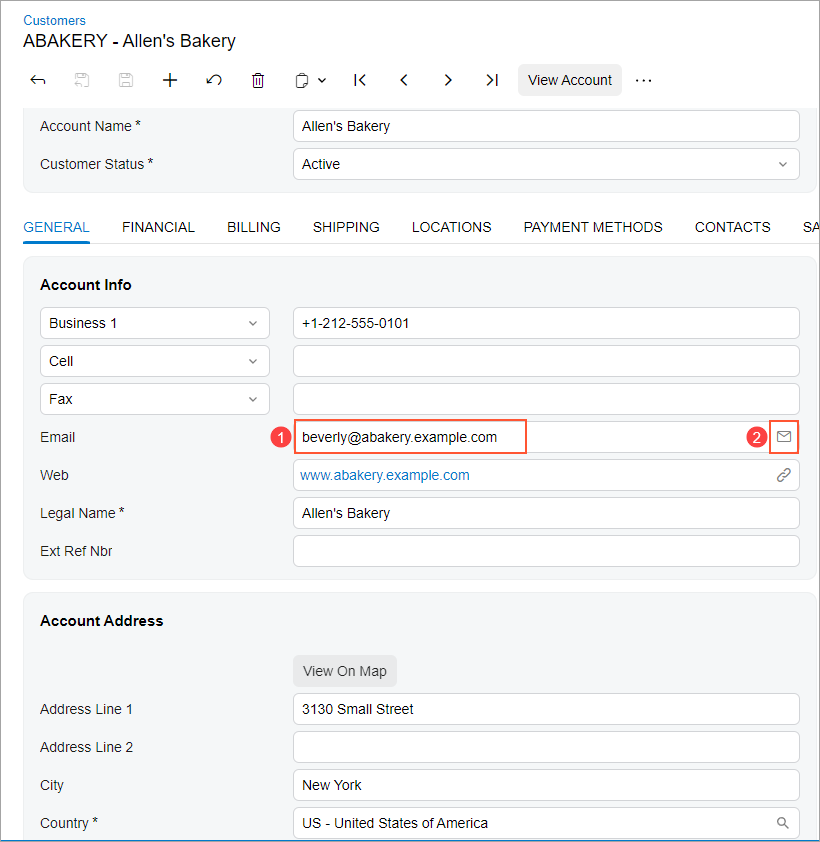
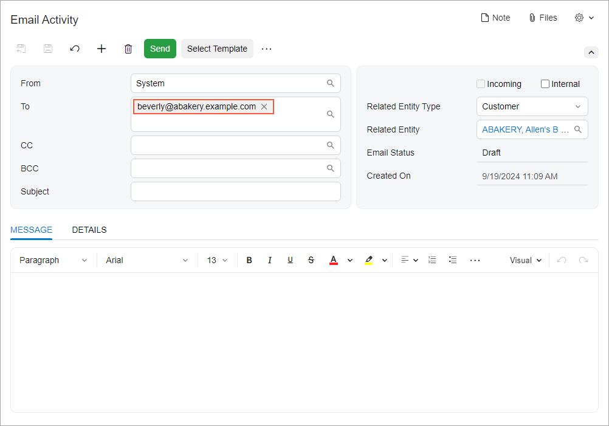

# Mail Editor: General Information {#_f0a83eac-5e35-445a-8aca-1ac52647a878 .concept}

The mail editor control consists of a text field and a button in the UI. In the text field, a user can enter an email address. You can assign an action to the button. If you do not specify an action, then by default, the button launches the default mail client application that is configured on the system running the Acumatica ERP instance.

A mail editor is defined by PXMailEdit in the Classic UI. In the Modern UI, you define a mail editor either by using the field tag with the control type specified or explicitly by using the [qp-mail-editor](https://help.acumatica.com/(W(1))/Help?ScreenId=ShowWiki&pageid=e3ce6369-88f2-5da9-1fd1-234d15647693) control.

## Learning Objectives { .section}

In this chapter, you will learn the following about the mail editor:

-   The common uses of the mail editor
-   The proper configuration of the mail editor

## Applicable Scenarios { .section}

You configure the mail editor when you want to give a user the ability to enter an email address and execute the appropriate action by clicking the button of this control.

## Uses of the Mail Editor { .section}

You generally use the mail editor control on forms that store an email address. As mentioned, you can specify an action for the button associated with this control. Typically, this action launches either the default email client application of your system or the [Email Activity](../UserGuide/CR_30_60_15.md) \(CR306015\) form in a pop-up window.

The following screenshot shows an example of the mail editor control on the **General** tab of the [Customers](../UserGuide/AR_30_30_00.md) \(AR303000\) form.

Item 1 in the following screenshot shows the text field of the control, in which the user types an email address. Item 2 shows the button associated with the control, which the user clicks to execute the action you have configured.

The following screenshot shows the result of the user clicking the button of the control shown in the previous screenshot: The action specified for the button has opened the [Email Activity](../UserGuide/CR_30_60_15.md) form in a pop-up window. Notice that the email address that was specified in the text field of the control in the preceding screenshot has been automatically inserted into the **To** box.

**Parent topic:**[Mail Editor](../DeveloperGuide/UIDevRef_MailEditor_Mapref.md)

