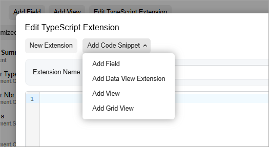
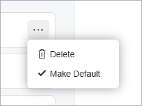

# Menu: General Information {#_60516034-7b2c-49b4-82da-b0188194dfa4 .concept}

A menu is a drop-down control that provides a list of commands.

A menu is defined by the qp-menu tag in the Modern UI. \(The control is not supported by the Classic UI.\)

## Learning Objectives { .section}

In this chapter, you’ll learn the following about the menu:

-   Its design guidelines, including naming conventions and layout recommendations
-   The configuration of the menu commands \(options\)
-   The proper configuration of the menu for specific cases, such as the implementation of an event handler for the menuselected event

## Applicable Scenarios { .section}

-   You want to add a drop-down menu to a specific area of a form, such as qp-template or a table toolbar
-   You want to add a menu to a tile of the data feed control

## Overview of the Menu Control {#section_jc3_gf2_ngc .section}

The menu control consists of a button that opens the menu and the drop-down menu. The drop-down menu contains menu commands. An example of an opened menu control is shown below.



You can place the menu control anywhere on a form, such as a tab toolbar, dialog box, or tile of a data feed control.

To define the menu control:

1.  In the TypeScript file, define the configuration of the control. For details, see[Menu: Configuration of the Menu Control](UIDevRef_Menu_Options.md).
2.  Optional: Define the menuSelected event handler. For details, see [Menu: Handling the MenuSelected Event](UIDevRef_Menu_MenuSelectedHandler.md).
3.  In the HTML template, add the qp-menu tag in the needed location. In the qp-menu tag, specify the configuration and the menuSelected event handler.

## Menu ID { .section}

A menu’s ID consists of two parts: the `menu` prefix and the semantic name., which describes the menu’s purpose. For example, a menu that contains file options may have the `menuFileOptions` ID, as the following code shows.

```language-xml
@observable fileMenuConfig:IMenuControlConfig = {
  id: "menuFileOptions,
  ...
}
```

A menu item’s ID consists of two parts: the semantic name and the `Action` postfix. The semantic name should be identical to the graph action’s name. For example, a menu item that adds a field may have `addFieldAction` ID, as the following code shows.

``` {#codeblock_jh4_x22_ngc}
options: [
  {
    id: "addFieldAction",
    commandName: "addField",
  },
  ...
]
```

## UI Naming Conventions { .section}

The following table shows the UI naming conventions for menu commands.

|Naming Convention|Example|
|-----------------|-------|
|Use a verb or verb phrase that describes the process that’s initiated when a user clicks the command. Use title-style capitalization for command names.|The tile menu on the Company Profile \(SP201000\) form of the Self-Service Portal

|

## Recommendations for Organizing the Layout {#section_mnw_f5z_mgc .section}

When you want the qp-menu control to be displayed as a button, use the qp-button class. The button that opens the menu will be displayed on a gray background. Below you can see an example of the **Add Code Snippet** button, which is a qp-menu control.


When the qp-menu control is displayed on a tile of a data feed control, follow the [layout recommendations for the data feed control](UIDevRef_DataFeed_GeneralInfo.md).

**Parent topic:**[Menu](../DeveloperGuide/UIDevRef_Menu_Mapref.md)

