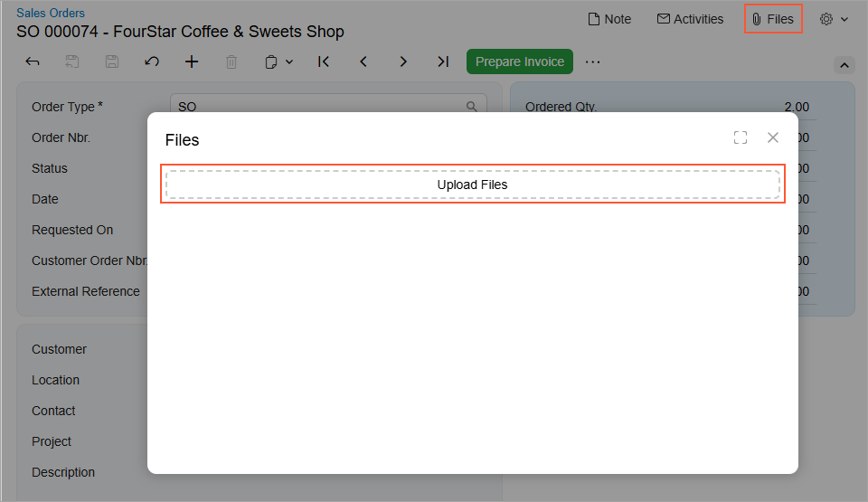

# Upload Files Button: General Information {#_994b3d99-d4f7-48c4-af18-43be38692513 .concept}

The upload files button control provides users with the ability to upload any number of files to a record. This control functions as both a button you can click and an area where files can be dropped. A user can upload the files either by dragging them onto the button or via the file upload dialog box, which opens when the button is clicked.

The following screenshot shows an example of the upload files button control in the **Files** dialog box. This dialog box opens when a user clicks **Files** on the form title bar of a form. In this example, the control is assigned the **Upload Files** name.



An upload files button control is defined by PXFileUploader in the Classic UI. In the Modern UI, an upload files button control is defined by the qp-multi-upload tag.

## Learning Objectives { .section}

In this chapter, you will learn the following about an upload files button control:

-   The proper configuration of the control
-   How to convert the ASPX elements of this control to HTML or TypeScript

## Applicable Scenarios { .section}

You configure the upload files button control when you want to give users the ability to upload any number of files to a record.

## Configuration of an Upload Files Button { .section}

You configure the upload files button control in HTML by using the qp-multi-upload tag.

The configuration properties of the qp-multi-upload control are stored in the IMultiUploaderConfig interface.

The following code shows an example of defining an upload files button control in HTML.

```
<qp-multi-upload
   config.bind="{
        id: 'uploadFilesControl',
        graph: 'MyPhotoLogEntry',
        view: 'Photos',
        action: 'UploadFiles',
        dropTarget: '#gridPhotos',
        autoRepaint: true,
   }"></qp-multi-upload>
```

**Parent topic:**[Upload Files Button](../DeveloperGuide/UIDevRef_MultiUploadFiles_Mapref.md)

