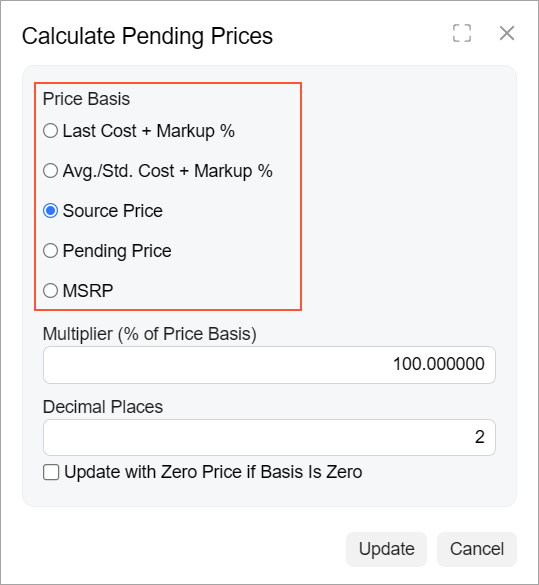
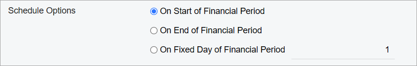

# Radio Button: Configuration {#_607de395-a8f6-4151-9bf1-0f9ed8487fe5 .concept}

In this topic, you will learn how to configure radio buttons for various layouts.

## Vertical Group of Radio Buttons { .section}

A simple group of radio buttons is defined in HTML with a field tag. You need to specify the qp-radio control type in the configuration of the control. By default, radio buttons are rendered horizontally.

In the following example, the radio buttons are configured to be rendered vertically.

```
<field name="PriceBasis" caption="Price Basis"
  control-type="qp-radio"
  config-class.bind="'vertical'">
</field>
```

The following screenshot shows the resulting layout.



## Group of Radio Buttons with a Box Next to a Radio Button {#_094a4002-b2be-4151-aac3-744e9c5121da .section}

In some cases, you might need the user to provide additional information if a particular radio button is selected. You can do this by placing a box right of the name of the radio button.

To insert a box next to a radio button, you perform the following steps:

1.  For the field tag that corresponds to a radio button, you add the replace-content attribute.
2.  Inside the field tag, you do the following:
    1.  You insert a qp-field tag that has the qp-radio control type and is bound to the needed field. You also specify the name of the control in the name property of the config attribute.
    2.  You add a qp-radio-item tag for the radio button for which you need to add a box in the same row. For the tag, you specify the following attributes:
        -   name: The same name that you have specified for the qp-field tag with the qp-radio control type
        -   value: The value that corresponds to the radio button in the database
    3.  You add a control, such as qp-field, for the box that you need to add in the same row.

The following example implements this approach.

```
<field name="ScheduleOption" replace-content>
  <qp-field
    control-type="qp-radio"
    control-state.bind="DeferredCode.ScheduleOption"
    config-name.bind="'ScheduleOption'"
    config-class.bind="'vertical'"
  >
    <span class="col-6"></span>
    <qp-radio-item name="ScheduleOption" value="D" class="col-6">
    </qp-radio-item>
    <qp-field control-state.bind="DeferredCode.FixedDay" class="col-6">
    </qp-field>
  </qp-field>
</field>
```

The code above results in the layout shown in the following screenshot.



**Parent topic:**[Radio Button \(Option Button\)](../DeveloperGuide/UIDevRef_RadioButton_Mapref.md)

