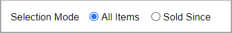
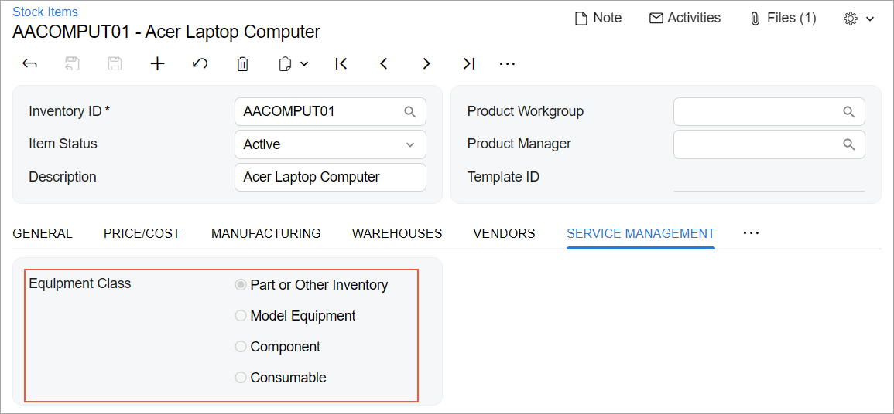
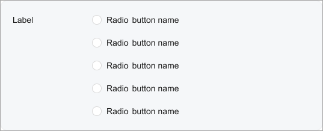
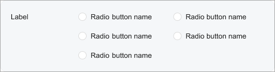

# Radio Button: General Information {#_1331d41a-267c-48dd-9f27-64720b3b94be .concept}

A radio button is a small circle that a user can click to turn on or turn off an action, as shown in the following screenshot. Radio buttons are generally organized in groups in which a user is permitted to select only one of the radio buttons.

A group of radio buttons is defined by PXGroupBox with nested PXRadioButton elements in the Classic UI. In the Modern UI, you define a group of radio buttons by using the field tag with the control type specified in TypeScript or explicitly by using the qp-radio control.

## Learning Objectives { .section}

In this chapter, you will learn the following about radio buttons:

-   The design guidelines for radio buttons, including the naming conventions and layout recommendations
-   The proper configuration of radio buttons for specific cases, such as including an additional box next to a radio button option

## Applicable Scenarios { .section}

You configure radio buttons when a user needs to select one of the buttons from a set of mutually exclusive options and you want all options to be visible at once.

## UI Naming Conventions { .section}

The following table shows the UI naming conventions for radio buttons.

|Naming Convention|Example|
|-----------------|-------|
|Use either of the following phrases as the names of a group of radio buttons:

 -   Noun phrases.

Use noun phrases if they satisfy the context—the name that precedes the group of radio buttons they follow and the meaning they are intended to convey.

-   Adverbs or prepositional phrases.

Use adverbs or prepositional phrases when the radio buttons should tell a user when or under what circumstances something should happen. Usually these radio buttons follow the verb phrase used as the name that precedes the group of radio buttons.

 The radio button names should be parallel with one another.

|The **Equipment Class** radio buttons on the [Stock Items](../UserGuide/IN_20_25_00.md) \(IN202500\) form, which is shown in the following screenshot

|

## Recommendations for Organizing the Layout {#section_vv2_1y4_y4b .section}

The following table shows the recommendations for organizing the layout for radio buttons.

|Correct|Incorrect|
|-------|---------|
|If there are more than two radio buttons, list them vertically. Do not arrange radio buttons in multiple columns if there are more than two of them.|
|||
|If the area where you are going to place the control has enough space, the control is used often \(such as in a wizard or a dialog box\), and the list of options contains no more than five options, use radio buttons instead of a combo box to avoid a user spending extra time on opening the option list in the combo box, scanning the list, and selecting an option.|
|||

**Parent topic:**[Radio Button \(Option Button\)](../DeveloperGuide/UIDevRef_RadioButton_Mapref.md)

