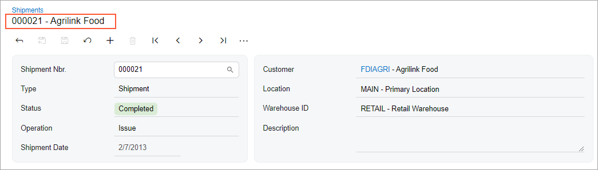
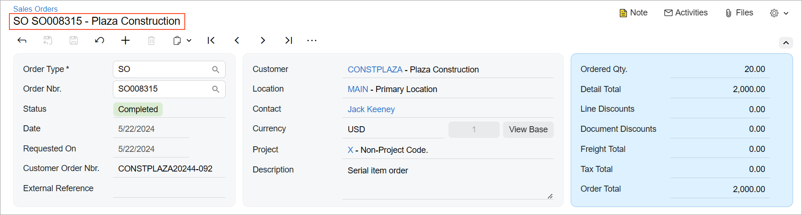
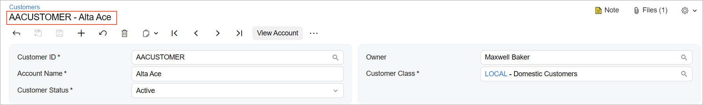
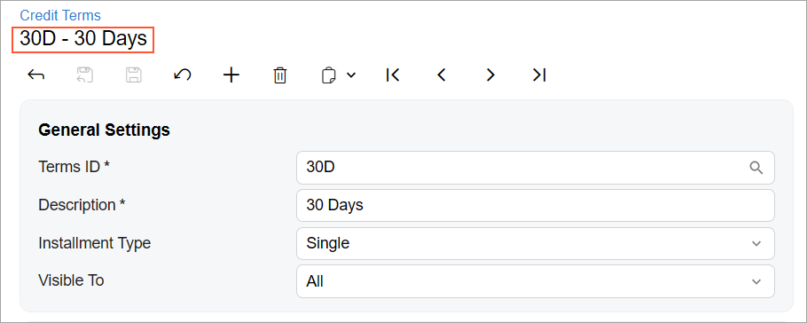

# Record Title: General Information {#_bc36f441-0faf-4eb8-bd37-a1d8b7b8dbba .concept}

In Acumatica ERP, data entry and maintenance forms can have a record title, which is a short description of the current record that is displayed under the form name on the form title bar. The record title usually includes the record’s ID along with the its name, its description, or additional information about the record.

**Tip:** The record title is also called the *header description*. In this topic, for simplicity, it will be further referred to as the *record title*.

The following screenshot shows an example of the record title for the [Shipments](../UserGuide/SO_30_20_00.md) \(SO302000\) form. Notice that the record title shows both the shipment number and the customer name.

## Learning Objectives { .section}

In this chapter, you will learn the following:

-   The design guidelines for a record title, including the naming conventions and layout recommendations
-   The proper configuration of a record title

## Applicable Scenarios { .section}

You configure a record title if you want to display a short description of the current record on a data entry or maintenance form.

## UI Naming Conventions { .section}

The following table shows the UI naming conventions for record titles.

|Naming Convention|Example|
|-----------------|-------|
|For a data entry form that is used to enter documents, include the following information:

 -   The document identifier.

For documents that have multiple key fields \(such as sales orders or invoices\), you need to include all key fields.

-   The account name of the customer or vendor account related to the document.

|The record title on the [Sales Orders](../UserGuide/SO_30_10_00.md) \(SO301000\) form, which is shown in the following screenshot. On this form, the record title displays the key fields of the sales order \(its order type and number\) and the customer name.

|
|For a maintenance or data entry form that is used to enter maintenance records or profiles \(such as inventory items, customers, and contacts\) that are used in data entry records, include the following information:

 -   The record identifier
-   The record name

|The record title on the [Customers](../UserGuide/AR_30_30_00.md) \(AR303000\) form, which is shown in the following screenshot. On this form, the record title displays the identifier of the customer record and the customer name.

|
|For other data entry or maintenance forms, include the following information:

 -   The record’s identifier.

For records that have compound identifiers, you need to include all parts of the identifier.

-   The record’s description.

If the record does not have a description, you can use any other field that can help a user to identify the record.

|The record title on the [Credit Terms](../UserGuide/CS_20_65_00.md) \(CS206500\) form, which is shown in the following screenshot. On this form, the record title displays the identifier of the credit term record and its description.

|

**Parent topic:**[Record Title](../DeveloperGuide/UIDevRef_RecordTitle_Mapref.md)

