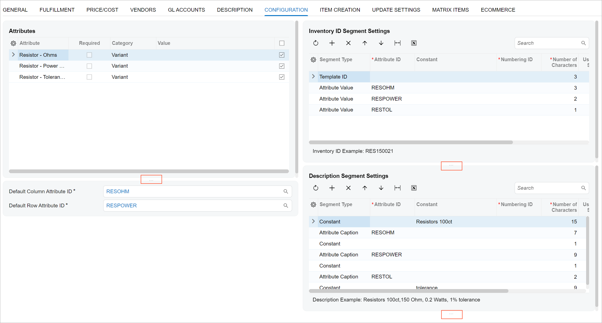
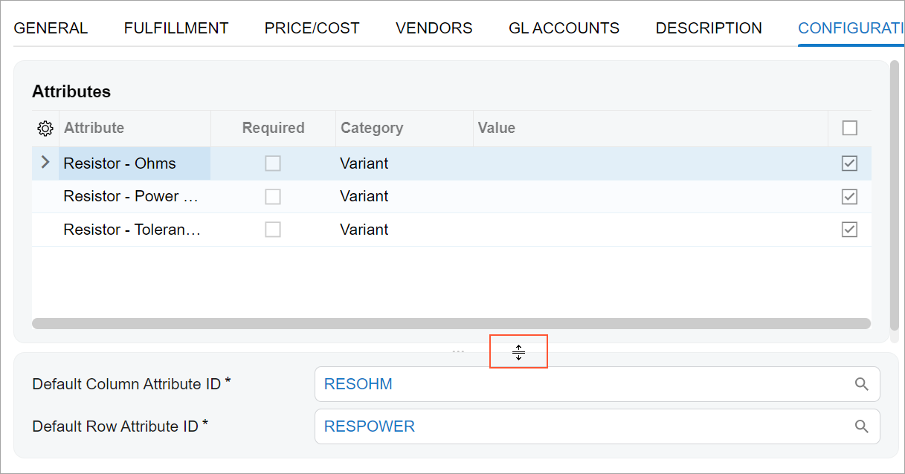

# Resizer: General Information {#_d2a18590-207a-418b-9b9d-9357b5a58cca .concept}

A resizer is a control that gives you the ability to adjust the height of a control that is located inside the resizer. You can put any control whose height can be changed into a resizer, such as a table or a tree. If a user adjusts the height of the control, the system stores the adjusted height in the user's preferences. When the user opens the form at any later time, the control will be shown with the adjusted height.

The control looks like a line with three dots in the middle \(see the first screenshot below\). The line is located under the control that has been placed inside the resizer. When a user hovers over the line with three dots \(see the second screenshot below\), the mouse pointer turns into a double-headed arrow with two lines in the middle, which means that the lines can be moved.





## Learning Objectives { .section}

In this chapter, you will learn the following about the resizer:

-   The design guidelines for the resizer, including the naming conventions and layout recommendations
-   The proper configuration of the resizer

## Applicable Scenarios { .section}

You configure a resizer when you want to give a user the ability to change the height of a control manually.

## Resizer Overview { .section}

The resizer control is defined by the qp-resizer tag in HTML.

To add a control inside a resizer, you place the tag for the control inside the qp-resizer tag, as shown in the following code. You can specify the initial height of the control in the resizer by using the initialSize attribute of the qp-resizer tag.

```
<qp-tab id="tab-UpdateExcludeSettings" caption="Update Settings">
  <qp-resizer id="resizer-gridFields" initial-size="400px">
    <qp-grid id="gridFields-UpdateExcludeSettings"
      view.bind="FieldsExcludedFromUpdate"
      caption="Fields Excluded from Update"
      class="framed-section">
    </qp-grid>
  </qp-resizer>
  <qp-resizer id="resizer-gridAttributes" initial-size="400px">
    <qp-grid id="gridAttributes-UpdateExcludeSettings"
      view.bind="AttributesExcludedFromUpdate"
      caption="Attributes Excluded from Update"
      class="framed-section">
    </qp-grid>
  </qp-resizer>
</qp-tab>
```

## Resizer ID { .section}

The ID of a resizer in HTML consists of two parts with a hyphen between them: the `resizer` prefix and the semantic name. The semantic name describes the element that is located inside the resizer. For example, a resizer that adjusts the height of a table with item attributes may have the `resizer-gridAttributes` ID, as the following code shows.

```
<qp-resizer id="resizer-gridAttributes" initial-size="400px">
  <qp-grid id="gridAttributes-UpdateExcludeSettings" ...>
  </qp-grid>
</qp-resizer>
```

**Parent topic:**[Resizer](../DeveloperGuide/UIDevRef_Resizer_Mapref.md)

