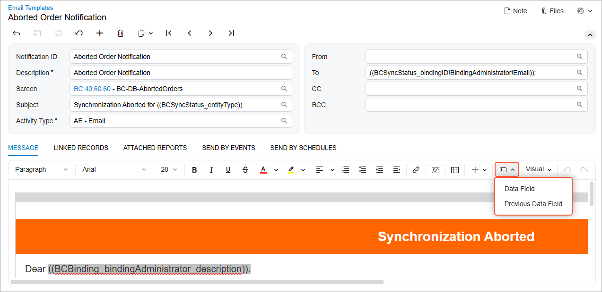
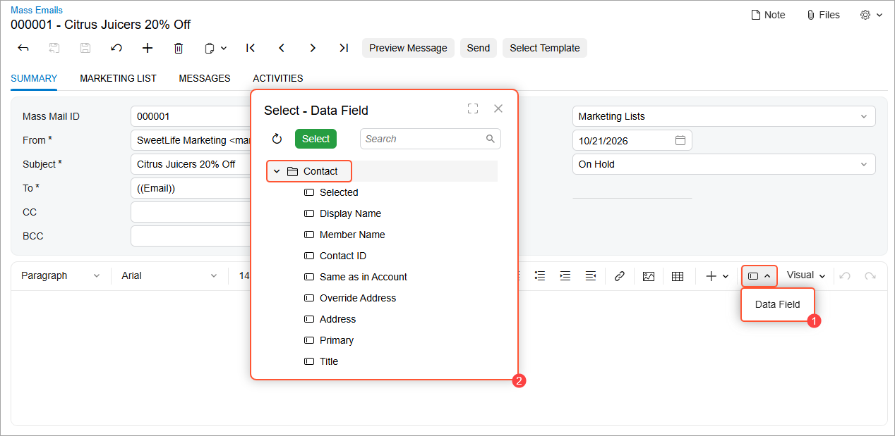

# Rich Text Editor: Configuration and Layout {#_6454fca1-767f-4c83-9ea5-cc8683590344 .concept}

In this topic, you can find general information about configuration of the rich text editor control as well as about layout adjustments.

## Configuration { .section}

To configure a rich text editor, you can use the [qp-rich-text-editor](https://help.acumatica.com/(W(1))/Help?ScreenId=ShowWiki&pageid=b1b64678-b4c2-d362-be31-eeefde7f4b9d) tag, as shown in the following code. The configuration parameters for the control are defined in the [IRichTextEditorConfig](https://help.acumatica.com/(W(1))/Help?ScreenId=ShowWiki&pageid=419b4741-deeb-21f0-b918-813d69158c96) interface.

```language-xml
<qp-rich-text-editor
  id="edBody"
  state.bind="EstimateRecordSelected.Body"
  class="stretch">
</qp-rich-text-editor>
```

You can also use the `field` or `qp-field` tag with the control type specified instead of the `qp-rich-text-editor` tag.

## Addition of Buttons to the Formatting Toolbar { .section}

While using a rich text editor, users may need to insert the previous or current value of a data field into the editing area. You can add the **Data Field** and **Previous Data Field** buttons to the formatting toolbar \(shown below\) to provide these capabilities..



To add these buttons to the formatting toolbar of the qp-rich-text-editor control, you use the insert-data-field and insert-data-field-prev tags. You add these tags within the opening and closing tags of the qp-rich-text-editor control, as shown below.

```language-xml
<qp-rich-text-editor ...>
  <insert-data-field 
    data-member="EntityItems"
    text-field="Name"
    value-field="Path"
    icon-field="Icon">
  </insert-data-field>
  <insert-data-field-prev
    data-member="EntityItemsWithPrevious"
    text-field="Name"
    value-field="Path"
    icon-field="Icon">
  </insert-data-field-prev>
</qp-rich-text-editor>
```

This code adds the **Data Field** and **Previous Data Field** buttons to the formatting toolbar.

When you click either button, the **Select - Data Field** dialog box opens. This dialog box lists the available views and their fields, which you can insert into the editing area.

The list of views in the dialog box depend on the value of the data-member property of the insert-data-field and insert-data-field-prev tags. If you want to make the fields from only a specific view available for selection, you can use the data-field-preview tag to specify:

-   The name of the view
-   The name of the graph in which this view is declared

See the following example.

```language-xml
<qp-rich-text-editor ...>
  <insert-data-field
  data-member="EntityItems"
  text-field="Name"
  value-field="Path"
  icon-field="Icon">
  </insert-data-field>
  <data-field-preview
  graph="PX.Objects.CR.ContactMaint"
  view="Contact">
  </data-field-preview>
</qp-rich-text-editor>
```

Based on this code, when you click the **Data Field** button \(Item 1 below\), the *Contact* view and its fields are displayed in the **Select - Data Field** dialog box \(Item 2\).



## Vertical Scroll in a Complex Layout { .section}

We do not recommend that you have three vertical scroll lines on a form, such as for a Summary area, grid, and rich text editor.

To avoid three vertical scroll lines, you make the following adjustments to the grid and rich text editor controls:

1.  Set the [expandToContent](https://help.acumatica.com/(W(5))/Help?ScreenId=ShowWiki&pageid=419b4741-deeb-21f0-b918-813d69158c96) property to *true* for the rich text editor control.
2.  Do not use resize in the grid.
3.  For the grid, specify [autoGrowInHeight](https://help.acumatica.com/(W(5))/Help?ScreenId=ShowWiki&pageid=fcde085e-8527-faeb-064e-17a6156a5499) equal to Fit.
4.  For the grid, specify [PageSize](https://help.acumatica.com/(W(5))/Help?ScreenId=ShowWiki&pageid=fcde085e-8527-faeb-064e-17a6156a5499) equal to *10*.

As a result, the form will include one scroll for the whole form. The grid will grow in height until it has 10 lines. If it has more than 10 lines, it will have pages.

**Parent topic:**[Rich Text Editor](../DeveloperGuide/UIDevRef_RichTextEditor_Mapref.md)

