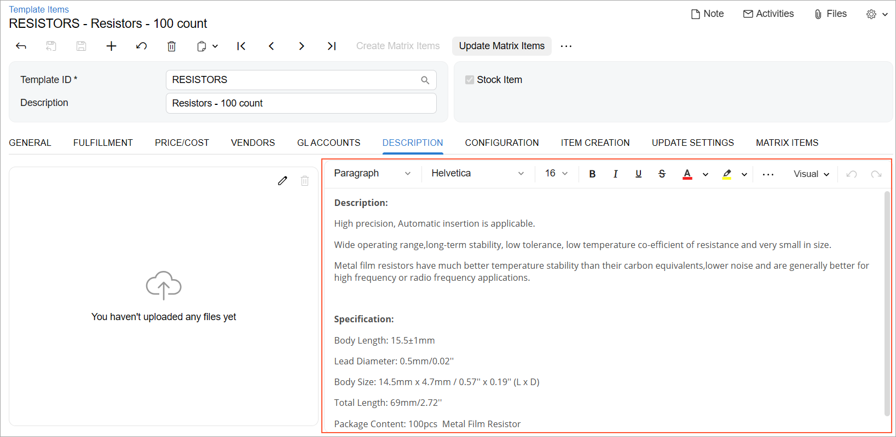
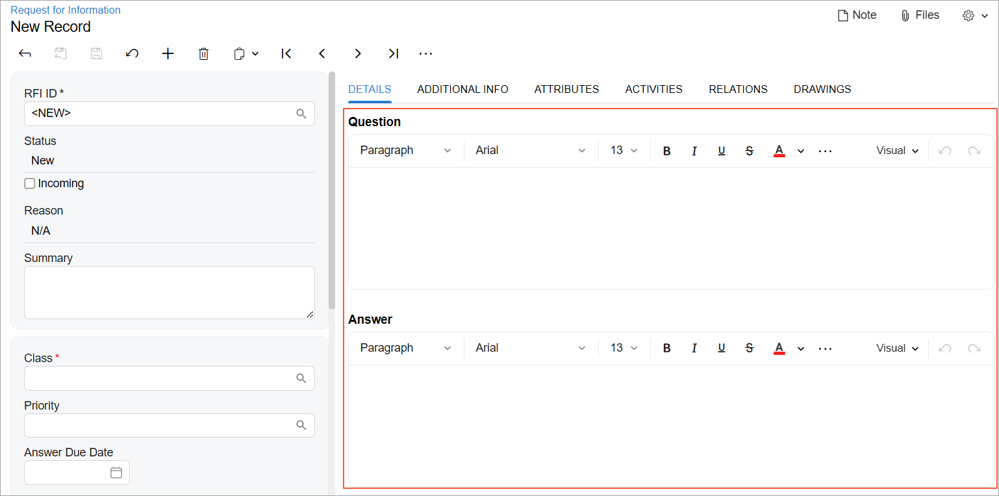
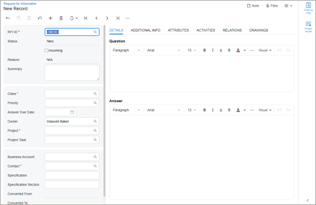
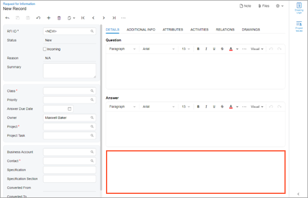

# Rich Text Editor: General Information {#_07ea878c-4ec6-4034-b846-52504c117527 .concept}

A rich text editor represents a text box with the formatting toolbar in the UI.

A rich text editor is defined by PXRichTextEdit in the Classic UI. In the Modern UI, you define a rich text editor either by using the field or qp-field tag with the control type specified or explicitly by using the [qp-rich-text-editor](https://help.acumatica.com/(W(1))/Help?ScreenId=ShowWiki&pageid=b1b64678-b4c2-d362-be31-eeefde7f4b9d) control.

## Learning Objectives { .section}

In this chapter, you will learn the following about a rich text editor:

-   The design guidelines for a rich text editor, including the naming conventions and layout recommendations
-   The proper configuration of a rich text editor for specific cases, such as when two rich text editors are used on one Acumatica ERP form

## Applicable Scenarios { .section}

You use a rich text editor on Acumatica ERP forms where users need to create, edit, and format text with various styles and media elements, such as in the following scenarios:

-   Composing and formatting emails that may use different fonts, colors, and embedded images
-   Formatting project descriptions, updates, and collaborative notes
-   Creating product descriptions and reviews with rich formatting

## Rich Text Editor ID { .section}

The ID of a rich text editor in HTML consists of two parts: the `ed` prefix and the semantic name. The semantic name describes the purpose of the element. For example, a rich text editor where a user provides the project issue description may have the `edProjectIssueDescription` ID, as the following code shows.

```language-xml
<qp-rich-text-editor id="edProjectIssueDescription"></qp-rich-text-editor>
```

## UI Naming Conventions { .section}

The following table shows the UI naming conventions for a rich text editor.

|Naming Convention|Example|
|-----------------|-------|
|If the contents of the rich text editor are clearly described by the container in which it is located, do not specify any name for the rich text editor.|The rich text editor on the **Description** tab of the [Template Items](../UserGuide/IN_20_30_00.md) \(IN203000\) form, which is shown in the following screenshot

|
|Use a noun or a noun phrase to describe the contents of a rich text editor if multiple rich text editors are used in one container. Preferably, the names of rich text editors should consist of no more than two words.|The **Question** and **Answer** rich text editors on the **Details** tab of the [Request for Information](../UserGuide/PJ_30_10_00.md) \(PJ301000\) form, which is shown in the following screenshot

|

## Recommendations for Organizing the Layout {#section_vv2_1y4_y4b .section}

The following table shows the recommendations for organizing the layout for a rich text editor.

|Correct|Incorrect|
|-------|---------|
|If two rich text editors are displayed on the UI vertically, we recommend that you explicitly stretch at least one of them.

 This will prevent empty spaces from being created between or after the rich text editors. Depending on your specific context, you may want to stretch either one or both of the rich text editors.

 To stretch the controls, you specify `class="stretch"` in the qp-rich-text-editor tag that represents the second rich text editor, as the following example shows. This causes the second rich text editor to expand its height to the end of its parent container and thus eliminates any empty space below it.

 ```
<qp-tab id="DetailsTab" caption="Details">
  <qp-caption caption="Question">
  </qp-caption>
  <qp-rich-text-editor ...>
  </qp-rich-text-editor>
  <qp-caption caption="Answer">
  <qp-rich-text-editor ... class="stretch">
  </qp-rich-text-editor>
</qp-tab>
```

|
|||

**Parent topic:**[Rich Text Editor](../DeveloperGuide/UIDevRef_RichTextEditor_Mapref.md)

