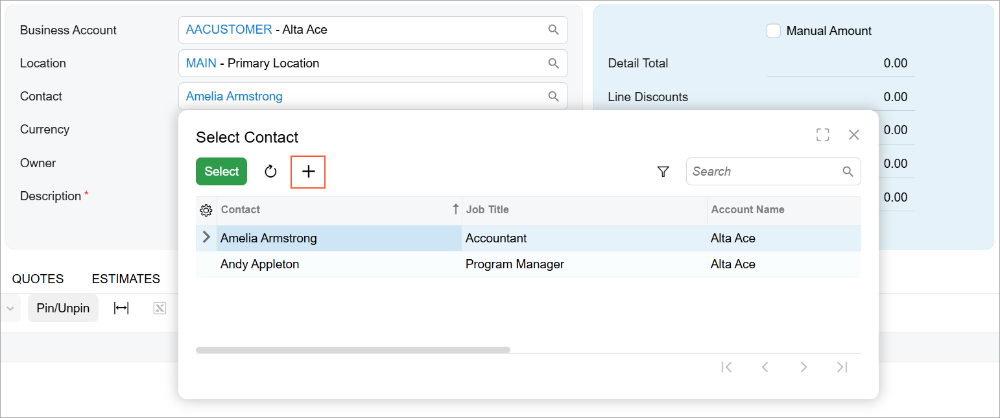

# Selector Control: Configuration of the Lookup Table {#_889916fd-4b77-421e-ac54-747dc48f9420 .concept}

You can configure the lookup table that is displayed when a user clicks the magnifier icon in the selector box.

## Configuring the Add New Record Button { .section}

You can specify which action is executed when a user clicks the **Add New Record** button in the lookup table, as shown in the following screenshot. By default, the system opens the relevant form with an empty record \(that is, no values except default ones are filled in\). To specify the action, use the addCommand property of the qp-selector config property.



Suppose that when a user clicks the **Add New Record** button in the selector control, the system needs to open a new record with prefilled values that depend on the user's data. For that purpose, you need to do the following:

1.  In the backend, define an action that opens a form with a new record and prefills the values depending on the user's data.
2.  In the frontend, declare a PXActionState property in the screen class for this action.
3.  In the controlConfig decorator for the form field, specify the action in the addCommand property, as shown in the following example.

    ```
    export class CROpportunityHeader extends PXView {
      @controlConfig({addCommand: "CreateNewContact"})
      ContactID: PXFieldState<PXFieldOptions.CommitChanges>;
    }
    ```


## Sorting Rows in the Lookup Table {#_3b4e567d-a1c2-49df-8233-0bcf6cd0d251 .section}

By default, the rows in the lookup table are sorted as follows:

-   If only plain text is displayed in the selector box \(`displayMode = "text"`\), the lookup table is sorted by the value of the `textField` property. The default value of the textField property is the SubstituteKey value of the PXSelector attribute on the DAC field.
-   Otherwise, the sorting is performed by `valueField`. The default value of the valueField property is the field in the Search&lt;&gt; command of the PXSelector attribute on the DAC field.

You can specify the field for sorting rows in the lookup table by specifying the column name in the textField property of the qp-selector config property. An example is shown in the following code.

```
@columnConfig({
  displayMode: GridColumnDisplayMode.Both,
  editorConfig: {
    textField: "title", displayMode: "text"
  }
})
ScreenID : PXFieldState;
```

For more details on the valueField and textField properties, see [Selector Control: Manual Configuration of the Value and Text](UIDevRef_Selector_ConfigureValueAndText.md).

**Parent topic:**[Selector](../DeveloperGuide/UIDevRef_Selector_Mapref.md)

