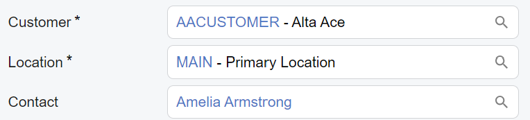
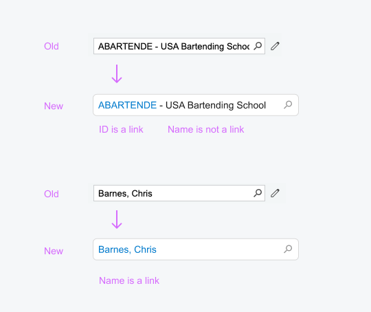
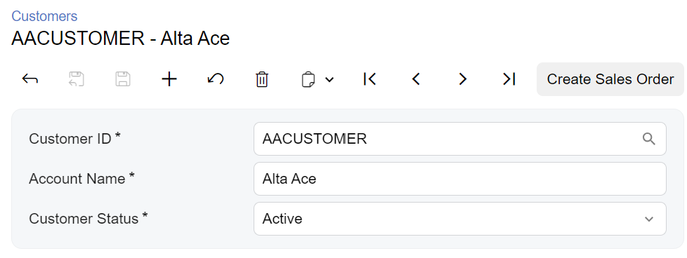

# Selector Control: General Information {#_1e70582c-06ab-47f1-8653-0b0f630ba233 .concept}

A selector control that consists of a box to hold a selected value and a lookup table where a user can select a value, as shown in the following screenshot.

A selector control is defined by PXSelector in the Classic UI. In the Modern UI, a selector control is defined by the field tag \(whose control type is automatically defined as a selector from the backend code\). In rare cases, a selector control in the Modern UI is defined explicitly by the [qp-selector](https://help.acumatica.com/(W(1))/Help?ScreenId=ShowWiki&pageid=26089c6f-5a63-9d30-2d33-827c98c3d439) control.

## Learning Objectives { .section}

In this chapter, you will learn the following about a selector control:

-   The design guidelines for the selector control, including the naming conventions and layout recommendations
-   The proper configuration of the selector control for specific cases, such as when it should display a link to a record
-   A detailed description of each property of the selector control
-   Differences between the selector control in the Classic UI and in the Modern UI

## Applicable Scenarios { .section}

You configure a selector control in the following cases:

-   A user needs to select a record from a list of possible records.
-   You need to display a box or a column with a record identifier.
-   You need to display the unique identifier of the existing record or the new record.
-   A user needs to be able to open the record by clicking on the link.

## Differences between the Classic UI and the Modern UI { .section}

The following screenshots demonstrate the difference between the `PXSelector` control in the Classic UI and the `qp-selector` control in the Modern UI.

The new selector control does not have the Edit button, which gave users of the Classic UI the ability to open the selected record for editing. Instead, in the Modern UI, the selector control displays a link to the selected record. A user clicks the link to open the record in a new window. For details on configuring a link in the selector control, see [Selector Control: Configuration of a Link](UIDevRef_Selector_Link.md).

To create a new record for a selector control in the Modern UI, a user needs to click the magnifier button and then click + on the toolbar of the lookup table. \(In the Classic UI, a user could do this by clicking the Edit button for an empty selector control.\)

## UI Naming Conventions { .section}

The following table shows the UI naming conventions for a selector control.

|Naming Convention|Example|
|-----------------|-------|
|For the label before the selector control, use a noun or noun phrase that describes the content of the element.Preferably, this label should consist of no more than two words.

**Tip:** Use **ID** in this name according to the following guidelines:

-   You use **ID** in the name if in this element, only the identifier of the entity can be selected and displayed \(as shown in the **Customer ID** box in the second screenshot\).
-   You do not use **ID** in the name if in this element, the identifier and the name of the entity \(separated by a hyphen\) is displayed \(as shown in the **Customer** box in the first screenshot\).

|

 

|

**Parent topic:**[Selector](../DeveloperGuide/UIDevRef_Selector_Mapref.md)

