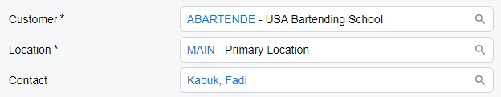
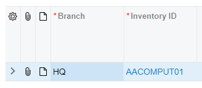

# Selector Control: Configuration of a Link {#_2e9d38bb-55ab-413a-a9c2-c54c4d1b2876 .concept}

A selector control can display a value as a link to the record whose identifier is displayed in the selector control. The link is configured differently depending on the location of the selector control.

## Selector Control in a Fieldset { .section}

In a fieldset, you add the link by specifying `allowEdit: true` in the controlConfig decorator for the field in TypeScript, as shown in the following example.

```language-javascript
@controlConfig({allowEdit: true, })
CustomerID: PXFieldState<PXFieldOptions.CommitChanges>;

@controlConfig({allowEdit: true, })
CustomerLocationID: PXFieldState;

@controlConfig({allowEdit: true, })
ContactID: PXFieldState;
```

The code above displays links, as shown below.



**Tip:** The `allowEdit: true` setting also adds the **+** \(**Add Row**\) button to the lookup table of the selector control.

## Selector Control in a Table { .section}

In a table, a link is displayed by default for a selector control. To remove the link, specify `hideViewLink: true` in the `columnConfig` decorator in TypeScript, as shown in the following example.

```language-javascript
@columnConfig({ hideViewLink: true })
BranchID: PXFieldState<PXFieldOptions.CommitChanges>;
```

The code above removes the link from the **Branch** column, as shown below.



## Link Behavior {#_8b030877-81b7-47e1-b29c-7d7735de8e2c .section}

You can configure which action is executed when a user clicks the link in the selector control. By default, the system opens the record that is selected by the user in the selector control. To specify a custom action, you use one of the following:

-   For a selector control located in a fieldset, the [editCommand](https://help.acumatica.com/(W(11))/Help?ScreenId=ShowWiki&pageid=f09209ae-c510-12ea-b69e-c24f1db45d18) property in the [controlConfig](https://help.acumatica.com/(W(11))/Help?ScreenId=ShowWiki&pageid=ece136fa-9f2c-a8b2-3b3c-aff23a4d1156) decorator, as shown in the following code

    ```language-javascript
    export class EPAssignmentMap extends PXView {
      @controlConfig({editCommand: "OpenForm"})
      GraphType: PXFieldState<PXFieldOptions.CommitChanges>;
    }
    ```

-   For a selector control located in a grid, the [linkCommand](https://help.acumatica.com/Help?ScreenId=ShowWiki&pageid=bcc7789a-04b4-7fc6-0e03-a9a9bc2d8e88) decorator

    ```language-javascript
    @gridConfig({
    	preset: GridPreset.Inquiry
    })
    export class RSSVWorkOrderToPay extends PXView {
    	@linkCommand<RS401000>("ViewOrder")
    	OrderNbr: PXFieldState;
    }
    ```


To use a custom action for the link in the selector control, you also need to do the following:

1.  In the graph, define an action that opens the entered form with the new record.
2.  In the TypeScript file of the form, declare a property of the PXActionState type for this action in the screen class.

**Parent topic:**[Selector](../DeveloperGuide/UIDevRef_Selector_Mapref.md)

