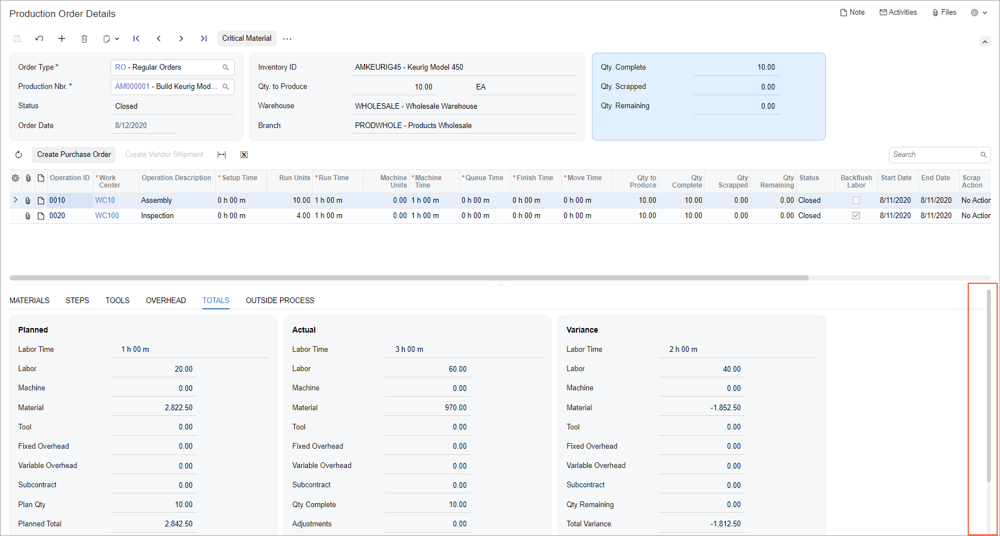
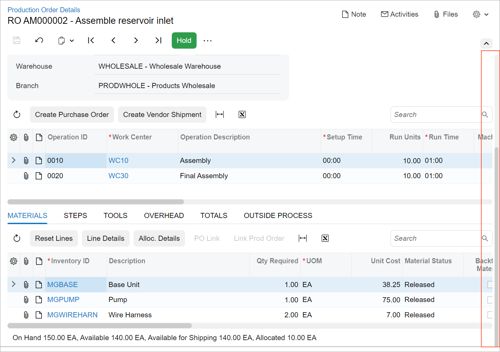

# Splitter: Configuration {#_c6b885b9-a37d-4ae4-bfa5-cb131b8ad916 .concept}

In this topic, you will learn how to configure a splitter control for different cases.

A splitter has many configuration options, which can be set up by means of the `config` property and the set of attributes in the HTML template. The full list of options is located in the `ISplitterConfig` interface.

## Splitting the Width and the Height { .section}

You can organize panes vertically and horizontally by specifying the value of the `split` attribute. By default, the panes are stacked vertically \(`split = "width"`\), which means that the width of the control is split into columns. When you specify `split="height"`, the height of the control is split into rows.

When the panes are stacked vertically \(`split = "width"`\) and the user adjusts the width of one of the panes, the other pane's width is adjusted accordingly. The width of the splitter itself does not change.

When the panes are stacked horizontally \(`split="height"`\) and the user adjusts the height of one of the panes, this pane's height is changed, but the height of the other pane remains fixed.

## Removing Scrollers From Splitter Panes { .section}

If you are using a splitter, the system may display scrollers for all panes, such as two horizonal scrollers and two vertical scrollers. This may not look very appealing.

As a possible solution, instead of using the splitter, you can use the `qp-resizer` control for one part or both parts of the splitter. In this case, a single vertical scroller will be displayed for the whole form.

For example, suppose that you need to display a table and a tab control below the table. You should put the table inside the `qp-resizer` control and then specify `autoAdjustColumns: true` in the `gridConfig` decorator for this table.

As the result, the paging buttons will appear for the table, and no scroller will be displayed for the table or the tabs.

The following table shows two implementations of this example, along with screenshots showing the result: the first column shows the qp-splitter control, and the second column illustrates the qp-resizer control.

|With qp-splitter|With qp-resizer|
|----------------|---------------|
|```
<qp-splitter id="ProdSplitter" 
  split="height" 
  initial-split="50%" state="normal" 
  reversed.bind="true">
  <split-pane>
    <qp-grid id="gridOperations" 
      view.bind="ProdOperRecords"></qp-grid>
  </split-pane>
  <split-pane>
    <qp-tabbar id="mainTab"></qp-tabbar>
  </split-pane>
</qp-splitter>
```

 

|HTML Template:```
<qp-resizer id="ProdResizer" 
  initial-size="200px" 
  min-size="140px">
  <qp-grid id="gridOperations" 
    view.bind="ProdOperRecords"></qp-grid>
</qp-resizer>
```

TypeScript:

```
@gridConfig({
    preset: GridPreset.Details,
    adjustPageSize: true,
    autoRepaint: [...],
})
export class AMProdOper extends PXView {...}
```



|

**Parent topic:**[Splitter](../DeveloperGuide/UIDevRef_Splitter_Mapref.md)

