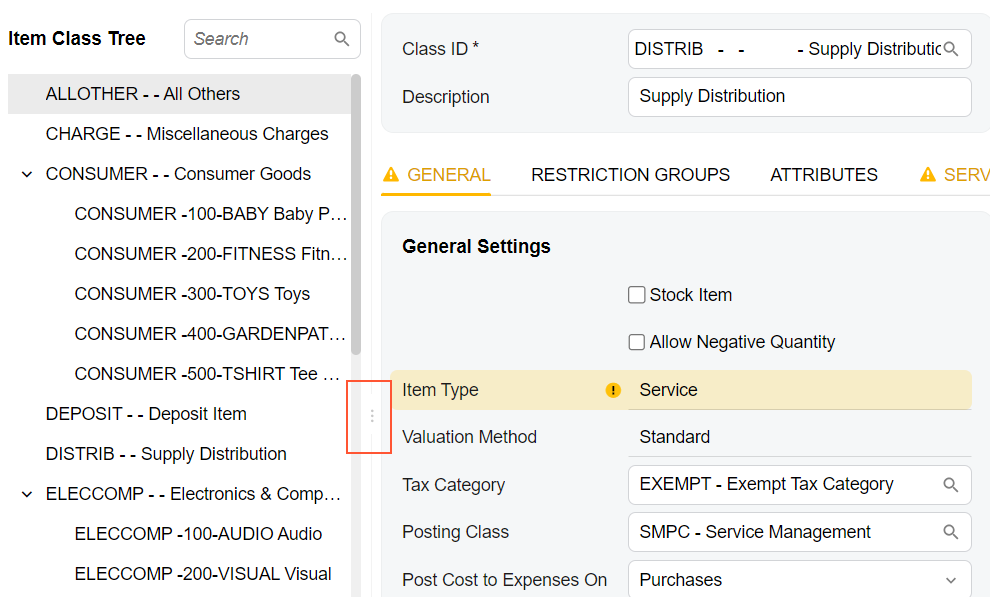
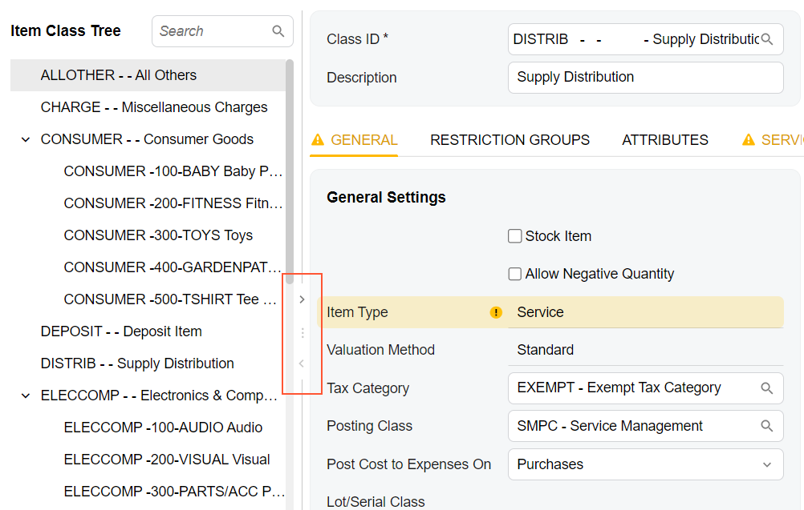
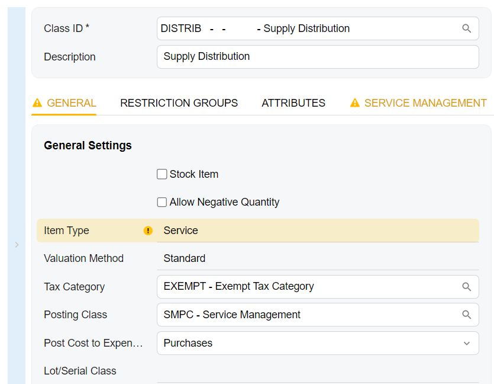
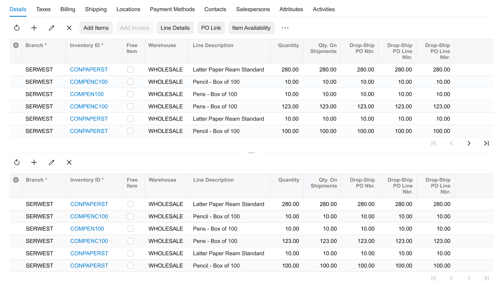

# Splitter: General Information {#_08002ee3-ea04-4d66-8dfd-2a7b34417c77 .concept}

A *splitter* is a control that gives you the ability to organize two panes with controls so that the panes can occupy the same part of the form, and give a user an ability to adjust the width of the panes and hide and show them separately.

## Learning Objectives { .section}

In this chapter, you will learn the following about a splitter:

-   The design guidelines for the splitter, including the naming conventions and layout recommendations
-   The proper configuration of the splitter for specific cases, such as removing scrollers
-   The details of each property of the splitter

## Applicable Scenarios { .section}

You configure a splitter when you need to organize two panes with controls on a form and give users the ability to close each of the areas.

## Splitter Control { .section}

The splitter control looks like a line with three dots in the middle and arrows that can be used to open or close the encased controls. When you hover over the three dots \(see the first screenshot below\), the two arrows appear next to it \(as shown in the second screenshot\).





When you click the top arrow, you collapse the right pane, when you click the bottom arrow, you collapse the left pane. The following screenshot shows the left pane collapsed.



The splitter control is defined by the [qp-splitter](https://help.acumatica.com/(W(8))/Help?ScreenId=ShowWiki&pageid=639af4b6-48cd-c413-3ef9-2d4526d593f7) tag in HTML.

A splitter contains panes that can be closed or opened by the user. A splitter can include exactly two panes. Each pane can include any number of controls.

Each pane is defined by the split-pane tag \(so that the qp-splitter tag contains two sets of the split-pane tags\). To put a control in a pane, you add the `split-pane` tag inside the `qp-splitter` tag, and then add the control inside the `split-pane` tag that corresponds to the pane where you want to put the control.

The following example shows two tables located in two panes.

```
<qp-splitter id="sp1">
  <split-pane>
    <qp-grid id="formReceipts" view.bind="Receipts">
    </qp-grid>
  </split-pane>
  <split-pane>
    <qp-grid id="formAPDocs" view.bind="APDocs">
    </qp-grid>
  </split-pane>
</qp-splitter>
```

## Splitter ID { .section}

An ID of a splitter in HTML consists of two parts, the `splitter` prefix and the semantic name. The semantic name describes the purpose of the element. For example, a splitter that includes two tables on the **PO History** tab may have the `splitter-POHistory` ID, as the following code shows.

```
<qp-splitter id="splitter-POHistory"></qp-splitter>
```

For each pane, the id should consist of two parts, the `splitPaneA` or `splitPaneB` prefix and the semantic name. The letter A or B in the prefix corresponds to the first pane and the second pane, respectively. The semantic name should be identical to the semantic name specified in the id of the qp-splitter tag. An example is shown in the following code.

```
<qp-splitter id="splitter-POHistory">
<split-pane id="splitPaneA-POHistory">
...
</split-pane>
<split-pane id="splitPaneB-POHistory">
...
</split-pane>
</qp-splitter>
```

## Recommendations for Organizing the Layout {#section_vv2_1y4_y4b .section}

The following table shows the recommendations for organizing the layout for the splitter.

|Correct|Incorrect|
|-------|---------|
|When each pane of a splitter contains a table, and the panes are organized horizontally, make the splitter visible.To make the splitter visible, specify `fading = "false"` in the qp-splitter tag, as shown below.

```
<qp-splitter fading="false">...</qp-splitter>
```

Do not configure a splitter between two horizontal tables with any of the following parameters: `fading="true"` and `invisible="true"`.

|
|||

**Parent topic:**[Splitter](../DeveloperGuide/UIDevRef_Splitter_Mapref.md)

