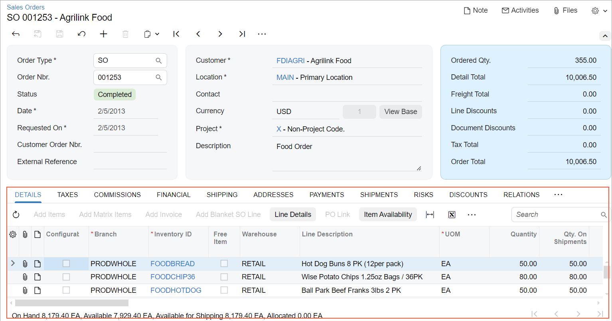
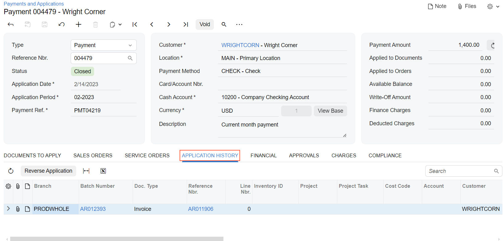
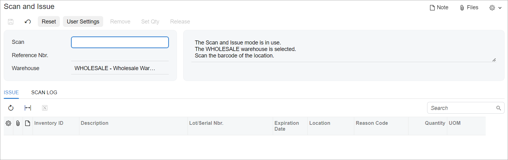
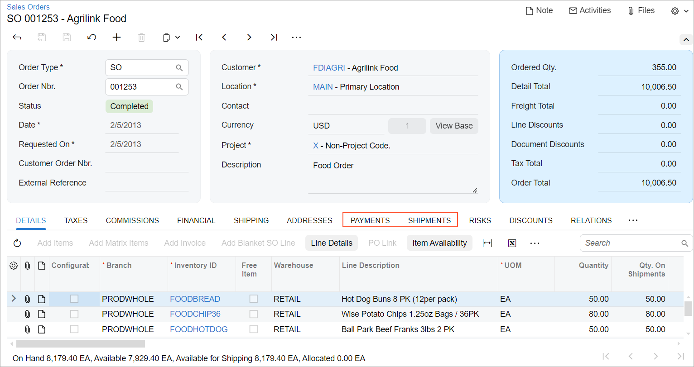
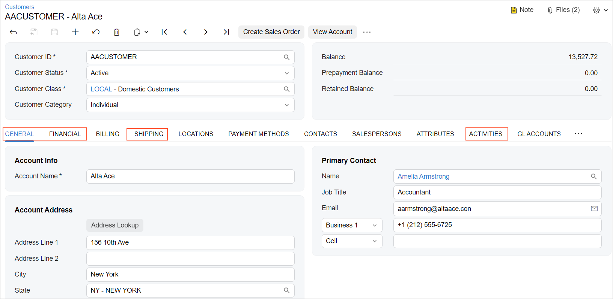
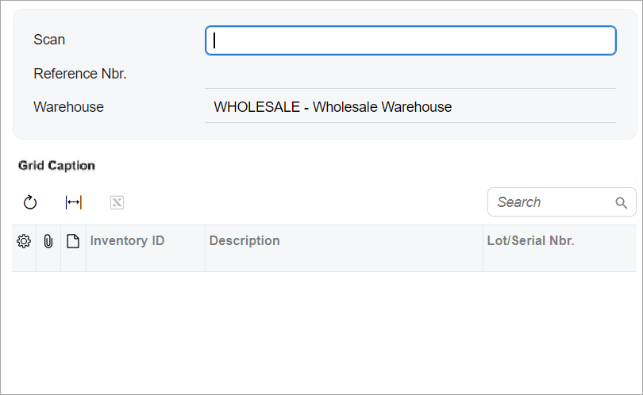
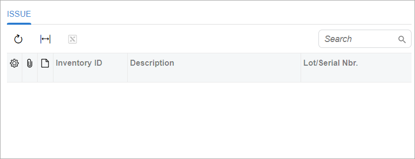

# Tab: General Information {#_aa56a558-dac8-47f2-85f2-6ad6a68360ba .concept}

A tab is a control that looks like a bookmark with a textual title, as shown in the following screenshot. A tab is usually located in a group of tabs, which is called *tab bar*. Users click tabs to navigate between multiple views within a single window.



A tab is defined by PXTabItem in the Classic UI and by the [qp-tab](https://help.acumatica.com/(W(8))/Help?ScreenId=ShowWiki&pageid=aac6d7aa-e2f9-aac3-838d-db12a2bcd4e3) that is nested in the qp-tabbar tag in the Modern UI. A tab bar is defined by PXTab in the Classic UI and by [qp-tabbar](https://help.acumatica.com/(W(8))/Help?ScreenId=ShowWiki&pageid=7660d36c-0c00-81dd-ef46-0640b84a7cb1) in the Modern UI.

## Learning Objectives { .section}

In this chapter, you will learn the following information about a tab:

-   The design guidelines for a tab, including the naming conventions and layout recommendations
-   The proper configuration of a tab for specific cases, such as conditional visibility of the tab
-   A detailed description of each property of API elements that are related to a tab

## Applicable Scenarios { .section}

You configure a tab in the following cases:

-   You want to keep a clear distinction between various sets of information, so that a user can easily switch between different contexts within the same Acumatica ERP form.
-   You need to guide a user through a step-by-step workflow and simplify complex tasks. You organize a layout with multiple tabs where each tab represents a sequential stage.

## Tab ID { .section}

An ID of a tab in HTML consists of two parts, the `tab` prefix and the semantic name. An ID of a tab bar has the `tabs` prefix and the semantic name. The semantic name describes the purpose of the element. For example, a tab that displays invoices may have the `tabInvoices` ID, and the whole tab bar that displays the settings of an sales order may have the `tabsSOOrder` ID, as the following code shows.

```
<qp-tabbar id="tabsSOOrder">
  <qp-tab id="tabInvoices">
  </qp-tab>
</qp-tabbar>
```

## UI Naming Conventions { .section}

The following table shows the UI naming conventions for tabs.

|Naming Convention|Example|
|-----------------|-------|
|Use a noun or noun phrase.|The **Application History** tab on the [Payments and Applications](../UserGuide/AR_30_20_00.md) \(AR302000\) form, which is shown in the following screenshot

|
|Use a name that is as short as possible while maintaining clarity. That is, the tab name should clearly distinguish the tab’s content from the content of other tabs on the form.|The **Issue** and **Scan Log** tabs on the [Scan and Issue](../UserGuide/IN_30_20_20.md) \(IN302020\) form, which are shown in the following screenshot

|
|For tabs that contain lists or tables with links to related records, use the plural form of the related record's name.|The **Payments** and **Shipments** tabs on the [Sales Orders](../UserGuide/SO_30_10_00.md) \(SO301000\) form, which are shown in the following screenshot

|
|For tabs with standard content, use the following standard names:-   **General**: The core information about a record
-   **Details**: The detail lines of the record
-   **Addresses**: The addresses and contact information related to the record
-   **Financial**: The financial settings of the record
-   **Shipping**: The shipping settings of the record
-   **Mailing &amp; Printing**: The mailing and printing settings that can be used for the record, class, or functional area
-   **Taxes**: The taxes applied to the record
-   **Discounts**: The discounts applied to the record
-   **Approvals**: The history of approvals for the record
-   **Activities**: Activities related to the record

|The **General**, **Financial**, **Shipping**, and **Activities** tabs on the [Customers](../UserGuide/AR_30_30_00.md) \(AR303000\) form, which are shown in the following screenshot

|

## Recommendations for Organizing Layout {#section_vv2_1y4_y4b .section}

The following table shows the recommendations for organizing the layout for tabs.

|Correct|Incorrect|
|-------|---------|
|Do not create a form with one tab. Instead of a single tab, use a container with a title, such as a table with a title.|
|||

**Parent topic:**[Tab](../DeveloperGuide/UIDevRef_Tab_Mapref.md)

