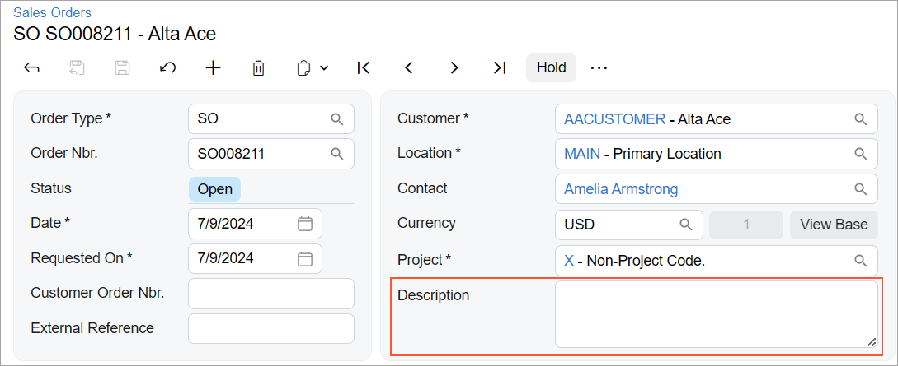

# Text Box: General Information {#_b192712f-d182-4b47-96ee-c357d0a56dd0 .concept}

A text box is a control in which a user enters a text string.

A text box is defined by PXTextEdit in the Classic UI. In the Modern UI, a text box is defined by the field tag \(whose control type is automatically defined as a text box from the backend code\). In rare cases, a text box in the Modern UI is defined explicitly by the [qp-text-editor](https://help.acumatica.com/(W(8))/Help?ScreenId=ShowWiki&pageid=4f175440-d59a-86e9-f522-66e72329ccff) control.

## Learning Objectives { .section}

In this chapter, you will learn the following about a text box:

-   The proper configuration of a text box for specific cases, such as when a text box needs to be configured as a multiline text box
-   A detailed description of each property of a text box

## Applicable Scenarios { .section}

You configure text boxes in the following user scenarios:

-   A user enters some information on a single line, such as the value of a required field.
-   A user enters some detailed information on multiple lines, such as the description of a record.
-   A user enters sensitive information that must be masked while the user is typing, such as the value of a password field.

## UI Naming Convention { .section}

The following table shows the UI naming convention for a text box.

|Naming Convention|Example|
|-----------------|-------|
|Use a noun or a noun phrase to describe the contents of a text box. Preferably, text box names should consist of one or two words.|The **Description** text box on the [Sales Orders](../UserGuide/SO_30_10_00.md) \(SO301000\) form, which is shown in the following screenshot.

|

**Parent topic:**[Text Box](../DeveloperGuide/UIDevRef_TextBox_Mapref.md)

