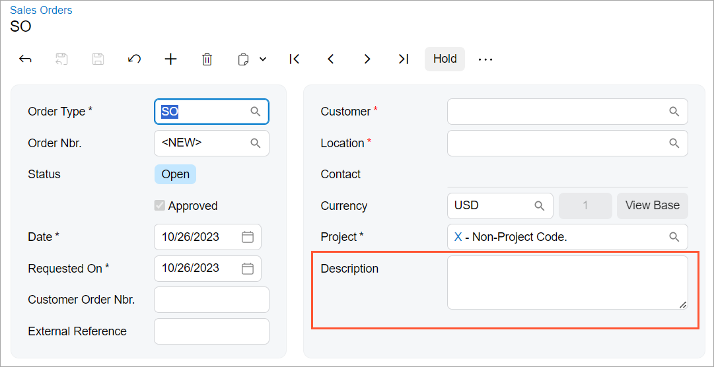

# Text Box: Multiline Text Box {#_5ce953ff-b70b-4ead-a228-894f2a692789 .concept}

You can configure a multiline text box by using one of the following approaches:

-   Using code in TypeScript \(recommended\)
-   Using code in HTML

**Tip:** You should use multiline text boxes in the Modern UI instead of text boxes that span multiple columns in the Classic UI.

An example of a multiline text box is shown in the following screenshot.



## Configuring a Multiline Text Box with TypeScript \(Recommended\) { .section}

To configure a multiline text box with TypeScript, you use the controlConfig decorator with the specified rows property, which specifies the number of lines in the control, and define the field with the PXFieldOptions.Multiline option, as the following example shows.

```
@controlConfig({rows: 2})
DocDesc: PXFieldState<PXFieldOptions.Multiline>;
```

In the HTML code, the field is defined as shown in the following code.

```
<field name="DocDesc"></field>
```

## Configuring a Multiline Text Box with HTML { .section}

To configure a multiline text box only in an HTML template, you specify the following attributes in the `field` declaration:

-   `config-type.bind="1"`, which indicates that the control has multiple lines.
-   `config-rows.bind="N"`, which specifies the number of lines in the control \(where `N` is the number of lines\).

An example of a multiline box is shown in the following code.

```
<field name="OrderDesc" config-type.bind="1" config-rows.bind="2"></field>
```

## Adding a New Line in the Multiline Text Box { .section}

By default, when a user clicks Enter in the multiline text box, the focus is shifted to the next control. To add a new line, the user should click Ctrl+Enter.

You can give users the ability to create a new line by pressing Enter. To do it, assign `true` to the `ITextEditorControlConfig.enterKeyAddsNewLine` property, as shown in the following code.

```
@fieldConfig({
  controlType: "qp-text-editor",
  controlConfig: {
    type: 1,
    rows: 13,
    enterKeyAddsNewLine: true
  }
})
Content: PXFieldState;
```

**Parent topic:**[Text Box](../DeveloperGuide/UIDevRef_TextBox_Mapref.md)

