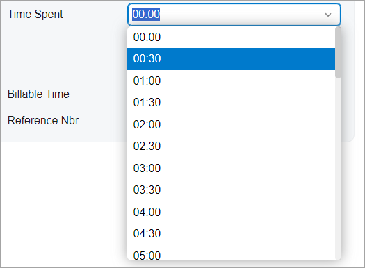
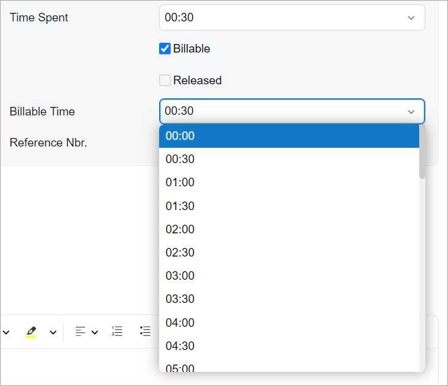

# Time Span: General Information {#_494f36ba-dd6d-47e6-8763-81bf1729b782 .concept}

A time span is a drop-down control that combines a text box with a list of options. The options of the control represent the time periods from 0 to 24 hours in the following format: `XX:YY`, where `XX` is the number of hours, and `YY` is the number of minutes. An example of a time span control is shown in the following screenshot.



A time span control is defined by the PXTimeSpan tag in the Classic UI. In the Modern UI, a time span is defined by the field tag, whose control type is automatically defined as a time span from the backend code. In rare cases, a time span in the Modern UI is defined explicitly by the [qp-time-span](https://help.acumatica.com/(W(8))/Help?ScreenId=ShowWiki&pageid=7598b163-70cc-295c-6f34-531fe9600721) tag. If the control is used in a column, the control is defined with the *qp-time-span* editorType in the controlConfig decorator.

The time span control is implemented as an extension of the selector control, so it has the same base properties and behavior.

## Learning Objectives { .section}

In this chapter, you will learn the following about a time span control:

-   The design guidelines for the time span, including the naming conventions and layout recommendations
-   The details of each property of the time span

## Applicable Scenarios { .section}

You configure a time span control when you need to add a control where a user can select a period of time, such as the amount of time spent on an activity.

## UI Naming Convention { .section}

The following table shows the UI naming convention for a combo box.

|Naming Convention|Example|
|-----------------|-------|
|Use a noun or a noun phrase to describe the contents of a time span control. Preferably, time span names should consist of one or two words.|The **Time Spent** and **Billable Time** time span controls on the [Activity](../UserGuide/CR_30_60_10.md) \(CR306010\) form, which is shown in the following screenshot.

|

## Adding the Time Span Control in a Table {#_fc30483d-57d6-4e59-bfa8-3b0bf0ccf263 .section}

To add the time span control in a column of a table, specify the editorType property of the columnConfig decorator. To allow a user to edit the value in the cell by typing it, specify `renderEditorText: true`, as shown in the following example.

```
@columnConfig({ renderEditorText: true, editorType: "qp-time-span" })
TimeSpent: PXFieldState<PXFieldOptions.CommitChanges>;
```

## Differences Between the Classic UI and the Modern UI { .section}

In the Classic UI, a user could only do one of the following: enter the number of minutes or the number of hours, or select an existing value from the list.

While using the time span control in the Modern UI, a user can enter both hours and minutes at the same time and enter the colon symbol between them—for example, *1:40*, meaning 1 hour and 40 minutes. This functionality is supported by default, so you do not need to specify additional parameters.

## Default Configuration { .section}

By default, the time span control has the following configuration:

-   It is optional \(`required: false`\).
-   String values are allowed in the control \(`valueType: NetType.String`\).
-   The suggester is turned off \(`autoSuggest : null`\).
-   Empty values are allowed \(`allowNull : true`\).
-   The list of options in the drop-down list is empty \(`options : null`\).

**Parent topic:**[Time Span](../DeveloperGuide/UIDevRef_TimeSpan_Mapref.md)

