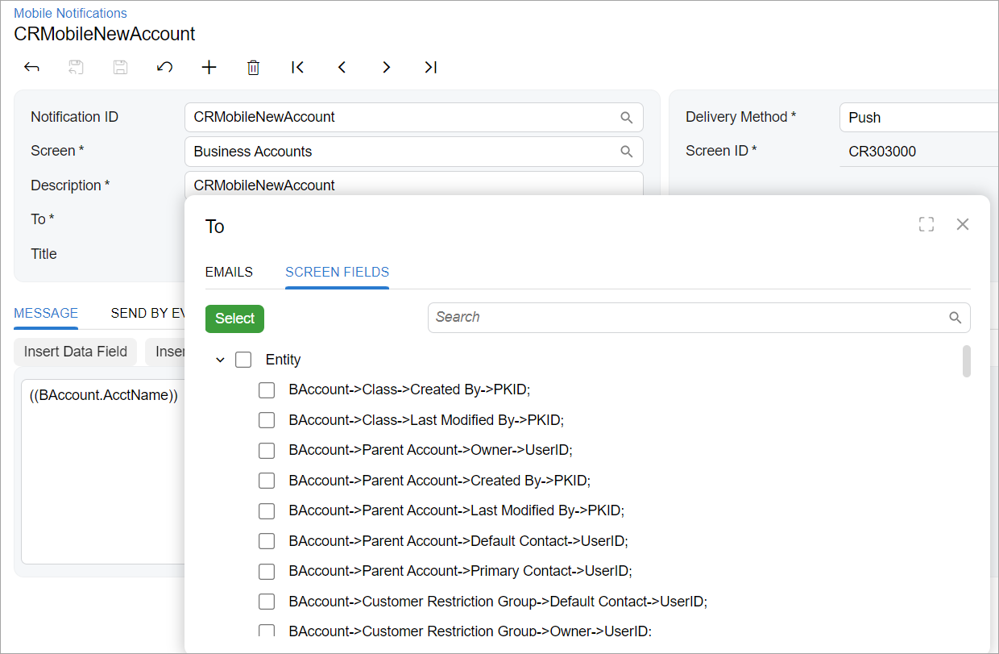

# Tree Selector Control: General Information {#_20176915-219f-4f57-b512-0dd86b48fbf8 .concept}

A tree selector control is a control that allows a user to select a value from a tree view, as shown in the following screenshot. A tree selector control can include two tabs: one tab displays the data in the selector table, another tab displays the data as a tree view.

In the Classic UI, a tree control with two tabs is defined with the PXTreeSelectorWithGrid control, a tree control without tabs is defined with the PXTreeSelector control. In the Modern UI, you use the [qp-tree-selector](https://help.acumatica.com/(W(8))/Help?ScreenId=ShowWiki&pageid=cafc43b3-b61d-df8d-2311-7722175df7e2) control to define both kinds of the tree conrol.

## Learning Objectives { .section}

In this chapter, you will learn about the proper configuration of a tree selector control for specific cases, such as for a tree selector control located in a table cell

## Applicable Scenarios { .section}

You configure a tree if you need to display a hierarchical data structure, such as an organizational chart, a category structure, or nested menu items, in a box or in a table cell.

**Parent topic:**[Tree Selector](../DeveloperGuide/UIDevRef_TreeSelector_Mapref.md)

