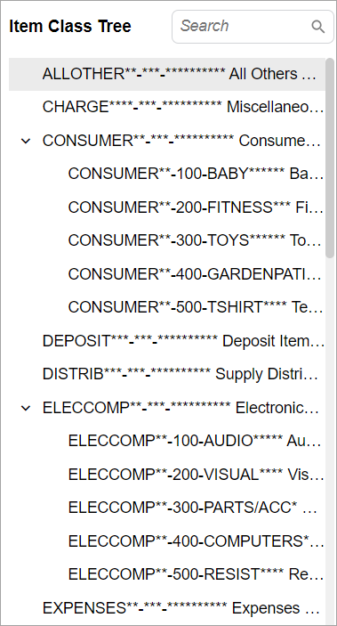

# Tree: General Information {#_591c2b23-45b8-478a-92a7-52eb44190f01 .concept}

A tree in the user interface represents a hierarchical data structure, which resembles an inverted tree with a root node at the top and branches extending downward. Each node in the tree represents a piece of data. The connections between nodes illustrate the relationships between them. The following screenshot shows an example of a tree.



A tree is defined by PXTree or PXTreeView in the Classic UI and by [`qp-tree`](https://help.acumatica.com/(W(8))/Help?ScreenId=ShowWiki&pageid=4efbaa8c-6e11-206b-0a33-c546ec4693ea) in the Modern UI.

## Learning Objectives { .section}

In this chapter, you will learn the following about a tree:

-   The design guidelines for a tree
-   The proper configuration of a tree

## Applicable Scenarios { .section}

You configure a tree if you need to display a hierarchical data structure, such as an organizational chart, a category structure, or nested menu items.

## Tree ID { .section}

An ID of a tree in HTML consists of two parts, the `tree` prefix and the semantic name. The semantic name describes the purpose of the element. For example, a tree that displays the budget tree may have the `treeBudget` ID, as the following code shows.

```
<qp-tree id="treeBudget"></qp-tree>
```

**Parent topic:**[Tree](../DeveloperGuide/UIDevRef_Tree_Mapref.md)

