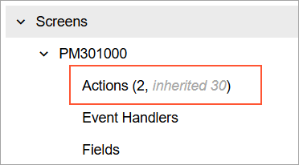

# Tree: Markup of a Tree Node Using HTML {#_0ccd17e7-b2a5-4509-9f73-bda7052b6baf .concept}

You can mark up the text of a node using HTML. For that purpose, you need to do the following:

-   In the treeConfig decorator, specify renderHTML: true
-   In backend, generate the text of the node including the HTML tags

For example, suppose that in a tree node, you need to display part of the text in italics, as shown in the following screenshot.



For that purpose, you need to generate the following text of the node in backend.

```
Actions (2, <span class="nodeHint">inherited 30</span>)
```

In TypeScript, you need to configure the tree, as shown in the following code.

```
@treeConfig({
	dynamic: true,
	hideRootNode: true,
	idField: "NodeID",
	textField: "Title",
	modifiable: false,
	mode: "single",
	singleClickSelect: true,
	syncPosition: true,
	**renderHTML: true**,
})
export class SiteMapTree extends PXView  {
	NodeID: PXFieldState;
	...
}
```

**Parent topic:**[Tree](../DeveloperGuide/UIDevRef_Tree_Mapref.md)

