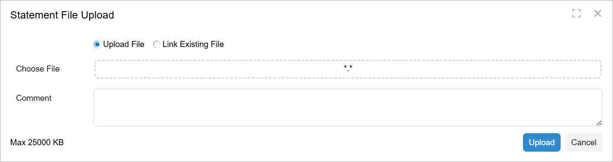

# Upload Dialog Box: General Information {#_3c120361-d33e-47c7-b2f3-42ddc8256c1b .concept}

An upload dialog box is a pop-up panel or window where a user can select and upload a file. An upload dialog box opens when a user clicks a button or a link. This dialog box looks like a modal pop-up panel where a user can select a file from the computer file system, leave a comment, and click **Upload** or **Cancel**. The following screenshot shows an upload dialog box.



## Learning Objectives { .section}

In this chapter, you will learn the following about an upload dialog box:

-   The design guidelines for the upload dialog box, including the naming conventions and layout recommendations
-   The proper configuration of the upload dialog box for specific cases

## Applicable Scenarios { .section}

You configure the upload dialog box when you want a user to upload a file whose contents can be loaded into the form.

**Note:** Users can also attach a file to a record by clicking the **Files** button on the form title bar of the form. With this approach, the contents of the file cannot be processed in code.

## Upload Dialog Box ID { .section}

The ID of an upload dialog box in HTML consists of two parts: the `dlg` prefix and the semantic name. The semantic name describes the purpose of the element. For example, a dialog box that uploads a ZIP package may have the `dlgUploadPackage` ID, as the following code shows.

```
<qp-upload-dialog id="dlgUploadPackage"></qp-upload-dialog>
```

## UI Naming Convention { .section}

The following table shows the UI naming convention for the upload dialog box.

|Naming Convention|Example|
|-----------------|-------|
|Ideally, the name of the button that opens the dialog box should be identical to the caption of the dialog box. If the caption is too long, the button name may be a short version of the caption.|The name of the dialog box is **Upload New File Version**. The name of the button that opens the dialog box may be either **Upload New File Version** or the shorter **Upload File Version**.|

**Parent topic:**[Upload Dialog Box](../DeveloperGuide/UIDevRef_UploadDialog_Mapref.md)

