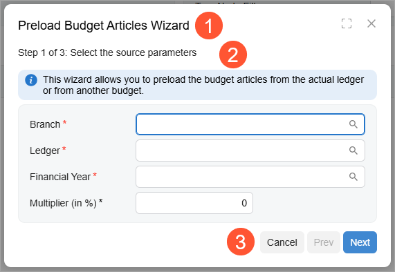

# Wizard: General Information {#_525fda55-c383-4045-b4dd-daa5cc3edc01 .concept}

You can configure a wizard control to divide multiple controls into several steps and make it easier for a user to provide values. In this topic, you will learn about the wizard control, its components, and its configuration.

## Learning Objectives { .section}

In this chapter, you will learn the following about the wizard control:

-   The design guidelines for the wizard control, including the naming conventions and layout recommendations
-   The proper configuration of the wizard control for specific cases

## Applicable Scenarios { .section}

You configure the wizard control when you want to a user to provide values for multiple fields and guide a user through a sequence of discrete steps.

## Overview of the Wizard Control { .section}

A wizard is a control that can consist of one step or multiple steps, each of which focuses on a part of a larger process. Each step may include instructions or prompts and a set of controls, such as boxes and tables, where users can view and enter data. A user can navigate between steps by clicking buttons at the bottom of the wizard.

The wizard control includes the following components:

-   A title at the top of the wizard \(Item 1 in the screenshot\)
-   A set of steps; Item 2 in the screenshot below shows the first step of the wizard. The wizard can display only one step at a time.
-   The bottom toolbar with buttons \(Item 3\).

    A toolbar contains the following buttons depending on the step of the wizard:

    -   **Cancel**: This button is active on each step of the wizard.
    -   **Prev**: This button is active on each step of the wizard except the first one.
    -   **Next**: This button is active on each step of the wizard except the last one.
    -   **Done**: This button is displayed only on the last step of the wizard.



A wizard is defined by PXWizard in the Classic UI. In the Modern UI, a wizard can be defined by the [qp-wizard](https://help.acumatica.com/Help?ScreenId=ShowWiki&pageid=67eb60e0-a2c4-4420-e797-1556d7f4784e) control.

To define each step of the wizard, you should use the [qp-tab](https://help.acumatica.com/Help?ScreenId=ShowWiki&pageid=aac6d7aa-e2f9-aac3-838d-db12a2bcd4e3) control inside the [qp-wizard](https://help.acumatica.com/Help?ScreenId=ShowWiki&pageid=67eb60e0-a2c4-4420-e797-1556d7f4784e) control.

## Configuration of the Wizard Control { .section}

A wizard control is typically displayed inside a dialog box, but it can also be displayed in a container control of a form, such as a tab or the Summary area

**Note:** If you need to define a wizard inside a dialog box, you should first define the dialog box. You do this by defining the action that opens the dialog box and adding the [qp-panel](https://help.acumatica.com/Help?ScreenId=ShowWiki&pageid=263bbb26-0eb6-c6fd-f37f-6d10269965f2) tag in HTML. For more details, see [Dialog Box: Opening a Dialog Box](UIDevRef_DialogBox_Open.md) and [Dialog Box: General Information](UIDevRef_DialogBox_GeneralInfo.md).

To define a wizard control, do the following:

1.  In TypeScript, define the configuration of the wizard control by using the properties of the [IWizardConfig](https://help.acumatica.com/Help?ScreenId=ShowWiki&pageid=cb56332d-a454-d3b8-7eba-1e187d67e222) interface.

    The following code shows a configuration that specifies the title of the wizard and an action for the **Next** button of the wizard. For details, see [Wizard: Configuration of Buttons](UIDevRef_Wizard_Actions.md).

    ```language-javascript
    export class GL302010 extends PXScreen {
      wizardConfig: IWizardConfig = { 
        caption: ImportMessages.WizardCaption,
        nextCommand: "wizardNext"
      };
    }
    ```

    **Note:** You can also define the properties from the IWizardConfig interface in HTML, as shown below.

    ``` {#codeblock_uqy_4w5_qgc .language-xml}
    <qp-wizard ... caption="Preload Budget Articles">
    ```

2.  In TypeScript, define views for the controls that are displayed on different steps of the wizard.
3.  In HTML, add the qp-wizard tag. In the config.bind property, specify the configuration from Instruction 1.

    The following code shows how to specify the configuration that was defined in TypeScript.

    ```language-xml
    <qp-wizard id="wizardBudgetArticles" config.bind="wizardConfig">
    </qp-wizard>
    ```

    **Note:** If you need to define a wizard inside a dialog box, put the qp-wizard tag inside the qp-panel tag, which corresponds to a dialog box. The caption specified for the qp-panel tag is the title of the wizard.

4.  In the qp-wizard tag, define the layout of each step in a [qp-tab](https://help.acumatica.com/Help?ScreenId=ShowWiki&pageid=aac6d7aa-e2f9-aac3-838d-db12a2bcd4e3) tag, as shown in the following code.

    To specify the title of the step, use the caption attribute of the qp-tab tag. The "Step X of Y:" prefix is calculated and added automatically to the caption string.

    ```language-xml
    <qp-tab id="tabWizardBudgetArticles-SourceParameters" 
      caption="Select the source parameters"">
      <qp-info-box caption="This wizard allows you to ..." type="info"></qp-info-box>
      <qp-template id="formWizardBudgetArticles-SourceParameters" name="1">
        <qp-fieldset slot="A" id="panelWizard-SourceParameters" view.bind="PreloadFilter">
          <field name="branchID"></field>
          ...
        </qp-fieldset>
      </qp-template>
    </qp-tab>
    ```

    The overall structure of the qp-wizard control in HTML can look as shown in the following code.

    ```language-xml
    <qp-wizard ...>
      <qp-tab ... > <!-- step 1 --> </qp-tab>
      <qp-tab ... > <!-- step 2 --> </qp-tab>
      <qp-tab ... > <!-- step 3 --> </qp-tab>
    </qp-wizard>
    ```


## Wizard and Step IDs { .section}

An ID of a wizard in HTML consists of two parts: the `wizard` prefix and the semantic name. The semantic name describes the purpose of the element. For example, a wizard that helps users preload budget articles may have the `wizardBudgetArticles` ID, as the following code shows.

```language-xml
<qp-wizard id="wizardBudgetArticles" config.bind="wizardConfig">
```

Each step of the wizard that you implement by using the [qp-tab](https://help.acumatica.com/Help?ScreenId=ShowWiki&pageid=aac6d7aa-e2f9-aac3-838d-db12a2bcd4e3) tag can also have an ID. An ID of a tab consists of the following parts:

1.  The `tab` prefix.
2.  The ID of the wizard.
3.  A hyphen.
4.  The semantic name of the step. This name describes the contents of the step.

For example, a tab that step with the source parameters of a budget article may have the `tabWizardBudgetArticles-SourceParameters` ID, as the following code shows.

```language-xml
<qp-wizard id="wizardBudgetArticles" config.bind="wizardConfig">
  <qp-tab id="tabWizardBudgetArticles-SourceParameters">
  </qp-tab>
</qp-wizard>
```

**Parent topic:**[Wizard](../DeveloperGuide/UIDevRef_Wizard_Mapref.md)

