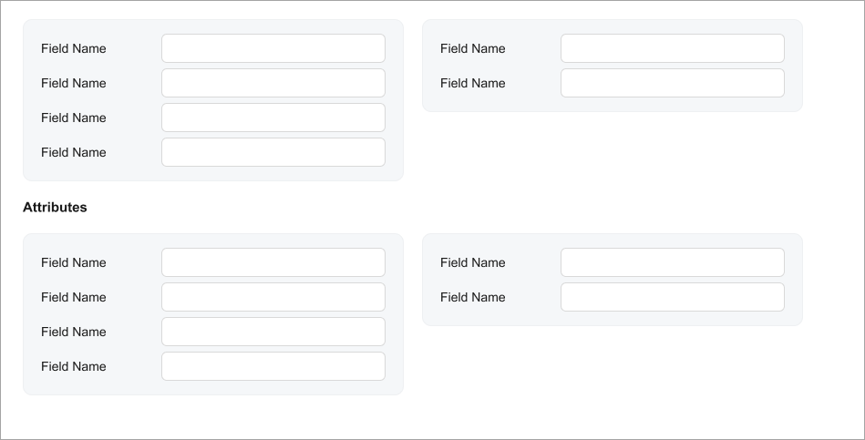

# Caption: Caption of a Template {#_47fb3c6c-cd5c-49e8-b8ea-f0ddbe333028 .concept}

To specify a caption for a group of fields inside a template, as shown with the **Attribute** caption in the following screenshot, you use the `qp-caption` control.



The following code example implements this approach.

```language-xml
<qp-caption caption="Contacts"></qp-caption>
<qp-template name="1-1-1" id="SyncPolicy_tab_Contacts" wg-container>
    <qp-fieldset id="contacts_left" slot="A" view.bind="SyncPolicy">
        <field name="ContactsSync"></field>
        <field name="ContactsSeparated"></field>
        <field name="ContactsMerge"></field>
        <field name="ContactsSkipCategory"></field>
        <field name="ContactsGenerateLink"></field>
    </qp-fieldset>
    <qp-fieldset id="contacts_right" slot="B" view.bind="SyncPolicy">
        <field name="ContactsDirection"></field>
        <field name="ContactsFolder"></field>
        <field name="ContactsFilter"></field>
        <field name="ContactsClass" config-allow-edit.bind="true"></field>
    </qp-fieldset>
</qp-template>
```

**Parent topic:**[Caption](../DeveloperGuide/UIDevRef_Caption_Mapref.md)

