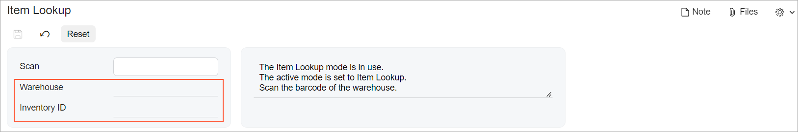

# UI Adjustments in HTML and TypeScript: HTML Examples {#_4916e170-ab95-4b99-b222-834731169c97 .concept}

You may need to add, remove, or replace particular UI elements to adjust the UI definition of the form. In this topic, you can find examples of layout adjustment in HTML.

**Important:** All tags that customize the original HTML code of an Acumatica ERP form must be located on the highest level of the extension layout—that is, in the template tag of the highest level.

## Adding Fields to the End of a Fieldset { .section}

Suppose that you need to add fields to a fieldset that is already defined on the form. The following code adds two fields to the fieldset that has `id="main"`. These fields will be added to the end of the fieldset, as shown in the following screenshot.



```language-xml
<template>
  <template modify="#main">
    <field name="SiteID"></field>
    <field name="InventoryID"></field>
  </template>
</template>
```

## Modifying Fields in a Fieldset { .section}

To add a field in the middle of a fieldset, in one of the following attributes of the field tag, you use a CSS selector that specifies the field relative to which you need to place the new elements:

-   before: Places the element before the element referenced in this attribute.
-   after: Places the element after the element referenced in this attribute.
-   append: Places the element after all child elements of the element referenced in this attribute.
-   prepend: Places the element before all child elements of the element referenced in this attribute.
-   modify: Modifies the attribute values of the element referenced in this attribute.
-   remove: Removes the element referenced in this attribute.
-   replace: Replaces the element referenced in this attribute.

In the following example, the `FieldName` field is inserted after the `OriginalFieldName` field of the `secondary` fieldset.

```language-xml
<template>
  <field name="FieldName" after="#secondary [name='OriginalFieldName']">
  </field>
</template>
```

## Reordering Fieldsets { .section}

To modify the order of fieldsets on an Acumatica ERP form, you add the qp-fieldset tag, specify the ID of the fieldset that you want to move in the modify attribute, and specify the new location by using the after or before attributes. In the following example, the fieldset with the *SomeID* ID is placed after the fieldset with the *AnotherID* ID.

```language-xml
<template>
  <qp-fieldset modify="#SomeID" after="#AnotherID"></qp-fieldset>
</template>
```

## Modifying the Layout Based on a Condition { .section}

To modify the layout only if a condition is fulfilled, you add the if.bind attribute to the container tag that you want to modify. In the following code, the tab is added only if the check box that corresponds to the `ShowPutAway` field is selected.

```language-xml
<template>
  <qp-tab after="#tabPutAway" id="tabTransfers" caption="Transfers" 
    if.bind="HeaderView.ShowPutAway.value == true">
    <qp-grid id="formTransfers" view.bind="RelatedTransfers">
    </qp-grid>
  </qp-tab>
</template>
```

**Parent topic:**[Adjusting HTML and TypeScript Code](../DeveloperGuide/UIDev_AdjustmentInExtension_Mapref.md)

