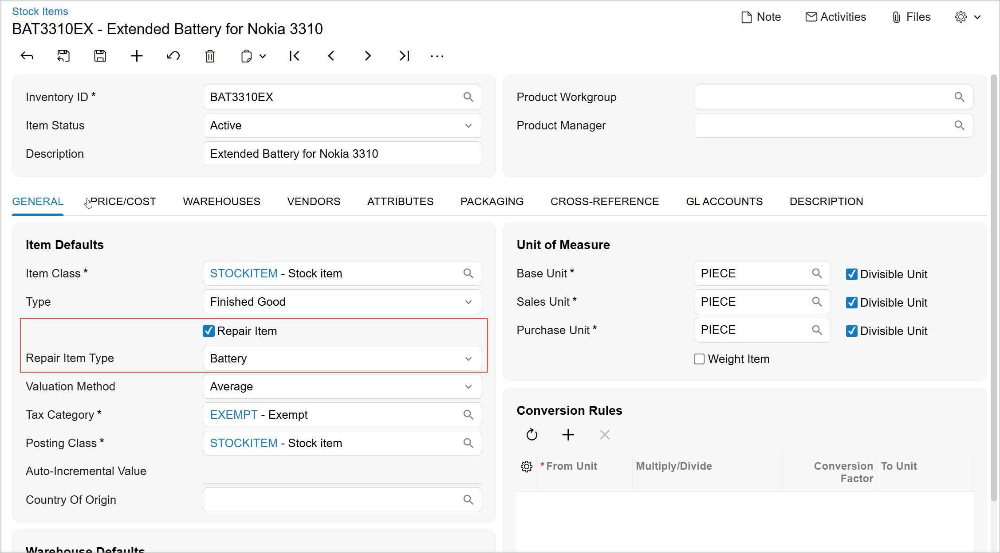
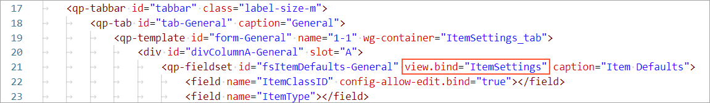
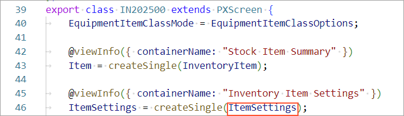
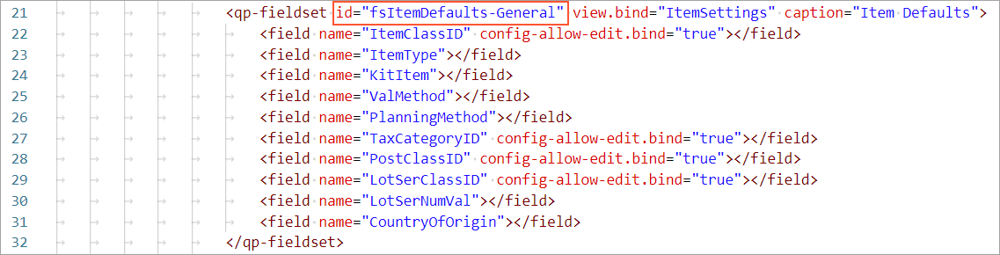

# UI Customization Development:To Add Elements to an Acumatica ERP Form {#_9ab3a86f-fcd3-4665-b462-863658837fc8 .task}

This activity will walk you through the process of adding elements to an existing Acumatica ERP form.

## Story { .section}

Suppose that you need to add two elements to the [Stock Items](../UserGuide/IN_20_25_00.md) \(IN202500\) form, as shown in the following screenshot.



That is, the customization of this form will include adding the following elements to the **Item Defaults** section of the **General** tab:

-   The **Repair Item** check box, which will be used to indicate whether the selected stock item is a repair item.
-   The **Repair Item Type** box, which will hold the repair item type to which the repair item belongs. The box will contain the following predefined options: *Battery*, *Screen*, *Screen Cover*, *Back Cover*, or *Motherboard*.

You have already implemented the backend of the form in the *PhoneRepairShop* customization project, which includes the following additions:

-   Two custom field declarations in the extension of the IN.InventoryItem data access class \(DAC\).
-   One custom event handler, which you have added to the extension of the InventoryItemMaint graph. You have used the RowSelected event handler to configure the UI presentation logic.

You have also already added the custom `UsrRepairItem` and `UsrRepairItemType` columns to the `InventoryItem` database table of the application database.

## Process Overview { .section}

You will create an extension of the Modern UI of the [Stock Items](../UserGuide/IN_20_25_00.md) \(IN202500\) form in TypeScript and HTML, build the source code of the UI of the form, and test the changes.

## System Preparation { .section}

Before you begin the customization of the UI of the [Stock Items](../UserGuide/IN_20_25_00.md) \(IN202500\) form, do the following:

1.  Complete the following prerequisite activity: [Modern UI Development: To Deploy an Instance with Custom Forms and the Modern UI](UIDev_ModernUI_Activity_PrepareInstance.md).
2.  Confirm that the prepared instance contains the following items:
    -   The `InventoryItemMaint_Extension` graph extension in the customization code
    -   The `InventoryItemExt` DAC extension in the customization code
    -   The `UsrRepairItem` and `UsrRepairItemType` columns in the `InventoryItem` database table
3.  Complete the following prerequisite activity: [Modern UI Development: To Build the Source Code of All Acumatica ERP Forms for Modern UI Development](UIDev_ModernUI_Activity_BuildingSourcesAll.md).

## Step 1: Creating Files for the Extension { .section}

To create the Modern UI for the new UI elements on the [Stock Items](../UserGuide/IN_20_25_00.md) \(IN202500\) form, you need to create TypeScript and HTML files for the form.

In the `FrontendSources\screen\src\development\screens\IN\IN202500\extensions` folder, create the following files:

-   `IN202500_PhoneRepairShop.ts`
-   `IN202500_PhoneRepairShop.html`

## Step 2: Extending the Screen Class in TypeScript { .section}

To customize the [Stock Items](../Shared/../UserGuide/IN_20_25_00.md) \(IN202500\) form in TypeScript, you need to extend the screen class of the form. Do the following:

1.  In the `IN202500_PhoneRepairShop.ts` file, add the following import directive. The directive imports the IN202500 class, which is the screen class of the [Stock Items](../Shared/../UserGuide/IN_20_25_00.md) form.

    ```language-javascript
    import {
    	IN202500,
    } from "src/screens/IN/IN202500/IN202500";
    ```

2.  Define the interface that extends the IN202500 screen class of the form and the class with the same name as the interface name as follows.

    ```language-javascript
    export interface IN202500_PhoneRepairShop extends IN202500 { }
    export class IN202500_PhoneRepairShop {
    
    }
    ```


## Step 3: Extending the View Class in TypeScript { .section}

To add elements to the **Item Defaults** section of the **General** tab of the [Stock Items](../UserGuide/IN_20_25_00.md) \(IN202500\) form in TypeScript, you need to extend the view class that provides data for the **Item Defaults** section. Proceed as follows:

1.  Review the `IN202500.html` file in the `FrontendSources\screen\src\screens\IN\IN202500` folder. You can see that the property for the view class for the **Item Defaults** section of the **General** tab of the form is ItemSettings, as shown in the following screenshot.

    

    In the `IN202500.ts` file in the same folder, find the name of the view class that corresponds to this property \(see the following screenshot\).

    

2.  In the `IN202500_PhoneRepairShop.ts` file, update the list of import directives, as the following code shows.

    ```language-javascript
    import {
    	IN202500,
    	ItemSettings
    } from "src/screens/IN/IN202500/IN202500";
    import {
    	PXFieldState,
    	PXFieldOptions,
    } from "client-controls";
    ```

3.  Add an interface and a class for the extension data view as follows.

    ```language-javascript
    export interface ItemSettings_PhoneRepairShop extends ItemSettings { }
    export class ItemSettings_PhoneRepairShop {}
    ```

4.  In the `ItemSettings_PhoneRepairShop` class, specify the properties for the `UsrRepairItem` and `UsrRepairItemType` fields of the data view, as shown below. You use the name of the data field as the property name.

    ```language-javascript
    export class ItemSettings_PhoneRepairShop {
    	UsrRepairItem: PXFieldState<PXFieldOptions.CommitChanges>;
    	UsrRepairItemType: PXFieldState;
    }
    ```

    For the `UsrRepairItem` field, changes should be committed to the server; therefore, you have used the PXFieldOptions.CommitChanges option for the property type.

5.  Save your changes.

## Step 4: Adjusting the Layout in HTML { .section}

You need to add two elements after the **Item Type** box in the **Item Defaults** section of the **General** tab of the [Stock Items](../UserGuide/IN_20_25_00.md) \(IN202500\) form. Do the following to adjust the layout in HTML:

1.  Review the `IN202500.html` file in the `FrontendSources\screen\src\screens\IN\IN202500` folder once again. You can see that the ItemType field is located in the fieldset with the *fsItemDefaults-General* ID, as shown in the following screenshot.

    

2.  In the `IN202500_PhoneRepairShop.html` file, which you have created earlier in this activity, add the following code.

    ```language-xml
    <template>
      <field
        after="#fsItemDefaults-General [name='ItemType']"
        name="UsrRepairItem"
      ></field>
      <field
        after="#fsItemDefaults-General [name='UsrRepairItem']"
        name="UsrRepairItemType"
      ></field>
    </template>
    ```

    You have inserted the `UsrRepairItem` field after the `ItemType` field of the `fsItemDefaults-General` fieldset, and the `UsrRepairItemType` field after the `UsrRepairItem` field.

3.  Save your changes.

## Step 5: Building the Source Code { .section}

Build the source code of the Modern UI of the [Stock Items](../UserGuide/IN_20_25_00.md) \(IN202500\) form, including the customization code, by executing the following command in the `FrontendSources\screen` folder.

```language-bourne
npm run build-dev --- --env customFolder=development screenIds=IN202500
```

## Step 6: Testing the Changes { .section}

To test your changes, do the following:

1.  Open the [Stock Items](../UserGuide/IN_20_25_00.md) \(IN202500\) form in the Modern UI.
2.  Select the *BAT3310EX* item.
3.  Make sure that the **Repair Item Type** box in the **Item Defaults** section of the **General** tab is available because the **Repair Item** check box is selected.
4.  Clear the **Repair Item** check box and make sure that the **Repair Item Type** box becomes unavailable for editing. This functionality is implemented in the custom event handler in the backend code.
5.  Do not save your changes.

**Parent topic:**[Customizing Acumatica ERP Forms in HTML and TypeScript](../DeveloperGuide/UIDev_Customization_Mapref.md)

