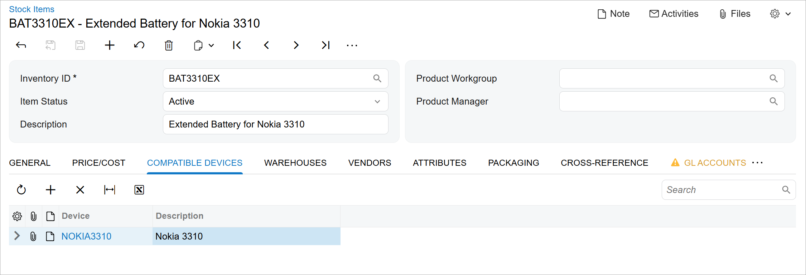

# UI Customization Development:To Add a Tab to an Acumatica ERP Form {#_e6ba73d3-207d-4533-b491-f1b122d33546 .task}

This activity will walk you through the process of adding a tab to an existing Acumatica ERP form.

## Story { .section}

Suppose that you need to add the new **Compatible Devices** tab to the [Stock Items](../UserGuide/IN_20_25_00.md) \(IN202500\) form, as shown in the following screenshot. The tab will contain a table with the compatible serviceable devices for the selected repair item. On this tab, managers of the Smart Fix company will list the devices that can be serviced by using the item.

You will place the new tab to the right of the **Price/Cost** tab. This tab will appear on the form only if the **Repair Item** check box is selected on the **General** tab.



You have already implemented the backend of the form in the *PhoneRepairShop* customization project, which includes the following additions:

-   The `RSSVStockItemDevice` data access class \(DAC\)
-   The CompatibleDevices data view in the InventoryItemMaint\_Extension graph extension
-   The RowSelected&lt;InventoryItem&gt; event handler in the InventoryItemMaint\_Extension graph extension

You have also already added the `RSSVStockItemDevice` database table to the application database.

## Process Overview { .section}

You will modify the extension of the Modern UI of the [Stock Items](../UserGuide/IN_20_25_00.md) \(IN202500\) form in TypeScript and HTML, build the source code of the UI of the form, and test the changes.

## System Preparation { .section}

Before you begin adding the tab to the UI of the [Stock Items](../UserGuide/IN_20_25_00.md) \(IN202500\) form, do the following:

1.  Complete the following prerequisite activity: [Modern UI Development: To Deploy an Instance with Custom Forms and the Modern UI](UIDev_ModernUI_Activity_PrepareInstance.md).
2.  Confirm that the prepared instance contains the following items:
    -   The CompatibleDevices data view and the RowSelected&lt;InventoryItem&gt; event handler in the InventoryItemMaint\_Extension graph extension in the customization code
    -   The `RSSVStockItemDevice` DAC in the customization code
    -   The `RSSVStockItemDevice` database table
3.  Complete the following prerequisite activity: [Modern UI Development: To Build the Source Code of All Acumatica ERP Forms for Modern UI Development](UIDev_ModernUI_Activity_BuildingSourcesAll.md).
4.  Customize the **General** tab of the form by performing the [UI Customization Development: To Add Elements to an Acumatica ERP Form](UIDev_Customization_Activity_CustomFields.md) prerequisite activity.

## Step 1: Modifying the Screen Extension in TypeScript { .section}

To add a new tab to the [Stock Items](../UserGuide/IN_20_25_00.md) \(IN202500\) form in TypeScript, you need to modify the screen extension that you have added in [UI Customization Development: To Add Elements to an Acumatica ERP Form](UIDev_Customization_Activity_CustomFields.md). Do the following:

1.  In the `IN202500_PhoneRepairShop.ts` file in the `FrontendSources\screen\src\development\screens\IN\IN202500\extensions` folder, add createCollection to the list of directives imported from client-controls.
2.  In the IN202500\_PhoneRepairShop class, define the property for the data view that corresponds to the table on the tab by using the following code. Because the data view is used to display a table, you need to initialize the property with the createCollection method. The input parameter of this method is an instance of the view class that you will define in the next step.

    ```language-javascript
    export class IN202500_PhoneRepairShop {
        CompatibleDevices = createCollection(RSSVStockItemDevice);
    }
    ```


## Step 2: Defining the View Class for the Tab in TypeScript { .section}

You need to define the view class for the **Compatible Devices** tab of the [Stock Items](../UserGuide/IN_20_25_00.md) \(IN202500\) form in TypeScript. Proceed as follows:

1.  In the `IN202500_PhoneRepairShop.ts` file, add PXView, gridConfig, and GridPreset to the list of directives imported from client-controls.
2.  Define the `RSSVStockItemDevice` view class as follows.

    ```language-javascript
    export class RSSVStockItemDevice extends PXView {
    	DeviceID: PXFieldState<PXFieldOptions.CommitChanges>;
    	DeviceID_description: PXFieldState;
    }
    ```

    For the `DeviceID` field, changes should be committed to the server; therefore, you have used the PXFieldOptions.CommitChanges option for the property type. The `DeviceID_description` field is the description that is available through the selector control of the `DeviceID` field.

3.  Add the gridConfig decorator to the view class, as the following code shows. In the gridConfig decorator, you must specify the preset property. Because you need an editable table on the tab, you use the *Details* preset.

    ```language-javascript
    @gridConfig({
    	preset: GridPreset.Details
    })
    export class RSSVStockItemDevice extends PXView {
    	DeviceID: PXFieldState<PXFieldOptions.CommitChanges>;
    	DeviceID_description: PXFieldState;
    }
    ```

4.  Save your changes.

## Step 3: Adjusting the Layout in HTML { .section}

You need to add the **Compatible Devices** tab after the **Price/Cost** tab on the [Stock Items](../UserGuide/IN_20_25_00.md) \(IN202500\) form. Do the following to adjust the layout in HTML:

1.  Review the `IN202500.html` file in the `FrontendSources\screen\src\screens\IN\IN202500` folder, and locate the qp-tab tag inside the qp-tabbar tag that defines the **Price/Cost** tab. The qp-tab tag has the *tab-PriceCost* ID.
2.  In the `IN202500_PhoneRepairShop.html` file, add the following code after the second field tag.

    ```language-xml
      <qp-tab
        after="#tab-PriceCost"
        id="tab-CompatibleDevices"
        caption="Compatible Devices"
      >
        <qp-grid id="grid-CompatibleDevices" view.bind="CompatibleDevices">
        </qp-grid>
      </qp-tab>
    ```

    You have inserted the tab after the last tab of the tab bar.

3.  Save your changes.

## Step 4: Building the Source Code { .section}

Build the source code of the Modern UI of the [Stock Items](../UserGuide/IN_20_25_00.md) \(IN202500\) form, including the customization code, by executing the following command in the `FrontendSources\screen` folder.

```language-bourne
npm run build-dev --- --env customFolder=development screenIds=IN202500
```

## Step 5: Testing the Changes { .section}

To test your changes, open the [Stock Items](../UserGuide/IN_20_25_00.md) \(IN202500\) form in the Modern UI and do the following:

1.  Select the *BAT3310EX* item and make sure that the **Compatible Devices** tab is displayed for it. \(The tab is displayed because the **Repair Item** check box is selected on the **General** tab.\)
2.  On the **Compatible Devices** tab, add the *Nokia3310* device to the list.
3.  Save your changes.
4.  In the Summary area, select the *HEADSET* item and make sure that the **Compatible Devices** tab is not displayed for this item. \(This is because the **Repair Item** check box is cleared.\)

**Parent topic:**[Customizing Acumatica ERP Forms in HTML and TypeScript](../DeveloperGuide/UIDev_Customization_Mapref.md)

