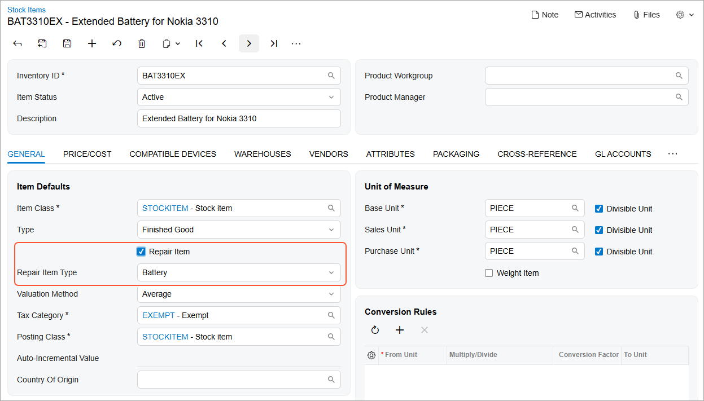
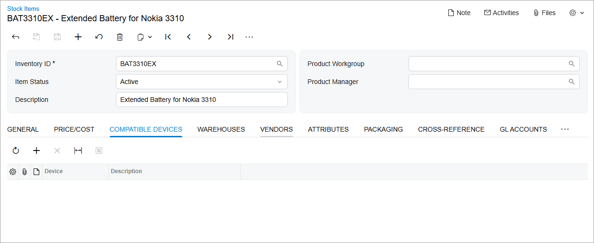

# Updating a Customization Project for the Modern UI: To Convert a Customized Form {#_163612e8-bfda-40d8-8605-7550e42889b2 .task}

The following activity will walk you through the conversion of a customized Acumatica ERP form from the Classic UI to the Modern UI. You’ll convert the form by using the customization project converter.

**Important:** The use of the customization project converter doesn't guarantee a perfect conversion of a form to the Modern UI. The converter provides **a baseline conversion that you should further fine-tune** based on your specific requirements. We strongly recommend that you:

-   **Make necessary backups** and use the converter **only in your development environment**.
-   **Always review the files** generated by the converter and **make any required corrections**.
-   Publish the converted form to your production environment **only after fully testing** its functionality in your development environment.

## Story { .section}

Suppose that you’ve customized the [Stock Items](../UserGuide/IN_20_25_00.md) \(IN202500\) form for the Smart Fix company. The customization project, developed for a previous version of Acumatica ERP, contains files created for the Classic UI. You need to convert the customized form to the Modern UI and want to use the customization project converter.

## Process Overview { .section}

You will use the customization project converter to convert the customized form and generate the TypeScript and HTML extension files. You will review the generated files and make necessary changes to them. You will then publish the corresponding customization project and view the Modern UI of the customized form.

## System Preparation { .section}

Before you begin converting the customized [Stock Items](../UserGuide/IN_20_25_00.md) \(IN202500\) form, do the following:

1.  Complete the following prerequisite activity: [Modern UI Development: To Deploy an Instance with Custom Forms and the Modern UI](UIDev_ModernUI_Activity_PrepareInstance.md). The prepared instance contains the customized [Stock Items](../UserGuide/IN_20_25_00.md) \(IN202500\) form in the Classic UI.
2.  Optional: If you plan to build code manually, perform the prerequisite actions and build the source code for the first time, as described in [Modern UI Development: To Build the Source Code of All Acumatica ERP Forms for Modern UI Development](UIDev_ModernUI_Activity_BuildingSourcesAll.md).

## Step 1: Converting the Customized Form { .section}

To convert the customized [Stock Items](../UserGuide/IN_20_25_00.md) \(IN202500\) form and generate the TypeScript and HTML extensions, do the following:

1.  Publish the *PhoneRepairShop* customization project \(if it's not already published\).
2.  On the [Customization Projects](../UserGuide/SM_20_45_05.md) \(SM204505\) form, open the *PhoneRepairShop* customization project in the Customization Project Editor.
3.  On the [Screens](../UserGuide/AU_20_10_00.md) page, click the row for the [Stock Items](../UserGuide/IN_20_25_00.md) form and click **Convert to Modern UI** on the page toolbar.

    The system displays a notification indicating that the conversion operation has started.

    When the operation has completed, the system navigates to the [Modern UI Files](../UserGuide/AU_20_46_00.md) page, which displays the extension files that were generated for the converted form:

    -   `IN202500_PhoneRepairShop_converted.ts`, which contains the difference in the TypeScript code of the original and customized versions of the form
    -   `IN202500_PhoneRepairShop_converted.html`, which contains the difference in the HTML code of the original and customized versions of the form

Now you can review the generated extension files and make some necessary changes.

## Step 2: Reviewing the Code of the TypeScript Extension { .section}

To review the code of the TypeScript extension that was generated in the previous step, open the `IN202500_PhoneRepairShop_converted.ts` file on the [Modern UI Files](../UserGuide/AU_20_46_00.md) page.

Notice the following additions in the extension file, which represents the differences between the original code of the form and its customized version:

-   The `CompatibleDevices` view, which is initialized in the `IN202500_PhoneRepairShop_converted` class that extends the `IN202500` screen class
-   The `UsrRepairItem` and `UsrRepairItemType` fields added in the `IN202500_ItemSettings_PhoneRepairShop_converted` view class, which extends the `ItemSettings` view class
-   The `RSSVStockItemDevice` grid view class

## Step 3: Reviewing the Code of the HTML Extension { .section}

To review the code of the HTML extension that was generated in the previous step, open the `IN202500_PhoneRepairShop_converted.html` file on the [Modern UI Files](../UserGuide/AU_20_46_00.md) page.

Notice the following additions in the extension file, which represents the differences between the original code of the form and its customized version:

-   The field tag that adds the custom `UsrRepairItem` field after the existing `ItemType` field.
-   The field tag that adds the custom `UsrRepairItemType` field after the custom `UsrRepairItem` field.
-   The qp-tab tag with the *Compatible Devices* caption; this tag adds a tab with the same name after the **Price/Cost** tab on the form. This qp-tab tag contains the qp-grid tag bound to the `CompatibleDevices` view.

Due to the conversion from ASPX to HTML, the converter may sometimes add incorrect IDs for some tags or use IDs that don’t follow the established naming conventions.

Update the `IN202500_PhoneRepairShop_converted.html` file on the [Modern UI Files](../UserGuide/AU_20_46_00.md) page as follows:

1.  Make sure the values of the `after` attribute for the two field tags are the same as the ones shown in the following list. The ID of the fieldset to which they should be added is `fsItemDefaults-General`:
    -   `<field after="#fsItemDefaults-General FIELD[name='ItemType']" name="UsrRepairItem"></field>`
    -   `<field after="#fsItemDefaults-General FIELD[name='UsrRepairItem']" name="UsrRepairItemType"></field>`
2.  Make sure the qp-tab tag is defined as follows: `<qp-tab id="tab-CompatibleDevices" after="#tab-PriceCost" caption="Compatible Devices">`.
3.  Correct the ID for the &lt;qp-grid&gt; tag as follows so that the ID follows established naming conventions: `<qp-grid id="grid-CompatibleDevices" view.bind="CompatibleDevices"></qp-grid>`.

    The final code of the `IN202500_PhoneRepairShop_converted.html` file is shown below.

    ```language-xml
    <template>
      <field 
        after="#fsItemDefaults-General FIELD[name='ItemType']" 
        name="UsrRepairItem">
      </field>
      <field after="#fsItemDefaults-General FIELD[name='UsrRepairItem']" 
        name="UsrRepairItemType">
      </field>
      <qp-tab 
        id="tab-CompatibleDevices" 
        after="#tab-PriceCost"
        caption="Compatible Devices">
        <qp-grid 
          id="grid-CompatibleDevices" 
          view.bind="CompatibleDevices"></qp-grid>
      </qp-tab>
    </template>
    
    ```

4.  Save your changes to the file.

## Step 4: Publishing the Project and Viewing the Form { .section}

Now you will publish the customization project and view the customized form in the Modern UI. Do the following:

1.  Publish the customization project.
2.  Open the [Stock Items](../UserGuide/IN_20_25_00.md) \(IN202500\) form.
3.  Select the *BAT3310EX* item in the table.
4.  If the form doesn't already open in the Modern UI, click **Tools** &gt; **Switch to Modern UI** on the form title bar. The Modern UI for the form is displayed.
5.  On the **General** tab \(**Item Defaults** section\), make sure the **Repair Item** check box and the **Repair Item Type** box are visible.
6.  Select the **Repair Item** check box. Make sure that the **Repair Item Type** box is available because the **Repair Item** check box is selected, as shown below.

    

7.  Make sure that the **Compatible Devices** tab is displayed, as shown below. \(The tab is displayed because the **Repair Item** check box is selected on the **General** tab.\)

    

8.  On the **Compatible Devices** tab, add the *Nokia3310* device to the list.
9.  Save your changes.
10. Select the *HEADSET* item and make sure that the **Compatible Devices** tab is not displayed for this item. \(This is because the **Repair Item** check box is cleared.\)

**Parent topic:**[Updating Customization Projects for the Modern UI](../DeveloperGuide/UIDev_Customization_Convert_Mapref.md)

