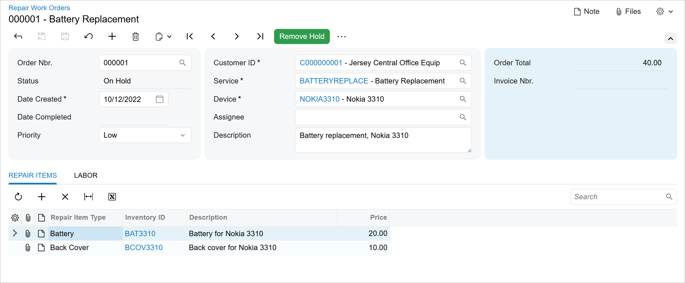

# Data Entry Form:To Create the UI of a Data Entry Form {#_da55bcfe-ebdd-4b33-94be-cdeba0c5497b .task}

The following activity will walk you through the process of developing the UI of a data entry form.

## Story { .section}

Suppose that you need to develop the Repair Work Orders \(RS301000\) form in the Modern UI. The form will have a Summary area and two tabs below the Summary area.

The following screenshot shows what the form should look like.



You have already implemented the backend for the form, which includes the `RSSVWorkOrderEntry` graph and the `RSSVWorkOrder`, `RSSVWorkOrderItem`, and `RSSVWorkOrderLabor` data access classes \(DACs\). You have also already added the corresponding tables to the application database.

## Process Overview { .section}

You will create TypeScript and HTML files for the Repair Work Orders \(RS301000\) form. In the TypeScript file, you will define the screen class and view classes for the form. You will also define the following views:

-   `WorkOrders`, which is the primary view of the form and is bound to the Summary area of the form
-   `RepairItems`, which is bound to the table on the **Repair Items** tab of the form
-   `Labor`, which is bound to the table on the **Labor** tab of the form

In the HTML file, you will define the layout of the form.

## System Preparation { .section}

Before you begin creating the UI of the Repair Work Orders \(RS301000\) form, do the following:

1.  Complete the following prerequisite activity: [Modern UI Development: To Deploy an Instance with Custom Forms and the Modern UI](UIDev_ModernUI_Activity_PrepareInstance.md). Make sure the prepared instance contains the following items:
    -   The `RSSVWorkOrderEntry` graph in the customization code
    -   The `RSSVWorkOrder`, `RSSVWorkOrderItem`, and `RSSVWorkOrderLabor` DACs in the customization code
    -   The `RSSVWorkOrder`, `RSSVWorkOrderItem`, and `RSSVWorkOrderLabor` database tables
2.  To take the prerequisite actions and build the source code for the first time, perform the following prerequisite activity: [Modern UI Development: To Build the Source Code of All Acumatica ERP Forms for Modern UI Development](UIDev_ModernUI_Activity_BuildingSourcesAll.md).

## Step 1: Creating Files for the Form { .section}

To implement the Modern UI version of the Repair Work Orders \(RS301000\) form, you need to create the TypeScript and HTML files for the form. Create the files as follows:

1.  In the `FrontendSources\screen\src\screens` folder of your Acumatica ERP instance, create a folder with the `RS` name if one has not been created yet. You will store the UI sources for all forms with the *RS* prefix in this folder.
2.  In the `FrontendSources\screen\src\development\screens\RS` folder, create a folder with the `RS301000` name if it has not been created yet.
3.  In the `FrontendSources\screen\src\development\screens\RS\RS301000` folder, create the following files:
    -   `RS301000.ts`
    -   `RS301000.html`

## Step 2: Defining the Screen Class in TypeScript { .section}

To define the view of the Repair Work Orders \(RS301000\) form in TypeScript, you define a screen class and a property for the data views of the form. Do the following:

1.  In the `RS301000.ts` file, add the import directives as follows.

    ```language-javascript
    import {
    	PXScreen, createCollection, graphInfo,
    	viewInfo, createSingle,
    } from "client-controls";
    ```

2.  Define the screen class for the form, as the following code shows. The class name is the ID of the form.

    ```language-javascript
    export class RS301000 extends PXScreen {}
    ```

3.  For the screen class, add the graphInfo decorator, and specify the graph and the primary view of the form in the decorator properties, as the following code shows.

    ```language-javascript
    @graphInfo({
    	graphType: "PhoneRepairShop.RSSVWorkOrderEntry",
    	primaryView: "WorkOrders"
    })
    export class RS301000 extends PXScreen {}
    ```

4.  Define the properties for the data views of the form, as the following code shows. To initialize the data view of the Summary area of the form, you should use the createSingle method. For the data view that is used to display a table, you need to initialize the property with the createCollection method. You will define the view classes whose instances are used as input parameters of the methods in the next step.

    **Attention:** The names of the data view properties should be the same as those in the graph. For example, if the `WorkOrders` view is declared in the `RSSVWorkOrderEntry` graph, the property with the same name should be declared in the `RS301000` screen class.

    ```language-javascript
    export class RS301000 extends PXScreen {
    	@viewInfo({ containerName: "Work Order" })
    	WorkOrders = createSingle(RSSVWorkOrder);
    	
    	@viewInfo({ containerName: "Repair Items" })
    	RepairItems = createCollection(RSSVWorkOrderItem);
    	
    	@viewInfo({ containerName: "Labor" })
    	Labor = createCollection(RSSVWorkOrderLabor);
    }
    ```

    In the viewInfo decorator, you have specified the names of the containers. These names are used as object names during the configuration of particular functionality, such as workflows and import and export scenarios. If this value is not specified, the system displays the name of the data view as the object name.


## Step 3: Defining the Primary View Class in TypeScript { .section}

You need to define a view class for the primary data view of the Repair Work Orders \(RS30100\) form, which is `WorkOrders`.

Proceed as follows:

1.  In the `RS301000.ts` file, update the list of import directives, as the following code shows.

    ```language-javascript
    import {
    	PXScreen, createCollection, graphInfo,
    	viewInfo, createSingle,
    	PXView, PXFieldOptions, PXFieldState, controlConfig,
    } from "client-controls";
    ```

2.  Define the `RSSVRepairWorkOrder` view class as follows.

    ```language-javascript
    export class RSSVWorkOrder extends PXView {}
    ```

3.  In the view class, specify the properties for all data fields of the data view that should be displayed in the UI, as shown below. You use the name of the data field as the property name.

    ```language-javascript
    export class RSSVWorkOrder extends PXView {
    	OrderNbr: PXFieldState;
    	
    	@controlConfig({allowEdit: true, })
    	CustomerID: PXFieldState<PXFieldOptions.CommitChanges>;
    	DateCreated: PXFieldState;
    	DateCompleted: PXFieldState;
    	Status: PXFieldState;
    	
    	@controlConfig({rows: 2})
    	Description : PXFieldState<PXFieldOptions.Multiline>;
    	
    	@controlConfig({allowEdit: true, })
    	ServiceID : PXFieldState<PXFieldOptions.CommitChanges>;
    	
    	@controlConfig({allowEdit: true, })
    	DeviceID: PXFieldState<PXFieldOptions.CommitChanges>;
    	OrderTotal: PXFieldState;
    	Assignee: PXFieldState;
    	Priority: PXFieldState<PXFieldOptions.CommitChanges>;
    	InvoiceNbr: PXFieldState;
    }
    ```

    For the `CustomerID`, `ServiceID`, `DeviceID`, and `Priority` fields, changes should be committed to the server; therefore, you have used the PXFieldOptions.CommitChanges option for the property type.

    You have defined the links in the selector controls for the `CustomerID`, `ServiceID`, and `DeviceID` fields by specifying `allowEdit: true` in the controlConfig decorator.

    You have used the controlConfig decorator with the specified rows property and the `Description` field with the PXFieldOptions.Multiline option to define a multiline text box with two text lines. For details, see [Text Box: Multiline Text Box](../Shared/../DeveloperGuide/UIDevRef_TextBox_MultilineTextBox.md).


## Step 4: Defining the View Classes for Tables in TypeScript { .section}

In the TypeScript file of the form, you need to define view classes for the views that are bound to tables on the **Repair Items** and **Labor** tabs of the Repair Work Orders \(RS301000\) form: `RSSVWorkOrderItem` and `RSSVWorkOrderLabor`. Proceed as follows:

1.  In the `RS301000.ts` file, add gridConfig and GridPreset to the list of import directives.
2.  Define the `RSSVWorkOrderItem` view class as follows.

    ```language-javascript
    export class RSSVWorkOrderItem extends PXView {
    	RepairItemType: PXFieldState;
    	InventoryID: PXFieldState<PXFieldOptions.CommitChanges>;
    	InventoryID_description: PXFieldState;
    	BasePrice: PXFieldState;
    }
    ```

    For the `InventoryID` field, changes should be committed to the server; therefore, you have used the PXFieldOptions.CommitChanges option for the property type.

3.  Add the gridConfig decorator to the `RSSVWorkOrderItem` view class, as the following code shows. In the gridConfig decorator, you must specify the preset property. Because the table is used on one of the tabs of the data entry form, you use the *Details* preset. For information about presets, see [Form Layout: Grid Presets](../Shared/../DeveloperGuide/UIDev_DesigningLayout_GridPresets.md).

    ```language-javascript
    @gridConfig({
    	preset: GridPreset.Details
    })
    export class RSSVWorkOrderItem extends PXView {
    	RepairItemType: PXFieldState;
    	InventoryID: PXFieldState<PXFieldOptions.CommitChanges>;
    	InventoryID_description: PXFieldState;
    	BasePrice: PXFieldState;
    }
    ```

4.  Define the `RSSVWorkOrderLabor` view class similarly to the way you defined the `RSSVWorkOrderItem` view class. The resulting class should be defined as follows.

    ```language-javascript
    @gridConfig({
    	preset: GridPreset.Details
    })
    export class RSSVWorkOrderLabor extends PXView {
    	InventoryID: PXFieldState;
    	InventoryID_description: PXFieldState;
    	DefaultPrice: PXFieldState;
    	Quantity: PXFieldState<PXFieldOptions.CommitChanges>;
    	ExtPrice: PXFieldState;
    }
    ```

5.  Save your changes.

## Step 5: Defining the Layout in HTML { .section}

The Repair Work Orders \(RS301000\) form contains the Summary area and two tabs below it. The Summary area has three columns, which you can arrange by using the `7-10-7` template. Each tab contains a table. To define the layout of the form, do the following:

1.  Define the Summary area of the form by adding the qp-template tag with the `7-10-7` template. For each slot, define a fieldset, as shown in the following code. For the third fieldset, specify `class="highlights-section"`, which makes the fieldset have blue background.

    ```language-xml
    <template>
      <qp-template
        id="form-Order"
        name="7-10-7"
        class="equal-height"
        qp-collapsible
      >
        <qp-fieldset id="fsColumnA-Order" slot="A" view.bind="WorkOrders">
        </qp-fieldset>
        <qp-fieldset id="fsColumnB-Order" slot="B" view.bind="WorkOrders">
        </qp-fieldset>
        <qp-fieldset id="fsColumnC-Order" slot="C" view.bind="WorkOrders"
          class="highlights-section">
        </qp-fieldset>
      </qp-template>
    </template>
    ```

    Each fieldset has been bound to the same `WorkOrders` property.

    You have defined the whole Summary area to be collapsible by using the qp-collapsible attribute. For more information, see [Collapsible Area: Configuration](../Shared/../DeveloperGuide/UIDevRef_CollapsibleArea_Configuration.md).

    For details about the qp-template tag and slots, see [Form Layout: Predefined Templates](../Shared/../DeveloperGuide/UIDev_DesigningLayout_Templates.md).

2.  In each fieldset, add the field tags for the fields that should be displayed in corresponding fieldset, as the following code shows.

    ```language-xml
        <qp-fieldset id="fsColumnA-Order" slot="A" view.bind="WorkOrders">
          <field name="OrderNbr"></field>
          <field name="Status"></field>
          <field name="DateCreated"></field>
          <field name="DateCompleted"></field>
          <field name="Priority"></field>
        </qp-fieldset>
        <qp-fieldset id="fsColumnB-Order" slot="B" view.bind="WorkOrders">
          <field name="CustomerID"></field>
          <field name="ServiceID"></field>
          <field name="DeviceID"></field>
          <field name="Assignee"></field>
          <field name="Description"></field>
        </qp-fieldset>
        <qp-fieldset id="fsColumnC-Order" slot="C" view.bind="WorkOrders"
          class="highlights-section">
          <field name="OrderTotal"></field>
          <field name="InvoiceNbr"></field>
        </qp-fieldset>
    ```

3.  Define the **Repair Items** tab:
    1.  After the qp-template tag, add the qp-tabbar tag with a nested qp-tab tag, as the following code shows. In the qp-tab tab, specify the name of the tab in the caption attribute.

        ```language-xml
          <qp-tabbar id="tabbar">
            <qp-tab id="tab-RepairItems" caption="Repair Items">
            </qp-tab>
          </qp-tabbar>
        ```

    2.  Define the table that should be displayed on the **Repair Items** tab: In the qp-tab tag, add the qp-grid tag, which is bound to the `RepairItems` view, as the following code shows.

        ```language-xml
          <qp-tabbar id="tabbar">
            <qp-tab id="tab-RepairItems" caption="Repair Items">
              <qp-grid id="grid-RepairItems" view.bind="RepairItems"></qp-grid>
            </qp-tab>
          </qp-tabbar>
        ```

4.  Define the **Labor** tab similarly to the way you defined the **Repair Items** tab: In the qp-tabbar tag, add the qp-tab tag after the qp-tab tag that was defined in the previous instruction. In the new qp-tab tag, add the qp-grid tag, and bind it to the `Labor` view, as the following code shows.

    ```language-xml
        <qp-tab id="tab-Labor" caption="Labor">
          <qp-grid id="grid-Labor" view.bind="Labor"></qp-grid>
        </qp-tab>
    ```

5.  Save your changes.

## Step 6: Building and Viewing the Form { .section}

To build the source files for the Repair Work Orders \(RS301000\) form and view its Modern UI version, do the following:

1.  Run the following command in the `FrontendSources\screen` folder of your instance.

    ```language-bourne
    npm run build-dev --- --env customFolder=development screenIds=RS301000
    ```

2.  After the source files have been built successfully, launch your Acumatica ERP instance, and open the Repair Work Orders form for the *000001* work order.
3.  On the form title bar, click **Tools** &gt; **Switch to Modern UI**. The Modern UI version of the Repair Work Orders form is displayed. The form should look similar to the form shown in the screenshot in the *Story* section of this activity.

    **Note:** If you see multiple actions of the form toolbar and no More menu after you switch to the Modern UI, open the Apply Updates \(SM203510\) form, and in the More menu, click Reset Caches.

4.  Click the link in the **Customer ID** box and make sure the [Customers](../UserGuide/AR_30_30_00.md) \(AR303000\) form opens with the *C000000001* record displayed. Close the [Customers](../UserGuide/AR_30_30_00.md) form.
5.  On the Repair Work Orders form, make sure the **Description** box is multiline.
6.  On the form toolbar, click **Remove Hold**. Notice that the status of the repair work order has changed to *Ready for Assignment*.

**Parent topic:**[Defining a Data Entry Form](../DeveloperGuide/UIDev_DataEntryScreen_Mapref.md)

