# Data Entry Form: General Information {#_c4cb1954-d67a-42ae-b31f-07306b08f47b .concept}

A data entry form is used for the input of records of a particular type. This topic provides recommendations and guidelines on organizing the layout of a data entry form.

The following screenshot shows an example of a data entry form. As is true of most data entry forms, the displayed form has a Summary area and a tab area with multiple tabs. The displayed tab shows a table \(generally referred to as a *grid*\).

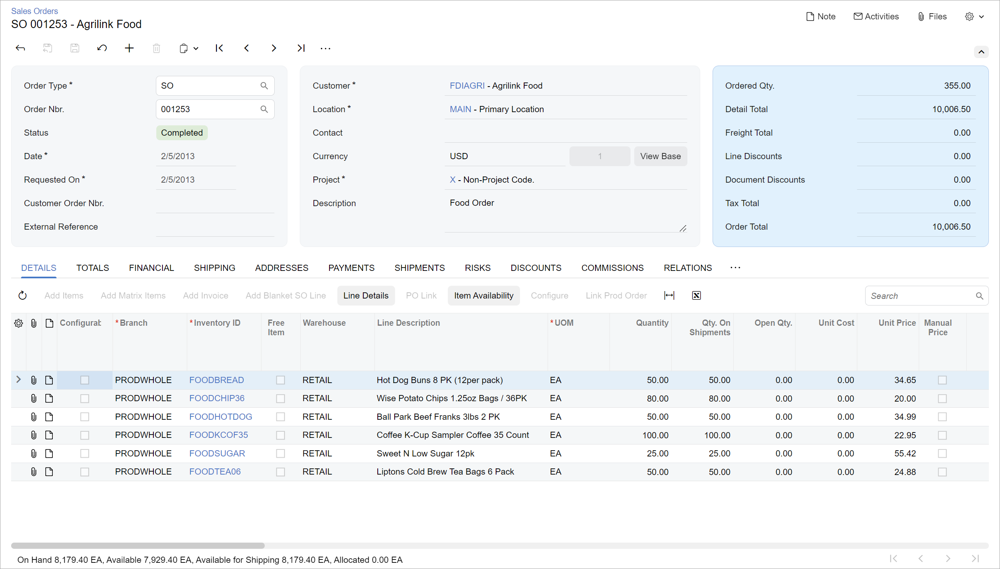

## Learning Objectives { .section}

In this chapter, you will how to do the following when you define a data entry form:

-   Organize the layout of the data entry form
-   Configure the data entry form in HTML and TypeScript

## Applicable Scenarios { .section}

You configure a data entry form in the following cases:

-   You are migrating an existing data entry form to the Modern UI.
-   You are creating a new data entry form by using the Modern UI.

## Templates and Label Sizes {#section_vv2_1y4_y4b .section}

Data entry forms that display transactional data, such as [Invoices and Memos](../UserGuide/AR_30_10_00.md) \(AR301000\), should use three-column templates for the Summary area. You can select a particular template by the general recommendations below. You use the default label size.

Data entry forms that display profile data, such as [Customers](../UserGuide/AR_30_30_00.md) \(AR303000\), should use the `1-1` template. Label size should be `M`.

When selecting a particular template, you can also use the general recommendations that are described in [Form Layout: Predefined Templates](UIDev_DesigningLayout_Templates.md).

## Recommendations for Organizing the Layout { .section}

The following table shows recommendations for organizing the layout of a data entry form.

|Correct|Incorrect|
|-------|---------|
|If you need to show total numbers, put them in the blue fieldset \(`class="highlights-section"`\) on the right side of the screen.

 Do not put the blue fieldset between other fieldsets.

|
|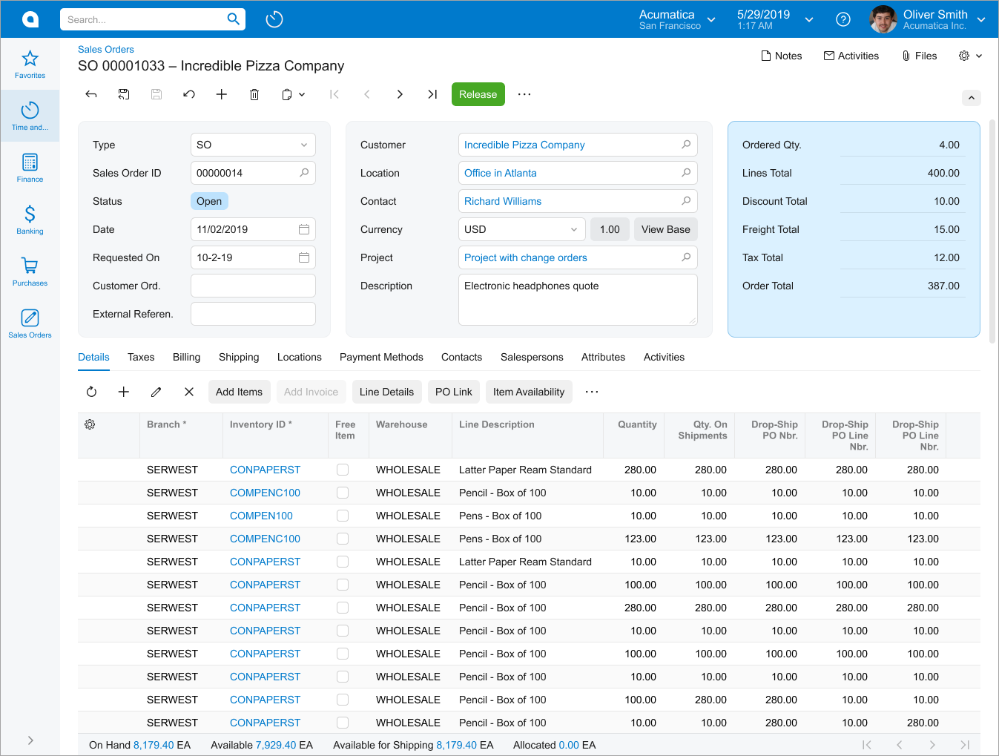|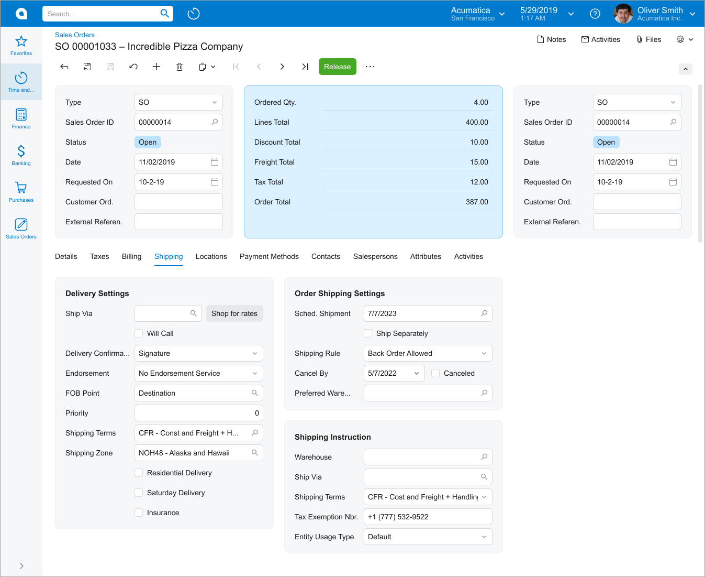|
|If you have multiple fieldsets with short labels and short values in fields, put them in multiple columns and stacks by using one of the following templates: `1-1-1`, `7-10-7`, `17-17-14`, or `1-1.`

 Do not put fields with short labels and short values in fields in the `1` template.

|
|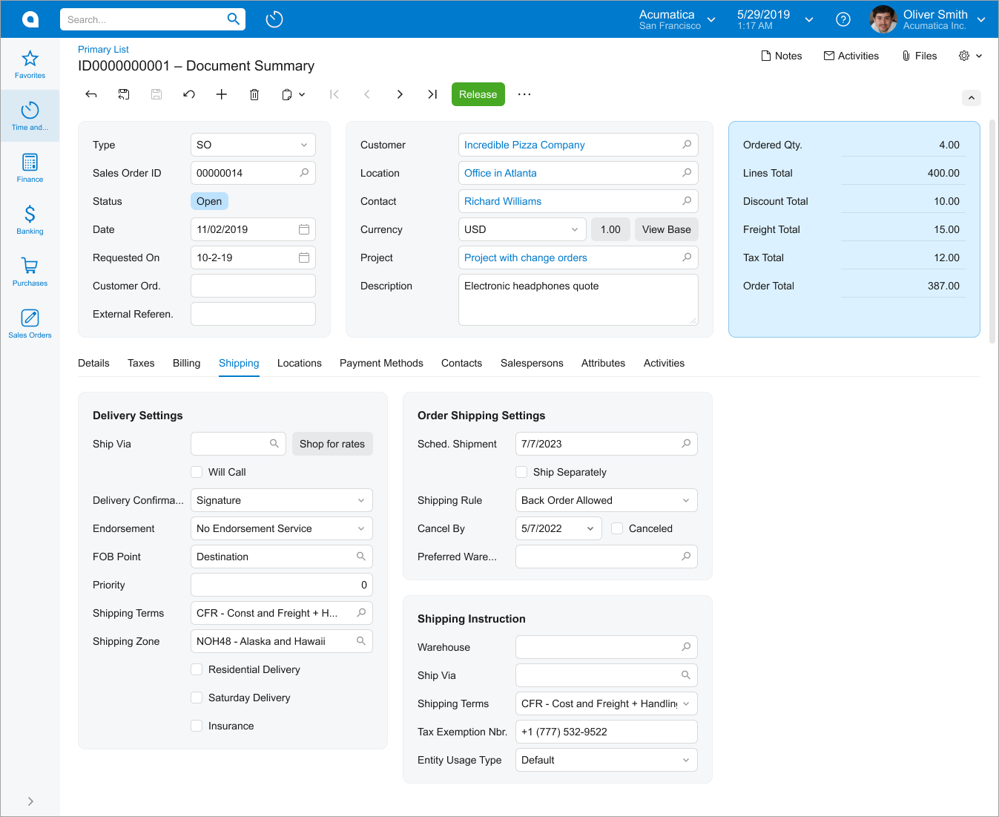|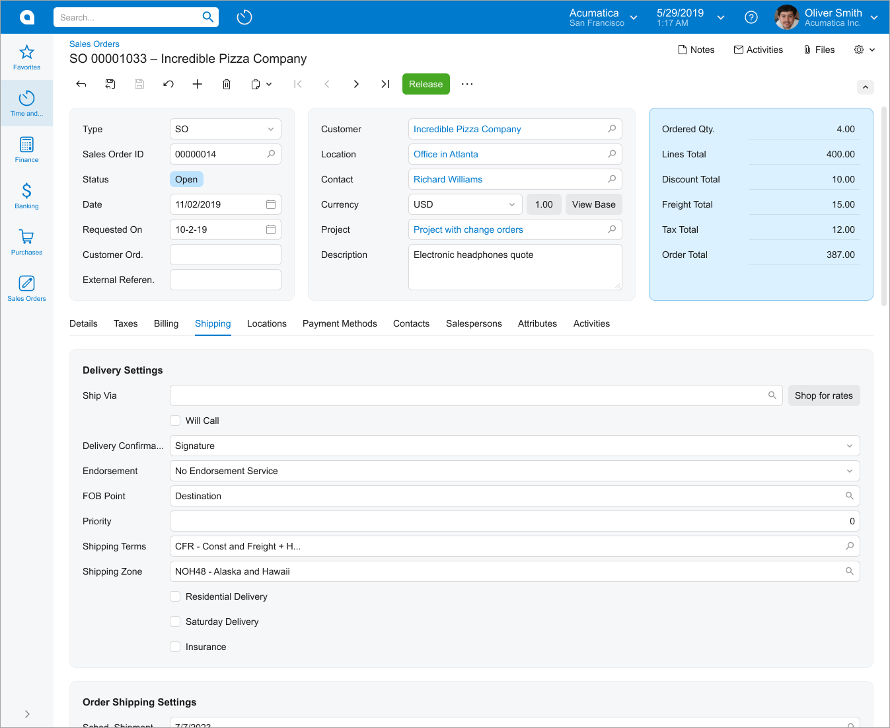|
|Make labels with long text longer. Try to make the labels in all fieldsets similar in length \(specify `class="label-size-<SIZE>"` in qp-template\).|
|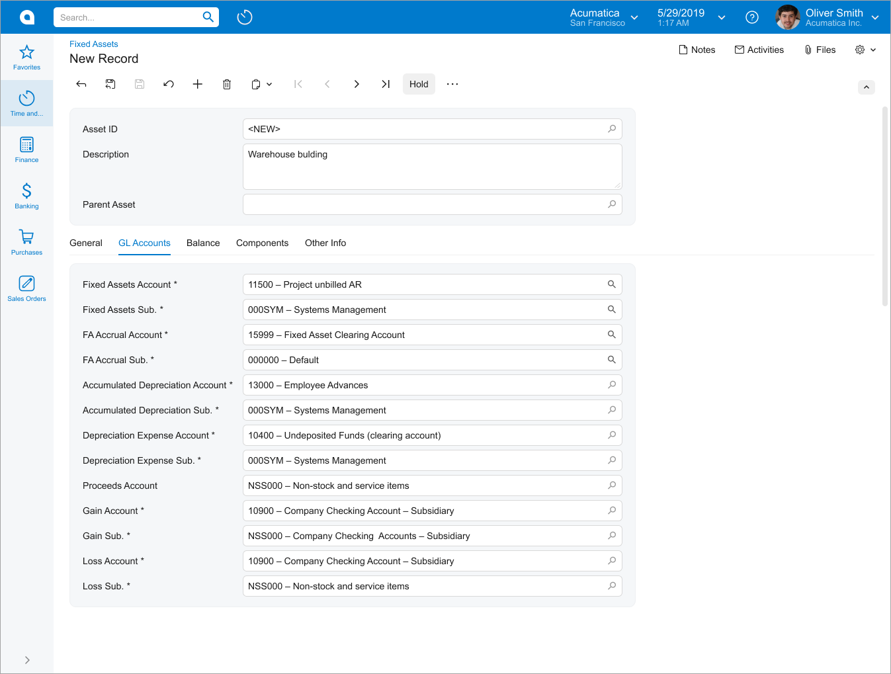|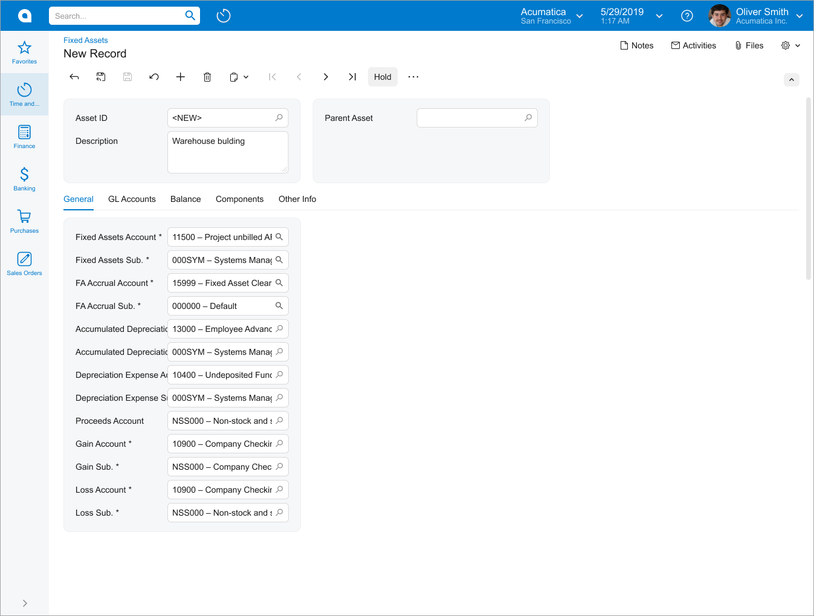|
|Use a caption instead of showing a single tab.

 For grids, add the caption as described in [Table with a Title](UIDevRef_Grid_LayoutExamples.md#_966685f5-5a79-43a8-93a4-90466ff32b38).

 For fieldsets in a qp-template, use the qp-caption control.

|
|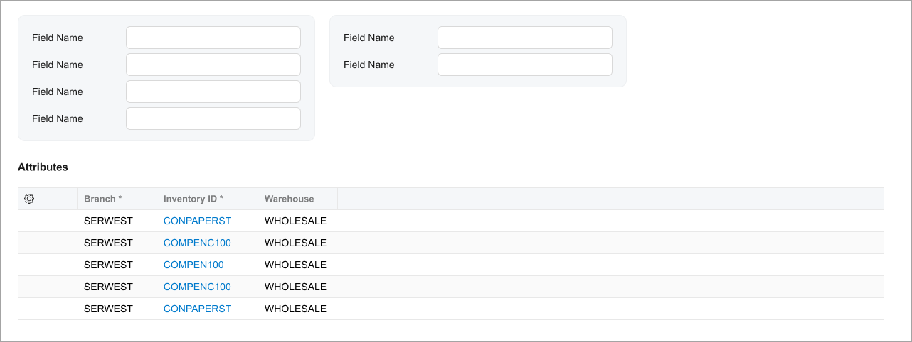

 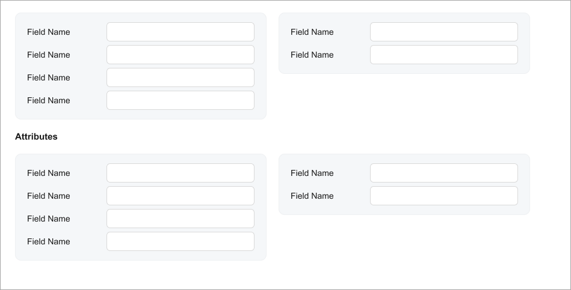

|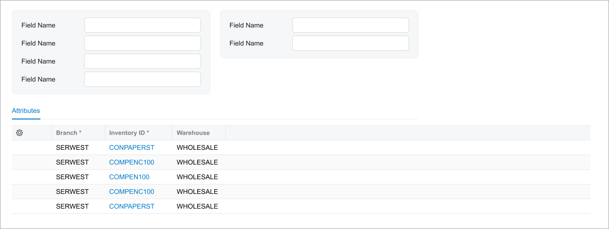

 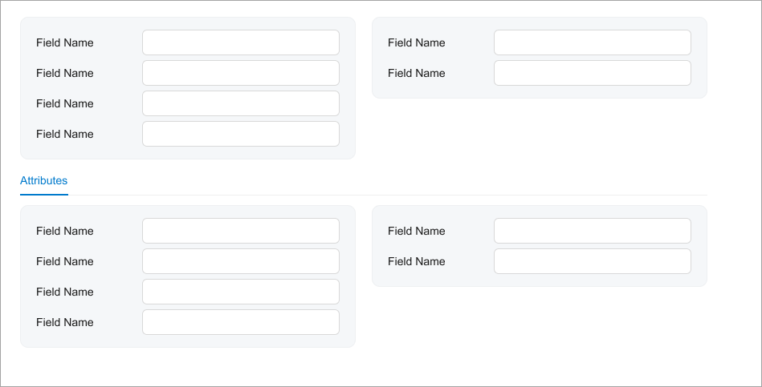

|
|Try to occupy slots of the template equally in order to balance the screen.|
|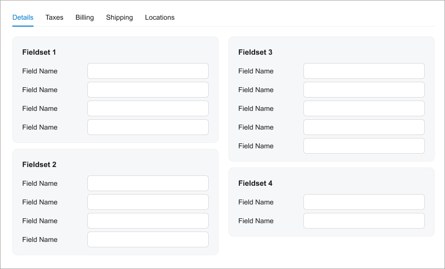|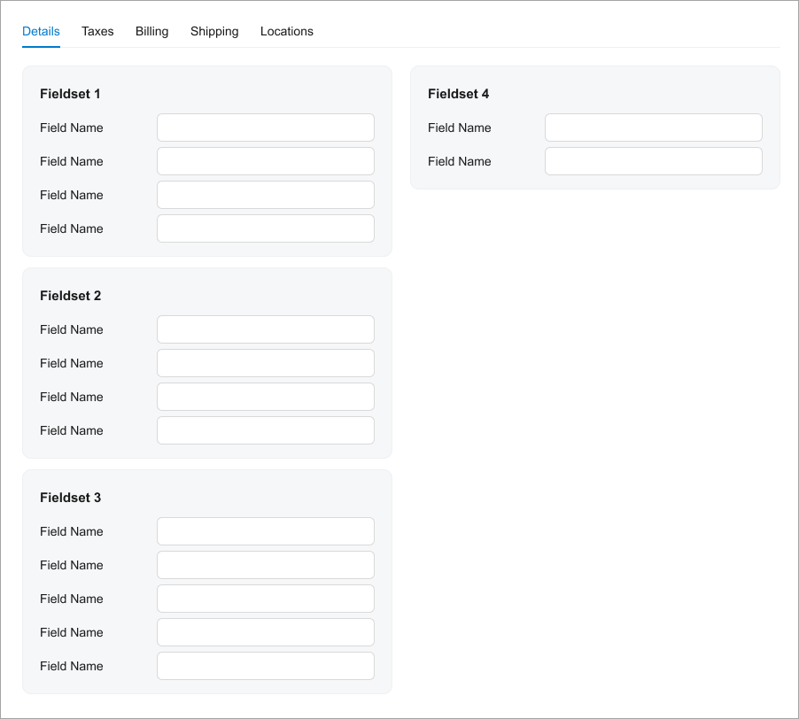|
|Use the multiline Description field because the width of a single slot on the data entry form may not fit the field properly. For details, see [Text Box: Multiline Text Box](UIDevRef_TextBox_MultilineTextBox.md).|
|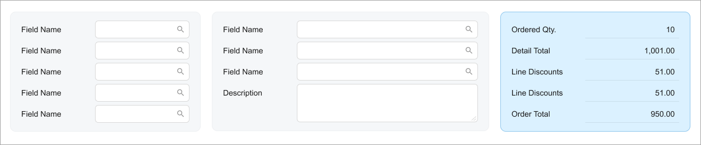|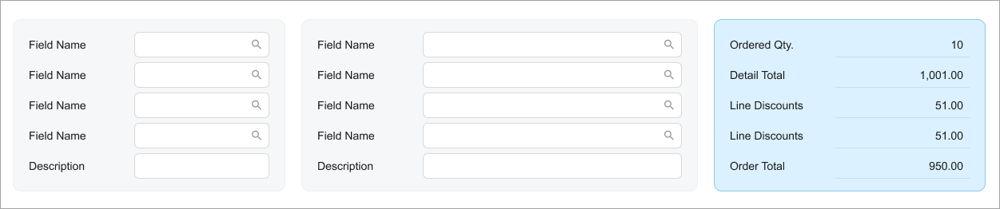|
|Show full-width grids without a gray background.|
|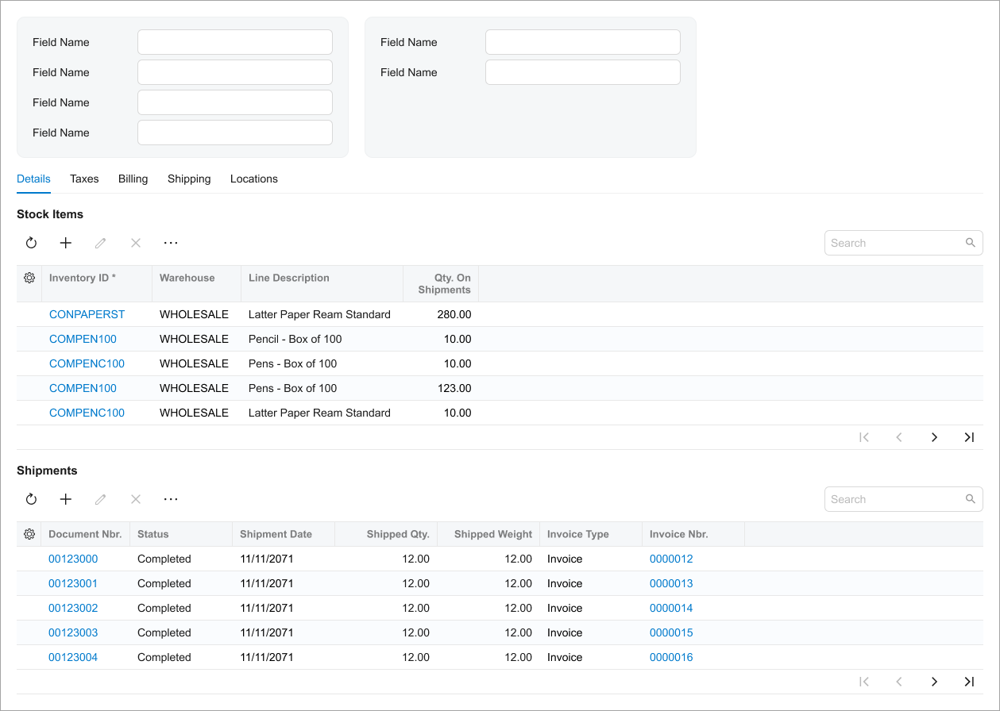|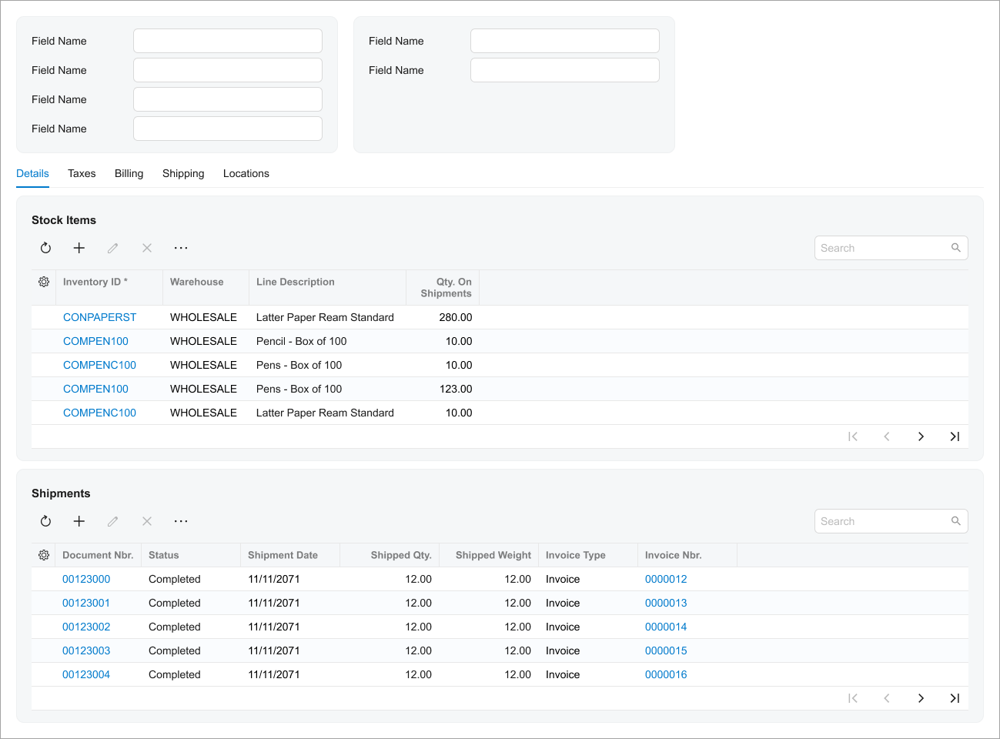|

## UX and Functional Guidelines { .section}

The form design should be tailored for screens with a resolution of 1280 x 720.

The number of the data entry form should start with *30*. For details, see [Form and Report Numbering](../StudioDeveloperGuide/DA__con_Form_Numbering.md).

**Parent topic:**[Defining a Data Entry Form](../DeveloperGuide/UIDev_DataEntryScreen_Mapref.md)

