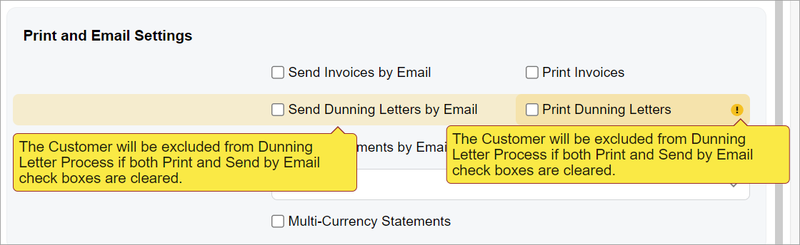
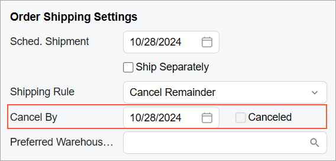
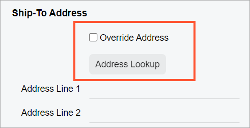
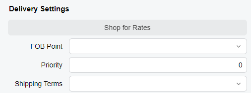
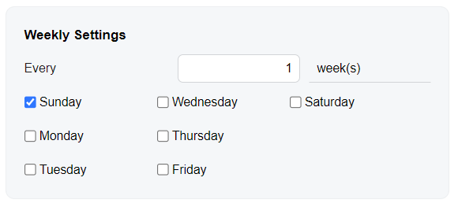

# Form Layout: An Element Next to Another Element {#_27f40039-d2b6-4fb4-b954-360a856978fa .concept}

If you need to define an additional element—for example, a button, another box, or a label—next to another element, you can add the corresponding tag inside the field tag. Each field tag can include one tag or multiple tags, such as qp-field or qp-button.

## Adding an Element Next to Another Element { .section}

You can add more than one control in place of an element in the following ways:

-   By adding the additional controls inside the field tag.

    In this case, the controls inside the field tag are dependent on the behavior of the control bound to the field tag. For example, when the control bound to the field tag is hidden \(for example, due to a feature switch or by a user in the **Section Configuration** dialog box\), the dependent control is also hidden.

    By default, the second control will occupy half of the space dedicated for the original field. If you need the second control to have a different width, you can specify `class="col-N"`, where `N` is a number of columns that is less than 12. The minimum width is 2 columns. To move a field to the next line, specify `col-12`.

-   By replacing the contents of the field tag with controls specified inside the field tag \(by using the replace-content attribute\).

    In this case, all controls specified in the field tag are independent of each other and the replaced control \(except for nested controls\).

    If you need to specify the width of the controls, you need to specify col-XX classes for all controls nested in the field tag unless the controls are nested within each other.


**Attention:** We recommend that you use the approach with adding controls inside the field tag for two related controls, such as a box and the related check box, or a box and its dynamic description.

Use the approach with replacing of the contents of the field tag for multiple unrelated controls. Do not use the approach with adding controls inside the field tag if you need to put multiple controls that are unrelated to each other in a row. If an error occurs in one of these controls, it will be duplicated in another control, as shown in the following screenshot.



## Adding a Check Box Next to an Element { .section}

You can add a check box next to an element \(defined by the field tag\) so that they both occupy a space of a single control. To do that, you need to add the qp-field bound to this check box inside the field tag. For example, suppose that you need to add the **Canceled** check box next to the **Cancel Date** box, as shown in the following screenshot.



The following code can be used to add the check box next to the **Cancel Date** box \(which corresponds to the `CancelDate` field\).

```language-xml
<field name="CancelDate">
  <qp-field control-state.bind="CurrentDocument.Cancelled" 
    config-enabled.bind="false"></qp-field>
</field>
```

**Tip:** You do not need to specify `class="no-label"` for the second control to omit the empty label of the check box because this class is used by default for a qp-field tag inside the field tag.

## Adding a Button to the Next Line { .section}

You can add a button after another control so that it is displayed on the next line below the control. To do that, you need to add the button control inside the field tag and specify `class="col-12"` for the button control.

For example, suppose that you need to place the **Address Lookup** button on the next line after a check box, as shown in the following screenshot.



The **Address Lookup** button is implemented by using the qp-address-lookup tag. The following code shows an example of moving the **Address Lookup** button to the next line.

```
<field name="OverrideAddress">
  <qp-address-lookup class="col-12" view.bind="Shipping_Address">
  </qp-address-lookup>
</field>
```

## Replacing a Field { .section}

You can put any content, such as a text box and a button, instead of an element \(that is, occupy the field space with arbitrary elements\) by doing the following:

1.  In the field tag, specify the replace-content attribute.
2.  Optional: If the field whose content you are replacing has no definition in TypeScript, add the unbound attribute.
3.  Inside the field tag, add all tags for the elements you want to add.

Suppose that you want to replace the content of an element with one button that occupies the whole space of the element, as shown in the following screenshot.



You need to add the qp-button tag inside the field tag, as shown in the following code.

```language-xml
<field name="fakename" replace-content unbound>
    <qp-button id="buttonShopRates" class="col-12" state.bind="ShopRates"></qp-button>
</field>
```

## Adding Multiple Elements in a Line { .section}

You can put multiple elements, such as check boxes, in one line by placing them inside the single field tag and specifying the proper CSS class. For details about CSS classes, see [Form Layout: CSS Classes](UIDev_DesigningLayout_CSSClasses.md).

Suppose that you need to show three check boxes in a single line, as shown in the following screenshots.



You need to put three qp-field tags inside a single field tag and specify `class="col-4"` for each of the qp-field tags, as shown in the following code.

```language-xml
<field name="fake01" unbound replace-content>
    <qp-field control-state.bind="StaffScheduleSelected.WeeklyOnSun" 
        config-enabled.bind="false" class="col-4"></qp-field>
    <qp-field control-state.bind="StaffScheduleSelected.WeeklyOnWed" 
        config-enabled.bind="false" class="col-4"></qp-field>
    <qp-field control-state.bind="StaffScheduleSelected.WeeklyOnSat" 
        config-enabled.bind="false" class="col-4"></qp-field>
</field>
```

**Tip:** You do not need to set `class="no-label"` to remove the label before each check box because this class is used by default in this case.

The `col-4` class helps to distribute the check boxes equally, which means that each check box occupies 4 \(12 / 3 = 4\) columns out of the 12 columns that the replaced element occupies. \(If you need to have four columns and need to distribute them equally, you should use `class="col-3"`.\)

**Parent topic:**[Designing the Layout of an Acumatica ERP Form](../DeveloperGuide/UIDev_DesigningLayout_Mapref.md)

