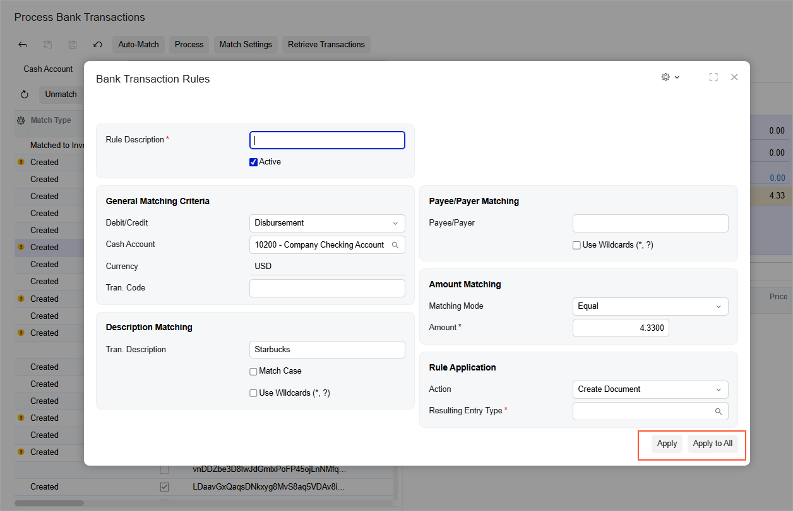
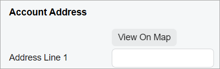
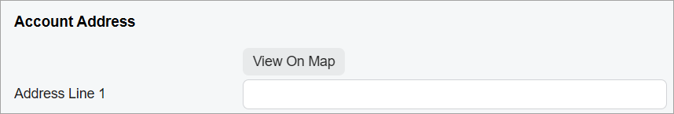
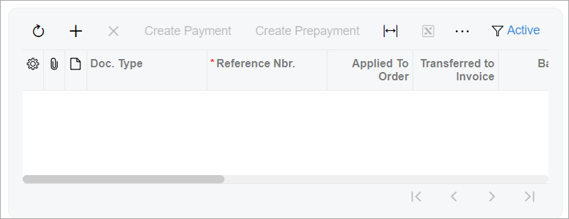
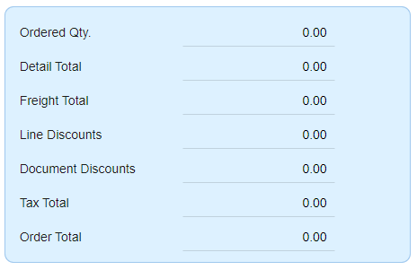
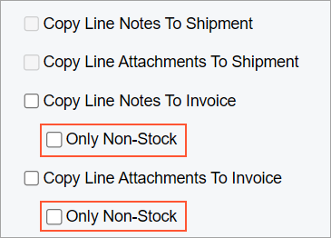
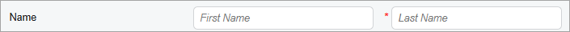
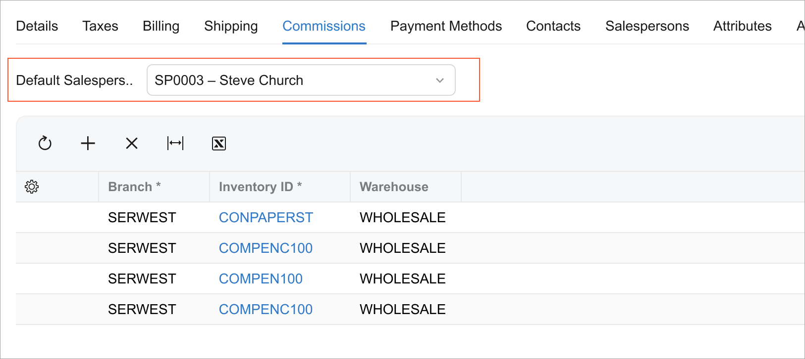
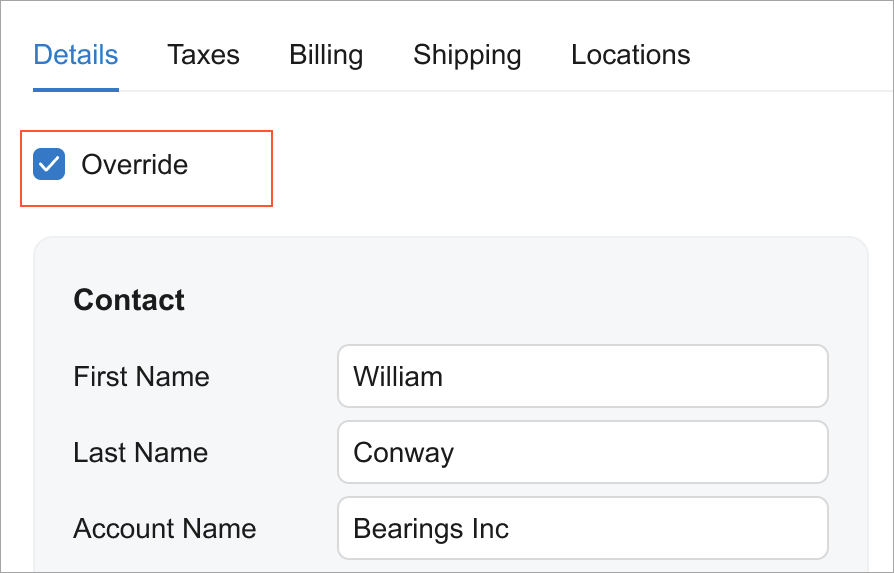

# Form Layout: CSS Classes {#_6411e1bf-5ef5-4734-865c-7d2f6800289c .concept}

You can use the predefined CSS classes, which are listed below, to adjust the color settings and layout of templates. These classes are defined in the `FrontendSources/screen/static/basic-layout.css` file of the instance folder.

## adaptive-height {#_1c25532f-2b2d-477e-a621-885afa87acdb .section}

You can use the adaptive-height CSS class for qp-text-box in multiline mode or for its parent control. The class causes the parent control to adapt its height to the size of the qp-text-box control.

The following example uses this class.

```
<qp-panel
  id="LogFileFilterRecord" caption="Log" auto-repaint="true" width="50vw">
  <qp-fieldset id="frmLockout" view.bind="LogFileFilterRecord">
    <field
      name="Text"
      class="label-size-xxs adaptive-height"
      config-type.bind="1"></field>
  </qp-fieldset>
  <footer>
    <qp-button id="btnCancel" dialog-result="Cancel" caption="Close"></qp-button>
  </footer>
</qp-panel>
```

## align-end { .section}

The align-end CSS class causes an element to be placed on the right side of the container, such as a form.

For example, if you need a set of buttons to be placed along the right border of a form that is displayed in a pop-up panel, you need to put the buttons in a div tag and specify the align-end class for this div tag. Such a form is shown in the following screenshot.



The following example implements this screenshot and uses the align-end class.

```
<template>
  <qp-template> ... </qp-template>
  <div class="h-stack align-end">
    <qp-button id="buttonApply" state.bind="SaveClose"></qp-button>
    <qp-button id="buttonApplyAll" state.bind="SaveAndApply"></qp-button>
  </div>
</template>
```

**Note:** In a dialog box \(the qp-panel control\), you do not need to specify the align-end class for the buttons located in the footer tag. The alignment along the right side is implemented for the footer by default.

## col-auto { .section}

The col-auto CSS class causes an element to have its caption fully visible and does not include excessive space in any screen size, as shown for the **View On Map** button in the following screenshots for a narrow screen and a wide screen. That is, the width of the button is fixed for any screen size.





The following example uses this class.

```language-xml
<field name="AddressButtons">
  <qp-button id="btnViewOnMap" state.bind="ViewOnMap" class="col-auto">
  </qp-button>
</field>
```

The class can be applied to any element \(however, it is designed to be used with buttons\).

## col-N { .section}

The col-N CSS class, where `N` is a number from 1 to 12, specifies the width of a control in columns. `N` defines the number of columns that the control occupies relative to the width of its parent control. \(That is, the width of the parent control is considered to be 12 columns.\)

You can use these classes to organize multiple UI controls inside a field area \(which are implemented with Merge in PXLayoutRule in ASPX\). For examples of the organization of multiple UI controls in a field area, see [Form Layout: An Element Next to Another Element](UIDev_DesigningLayout_AddControlNextToField.md).

**Note:** Avoid using controls that span multiple columns of controls \(which are implemented with ColumnSpan in PXLayoutRule in ASPX\). You should use multiline text boxes instead. For details, see [Text Box: Multiline Text Box](UIDevRef_TextBox_MultilineTextBox.md).

The following example uses this class.

```
<field name="ShipVia">
    <qp-button id="btnShopRates" state.bind="ShopRates" class="col-7">
    </qp-button>
</field>
```

The class can be applied to any element.

## col-lg-X, col-md-X, and col-sm-X { .section}

The col-lg-X, col-md-X, and col-sm-X CSS classes, where `X` is a number from 1 to 12, specify the width of a control in columns for different types of screens:

-   For large screens: col-lg-X
-   For medium screens: col-md-X
-   For small screens: col-sm-X

`X` indicates the width in columns, where 1 is the smallest width and 12 is the full width of the parent control.

The following example uses these classes.

```
<div class="v-stack col-sm-12 col-md-6 col-lg-4"></div>
```

The class can be applied to any element.

## control-size-&lt;SIZE&gt; { .section}

The control-size-XXX classes limit the maximum width of a control to the specified size.

`<SIZE>` can have the following values:

-   *xxs*: 40 px
-   *xs*: 70 px
-   *s*: 100 px
-   *sm*: 140 px
-   *m*: 200 px
-   *xm*: 250 px
-   *l*: 300 px
-   *xl*: 350 px
-   *xxl*: 400 px

The following examples use these classes.

```language-xml
<field class="control-size-m"...>
<qp-field class="control-size-l"...>
<qp-fieldset class="control-size-xxl"...>
```

The class can be applied to any element.

**Note:** We do not recommend that you use these classes extensively: Because the Modern UI forms are adaptive to the width of the screen, the use of these classes may lead to different widths of controls in a single column.

## default-control { .section}

The default-control class indicates that the control should have focus when the form opens.

```
<field name="CustomerID" config-allow-edit.bind="true" 
  class="default-control"></field>
```

**Note:** In ASPX, you would use the DefaultControlID attribute of the PXFormView tag to indicate the default control that would have focus.

## equal-height { .section}

The equal-height class indicates that the columns in the template should be aligned in height.

The class can be applied to qp-template.

## framed-section { .section}

The framed-section CSS class displays a container in a separate gray frame, as shown in the following screenshot.



The following example uses this class.

```language-xml
<qp-grid id="gridSalesPerTran" view.bind="SalesPerTran"
  class="framed-section"></qp-grid>
```

The class can be applied to any container.

## full-width { .section}

The full-width CSS class stretches the right side of the template to the right side of the screen, ignoring the maximum size of the form, which is 1600 px.

We recommend that you use this CSS class if you have a wide grid inside the template.

The following example uses this class.

```
<qp-template name="7-17" id="comissions-form" class="full-width">
    ...
</qp-template>
```

The class can be applied to qp-template.

## h-stack { .section}

The h-stack CSS class defines the list of elements rendered horizontally.

The following example uses this class.

```
<div class="h-stack">
    <div class="h-stack" >
        <qp-fieldset id="first" hide-caption="true">
            ...
        </qp-fieldset>
        <qp-fieldset id="second" hide-caption="false">
            ...
        </qp-fieldset>
    </div>
    <qp-fieldset id="summary" hide-caption="false" caption="Summary" >
        ...
    </qp-fieldset>
</div>
```

The class can be applied to any container.

## highlights-section { .section}

The highlights-section CSS class defines the style for the pane with a blue background, as shown in the following screenshot.



The following example uses this class.

```
<qp-fieldset id="totals"
  hide-caption="false" 
  class="highlights-section">
  ...
</qp-fieldset>
```

The class can be applied to `qp-fieldset`.

## indent-1, indent-2, and indent-3 { .section}

The indent-1, indent-2, and indent-3 CSS classes define the number of indentations for the control. The number in the class name corresponds to the number of indentations.



The following example uses this class.

```
<field name="CopyLineNotesToInvoice"></field>
<field name="CopyLineNotesToInvoiceOnlyNS" class="indent-1"></field>
```

The class can be applied to the `field` tag.

## label-size-&lt;SIZE&gt; { .section}

The label-size-&lt;SIZE&gt; CSS class specifies the width of the labels in the container.

**Note:** We recommend that you not overuse this set of CSS classes. Ideally, all labels on a form should have the same size.

`<SIZE>` can have the following values:

-   *xxs*: 40 px
-   *xs*: 70 px
-   *s*: 100 px
-   *sm*: 140 px
-   *m*: 200 px
-   *xm*: 250 px
-   *l*: 300 px
-   *xl*: 350 px
-   *xxl*: 400 px

The class can be applied to any element.

## label-size-zero {#_2975005b-aebe-4848-905c-f00324db89b3 .section}

The `label-size-zero` class specifies that the element and its nested elements do not have labels but should have the asterisk \(\*\) displayed to indicate that the value is required.

In the following code, two boxes \(**First Name** and **Last Name**\) are displayed in a single line. The **Last Name** box is required, as shown in the following screenshot.



```
<qp-field control-state.bind="PrimaryContactCurrent.FirstName" 
    config-placeholder.bind="'First Name'">
  <qp-label slot="label" caption="Name"></qp-label>
  <qp-field control-state.bind="PrimaryContactCurrent.LastName" 
    **class="label-size-zero"** config-placeholder.bind="'Last Name'" 
    config-required="PrimaryContactCurrent.LastName.required">
  </qp-field>
</qp-field>
```

## no-label { .section}

The no-label CSS class specifies that the element and all its nested elements do not have labels. However, you can override this behavior in any nested element by specifying `class="label-size-<SIZE>"` for the nested element.

**Tip:** You do not need to use `class="no-label"` with qp-field. qp-field does not have a label by default.

If you need to hide the label part of the control but display the asterisk \(\*\) symbol, use the [label-size-zero](#_2975005b-aebe-4848-905c-f00324db89b3) class.

In the following code, the `One` field has a label of size *S*, the `Two` field has no label, the `Three` field has no label, and the `Four` field has a label of size *M*.

```
<qp-template name="1" id="mf" class="no-label">
  <qp-fieldset id="fs1" view.bind="MyView" class="label-size-s">
    <field name="One"></field>
    <field name="Two" class="no-label"></field>
  </qp-fieldset>
  <qp-fieldset id="fs2" view.bind="MyView">
    <field name="Three"></field>
    <field name="Four" class="label-size-m"></field>
  </qp-fieldset>
</qp-template>
```

The class can be applied to any element.

## no-stretch { .section}

The no-stretch CSS class prevents the element from being stretched over the height of the whole Acumatica ERP form or the area of a form, such as a tab.

**Tip:** By default, the grid is stretched over the height of the whole area.

The following example uses this class.

```
<div class="v-stack">
    <div id="Filter_form" wg-container>
            ...
    </div>
    <qp-grid id="grid" view.bind="EnqResult"
      class="no-stretch">
    </qp-grid>
</div>
```

The class can be applied to any container.

## stretch { .section}

The stretch CSS class stretches the element over the height of the container to which the element belongs. For example, the element can be stretched to the height of the whole Acumatica ERP form or the area of a form, such as a tab.

The class is applied by default to `qp-grid` and `qp-tabbar`.

The following example uses this class.

```
<qp-rich-text-editor id="edDescription" class="stretch"
  state.bind="Case.Description">
</qp-rich-text-editor>
```

The class can be applied to any element.

## transparent-section { .section}

The transparent-section CSS class defines the style of the pane with the transparent background.

We recommend that you use transparency only for fieldsets with a maximum of two rows of controls.

The following screenshot shows an element in a transparent fieldset.



The following screenshot shows a selected check box in a transparent fieldset.



The following example uses this class.

```
<qp-template name="17-17-14" id="byBookFilterForm">
  <qp-fieldset slot="A" id="deprBookFilterForm" view.bind="deprbookfilter"
    class="transparent-section">
    <field name="BookID"></field>
  </qp-fieldset>
</qp-template>
```

The class can be applied to `qp-fieldset` .

## v-stack { .section}

The v-stack CSS class defines the list of elements rendered vertically.

The elements are rendered vertically by default; therefore, in most cases, there is no need to use this class.

The following example uses this class.

```
<div class="v-stack">
    <div id="Filter_form" wg-container>
            ...
    </div>
    <qp-grid id="grid" view.bind="EnqResult">
    </qp-grid>
</div>
```

The class can be applied to any container.

**Parent topic:**[Designing the Layout of an Acumatica ERP Form](../DeveloperGuide/UIDev_DesigningLayout_Mapref.md)

