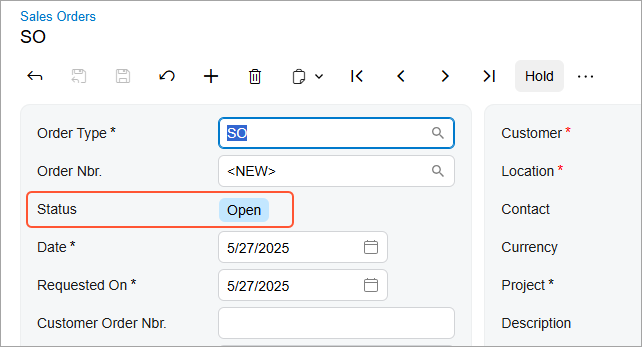

# Form Layout: Box Connotations {#_ff73e924-e9ba-41d8-a999-bd145cde58f3 .concept}

You can highlight a value in the textbox control with a color connotation. The color can change depending on the value in the box.

In Acumatica ERP data entry forms with workflows, the **Status** box has default connotations. You can add new connotations or change existing ones. The following screenshot shows an example of the color connotation for the *Open* status.



## Changing the Default Color or Defining a New One { .section}

You can specify a connotation for any box that has the [PXStringListAttribute](https://help.acumatica.com/Help?ScreenId=ShowWiki&pageid=eb18681d-a07f-87ae-3738-cb6452c24260) attribute on the corresponding DAC field. Some forms, such as data entry forms with workflows, have default connotations defined in the `style.scss` file of the screen folder or in the `common` folder of the module.

You can change the default connotation or create a new one by doing the following:

1.  In the screen folder, open the `style.scss` file or create a new one.

    If you’re creating a new file, in the `style.scss` file, import the mixin from the `WebSites/Pure/Site/FrontendSources/screen/static/status-colors.scss` file.

2.  Define the correspondence between the PXStringList attribute values and the colors, as shown in the following example.

    ```
    @import 'static/status-colors.scss';
    @include colored-status('N', var(--status-blue-color));
    @include colored-status('H', var(--status-orange-color));
    @include colored-status('P', var(--status-red-color));
    @include colored-status('V', var(--status-red-color));
    @include colored-status('E', var(--status-orange-color));
    @include colored-status('A', var(--status-orange-color));
    @include colored-status('R', var(--status-red-color));
    @include colored-status('C', var(--status-gray-color));
    @include colored-status('L', var(--status-gray-color));
    @include colored-status('B', var(--status-orange-color));
    @include colored-status('S', var(--status-blue-color));
    @include colored-status('I', var(--status-blue-color));
    @include colored-status('D', var(--status-orange-color));
    ```


## Specifying the Connotation for a Box { .section}

To specify connotations that have been defined in the `style.scss` file, do the following:

1.  In the HTML template of the screen, import the `styles.scss` file that defines the connotations.

    ```
    <template>
        <require from="./style.scss"></require>
        ...
    </template>
    ```

2.  For the field that you want to highlight, specify `class="colored"` in the corresponding `field` tag.

    ```
    <qp-fieldset id="fsColumnA-Order" slot="A" view.bind="Document">
      ...
      <field name="Status" class="colored" pinned="true"></field>
    </qp-fieldset>
    ```


**Parent topic:**[Designing the Layout of an Acumatica ERP Form](../DeveloperGuide/UIDev_DesigningLayout_Mapref.md)

