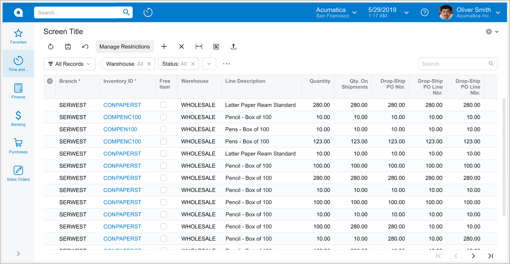
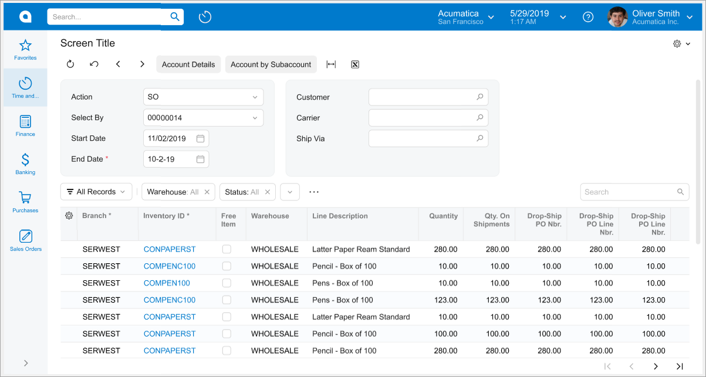
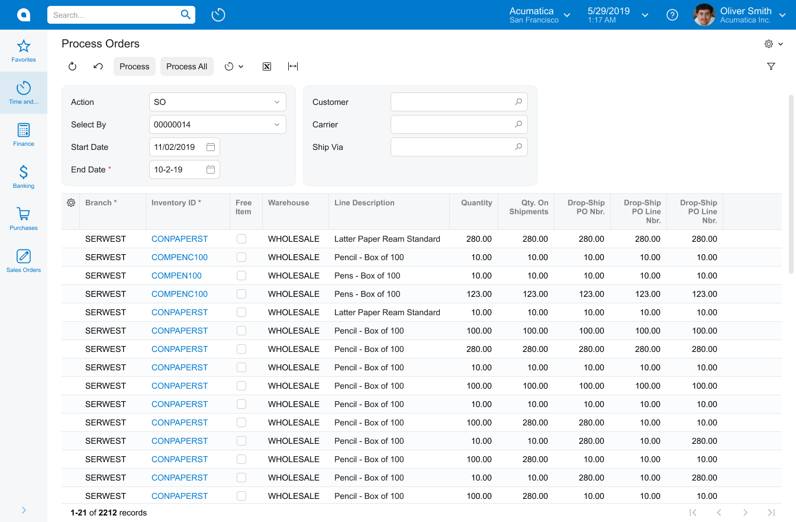
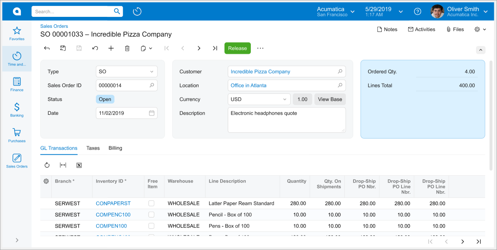
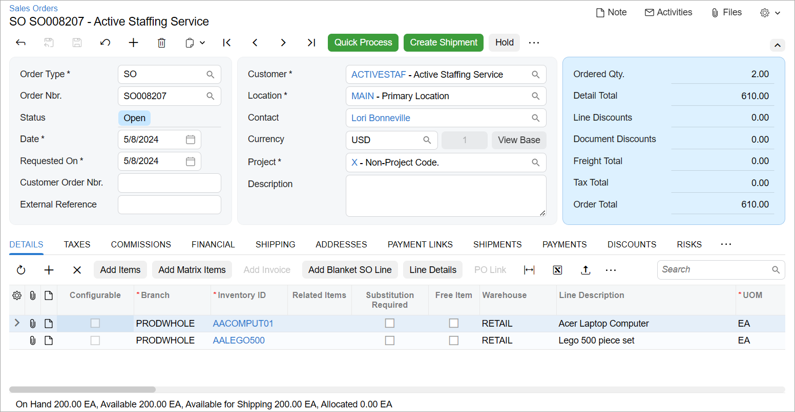
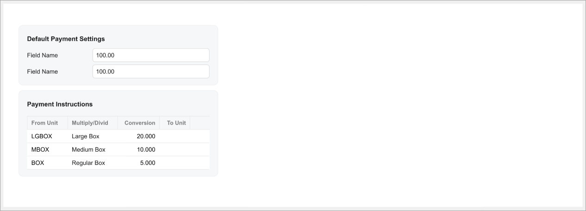
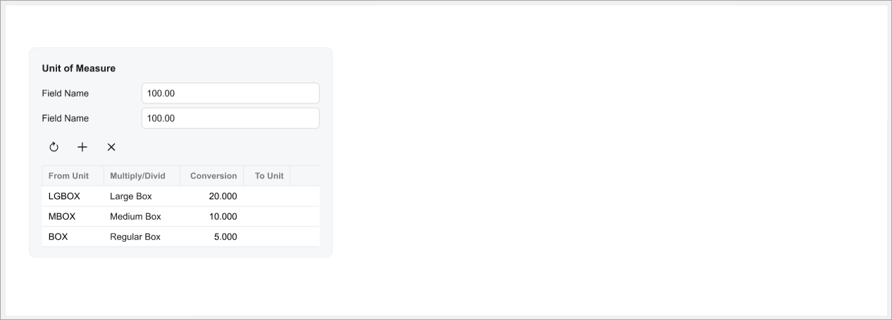

# Form Layout: Grid Presets {#_7e979f7d-cfac-44c3-9c23-f72635fc4f7f .concept}

To configure the appearance of a table \(which is also called *grid*\) on an Acumatica ERP form, you can specify a preset for the grid control. A preset is a predefined set of properties, such as `mergeToolbarWidth` or `syncPosition`, that define the appearance of the grid.

Presets are an analog of the `SkinID` property in ASPX in the Classic UI. However, not all values of the `SkinID` property have analogs in the Modern UI. You need to find the appropriate preset in the list of available values.

You should use presets because they unify the appearance of grids in the UI and simplify the process of updating the design.

To specify the preset, you use the preset property of the `gridConfig` decorator, as shown in the following example.

|Without Preset|With Preset|
|--------------|-----------|
|```language-javascript

@gridConfig({
    adjustPageSize: true,
    mergeToolbarWith: 'ScreenToolbar',
    syncPosition: true,
    preserveSortsAndFilters: true,
    allowDelete: false,
    allowInsert: false,
    allowImport: false,
    allowSkipTabs: false,
    actionsConfig: {
        insert: {hidden: true},
        delete: {hidden: true}}
})
export class GLHistoryEnquiryResult 
    extends PXView
```

|```language-javascript
@gridConfig({
    preset: GridPreset.ReadOnly
})
export class GLHistoryEnquiryResult 
    extends PXView
```

|

## Available Presets { .section}

The following table lists the values of the preset property and the designs they provide.

**Tip:** If some of the properties of the preset do not fit your needs, you can override them in the gridConfig decorator.

|Value|Description|
|-----|-----------|
|Primary

|An editable table, which includes the following components:

 -   Table toolbar: Merged with the form toolbar
-   Filtering and search: Available and saved in the session
-   Table footer: Displayed

 Guidelines:

 -   Use this preset for primary lists with an editable table if there is no entry form for the records, such as [Chart of Accounts](../UserGuide/GL_20_25_00.md) \(GL202500\).
-   Do not specify a grid caption.

 Respective SkinID in ASPX: `Primary`

|
|Inquiry

|A read-only table, which includes the following components:

 -   Table toolbar: Merged with the form toolbar
-   Filtering and search: Available and saved in the session
-   Table footer: Displayed
-   The insert and delete operations inside the table: Forbidden

 Guidelines:

 -   Use this preset for primary lists with read-only grids, such as Sales Orders \(SO3010PL\), Invoices \(SO3030PL\), and Import Bank Transactions \(CA3065PL\).
-   Use the preset for inquiry forms.
-   Do not specify a table caption.

 Respective SkinID in ASPX: `PrimaryInquiry`

|
|Processing

|A read-only table, which includes the following components:

 -   Table toolbar: Merged with the form toolbar
-   Filtering and search: The grid filters are shown on demand \(`showFilterBar: GridFilterBarVisibility.OnDemand`\)
-   Table footer: Displayed
-   The insert and delete operations inside the table: Forbidden


 Guidelines:

 -   Use for processing forms.

 This preset does not have an analogue in ASPX.

|
|ReadOnly

|A read-only table, which includes the following components:

 -   Table toolbar: Displayed separately from the form toolbar
-   Filtering and search: Only the Search box is available
-   Table footer: Displayed
-   The insert and delete operations inside the table: Forbidden

 Guidelines:

 -   Use this preset for read-only tables on data entry forms, such as the table on the **Shipments** tab on [Sales Orders](../UserGuide/SO_30_10_00.md) \(SO301000\) form.
-   Do not specify a grid caption.

 Respective SkinID in ASPX: `Inquiry`

|
|Details

|An editable table, which includes the following components:

 -   Table toolbar: Displayed separately from the form toolbar
-   Filtering and search: Only the Search box is available
-   Table footer: Displayed
-   The insert and delete operations inside the table: Allowed

 Guidelines:

 -   Use this preset for editable tables on data entry forms.
-   Do not specify a table caption.

 Respective SkinID in ASPX: `Details`

|
|Attributes

|A partially editable table with a predefined set of rows, but the cells can be editable. The table includes the following components:

 -   Table toolbar: Not displayed
-   Filtering and search: Unavailable
-   Table footer: Not displayed
-   The insert and delete operations inside the grid: Forbidden

 Guidelines:

 -   Use this preset for smaller tables surrounded by other fieldsets, such as the **Attributes** table on the **Attributes** tab of the [Stock Items](../UserGuide/IN_20_25_00.md) \(IN202500\) form.
-   Specify a table caption.

 Respective SkinID in ASPX: `Attributes`

|
|ShortList

|An editable table, which includes the following components:

 -   Table toolbar: Displayed separately from the form toolbar
-   Filtering and search: Unavailable
-   Table footer: Not displayed
-   The insert and delete operations inside the grid: Allowed

 Guidelines:

 -   Use this preset for smaller tables, such as the **Sales Categories** table on the **Attributes** tab of the [Stock Items](../UserGuide/IN_20_25_00.md) form.
-   Do not specify a table caption.

 Respective SkinID in ASPX: `ShortList`

|
|Empty|An empty preset that includes no settings.

 Guideline: Use this preset if the preset property becomes mandatory and you need to use a custom set of properties.

|

The default values of settings in each preset are described in the [attached file](Files/GridPresets.xlsx).

**Tip:** In the file, the value *from server* means that the default value is received from the server. If no value is specified on the server side, the default value is *false*. If the *true* value is specified, the value is defined by the server. If the *true* value is specified and no value has been received from the server, the value is *true*.

**Parent topic:**[Designing the Layout of an Acumatica ERP Form](../DeveloperGuide/UIDev_DesigningLayout_Mapref.md)

