# Form Layout: Predefined Templates {#_df37e247-9176-46fe-b326-f1af81e5c547 .concept}

You can use predefined templates to control the layout of areas of an Acumatica ERP form. Templates automatically adjust based on screen width and resolution.

## Overview of Templates { .section}

You specify a template by using the qp-template tag with the following required attributes:

-   id: Identifies a template instance and can be used to reference the template in customizations and extensions
-   name: Specifies which template to use

Each template organizes UI elements into named slots. The name of a template has the following structure: *&lt;Slot1&gt;-...-&lt;SlotN&gt;*, where:

-   *N* is the number of slots in the template.
-   Each slot number represents its relative width.

For example, the `7-10-7` template has three slots:

-   The first slot has a width of 7/24 of the form’s width.
-   The second slot is 10/24 of the form’s width.
-   The third slot has a width of 7/24 of the form’s width; 24 is the sum of the relative width of all slots: `7 + 10 + 7 = 24`.

To use qp-template, you need to distribute the UI controls among the available slots by using the slot attribute. In each slot, controls are rendered vertically. The slots are referred to by names, such as A, B, and C. You can apply the slot attribute to any element, such as qp-fieldset, qp-grid, or div. If a template contains multiple slots, you can distribute controls between only some of them. For example, if a template contains three slots, you may use only two of them; any unused slot remains empty.

## Template Usage Example {#section_rlc_sgr_tfc .section}

The following example uses the `7-10-7` template.

``` {#codeblock_i3j_sgr_tfc .language-xml}
<qp-template id="formDocument" name="7-10-7" wg-container>
  <qp-fieldset id="fsColumnA" slot="A" view.bind="Document">
    <field name="OrderType"></field>
    <field name="OrderNbr"></field>
    <field name="Status"></field>
    <field name="OrderDate"></field>
    <field name="RequestDate"></field>
    <field name="CustomerOrderNbr"></field>
    <field name="CustomerRefNbr"></field>
  </qp-fieldset>
  <qp-fieldset id="fsColumnB" slot="B" view.bind="Document">
    <field name="CustomerID" config-allow-edit.bind="true"></field>
    <field name="CustomerLocationID" config-allow-edit.bind="true"></field>
    <field name="ContactID" config-allow-edit.bind="true"></field>
    <field name="CuryID" control-type="qp-currency" view.bind="CurrencyInfo"></field>
    <field name="DestinationSiteID"></field>
    <field name="ProjectID" config-allow-edit.bind="true"></field>
    <field name="OrderDesc" config-type.bind="1" config-rows.bind="3"></field>
  </qp-fieldset>
  <qp-fieldset id="fsColumnC-summary" slot="C" view.bind="Document">
    <field name="OrderQty"></field>
    <field name="CuryDiscTot"></field>
    <field name="CuryVatExemptTotal"></field>
    <field name="CuryVatTaxableTotal"></field>
    <field name="CuryTaxTotal"></field>
    <field name="CuryOrderTotal"></field>
    <field name="CuryControlTotal"></field>
  </qp-fieldset>
</qp-template>
```

## Template Selection Guide { .section}

We recommend choosing the template and label size based on the form type, as specified in the following table.

|Form Type|Template|Label Size|
|---------|--------|----------|
|Data entry forms for transactions \(records representing the exchange or movement of money, goods, or services\)|Three-slot templates for the Summary area; you can select a template by using the recommendations below.|Default|
|Data entry forms for profiles \(records representing a person, company, or entity\)|`1-1`|`M`|
|Processing forms|`17-17-14` or `17-14-17`|Default|
|Inquiry forms|`17-17-14` or `17-14-17`|Default|
|Setup forms|`1-1`|`XM`|
|Maintenance forms|`1-1`|`XM`|

Use the following general recommendations when selecting a template.

If the Summary area or a tab of a form should include three slots of elements:

-   Use `7-10-7` if you need narrower left and right slots and a wider center slot.
-   Use `17-17-14` for equal left and center slots but a narrower right slot.
-   Use `1-1-1` for three slots with similar widths.

If the Summary area of a form should include two slots of elements:

-   Use `1-1` for slots with equal width.
-   Use `17-7` or `2-1` if you want to put a grid in the first slot and a fieldset in the second or if `1-1` is not wide enough due to longer elements in the first slot.
-   Use `7-17` or `1-2` if you want to put a fieldset in the first slot and a grid in the second or if `1-1` isn’t wide enough due to very long elements in the second slot.

## Available Templates { .section}

See the following table to learn more about the available templates.

|Template|Description|
|--------|-----------|
|`17-17-14`|Three slots—the third with short elements.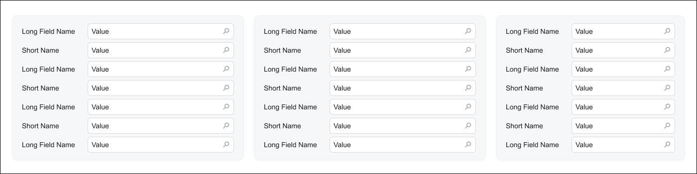

|
|`17-14-17`|Shows three slots; the second has shorter elements than the first and third do.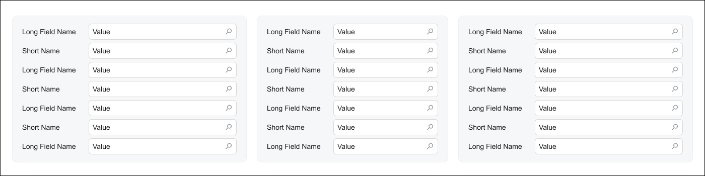

|
|`14-17-17`|Shows three slots; the first has shorter elements than the second and third do.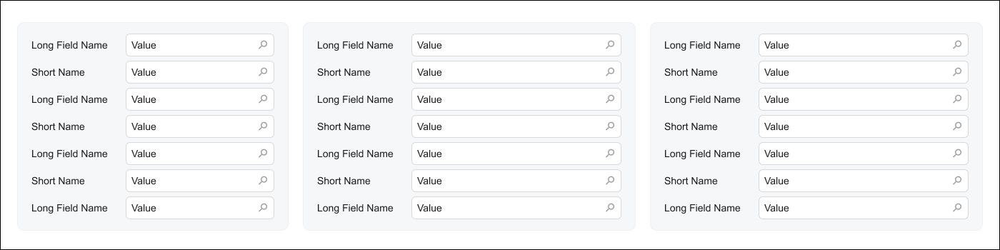

|
|`17-31`|Shows two slots; the first has shorter elements than the second does.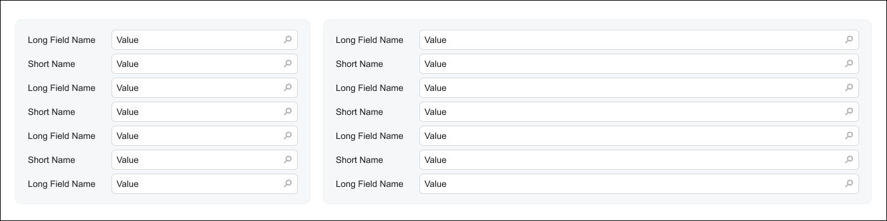

|
|`7-10-7`|Shows three slots; the second includes long elements.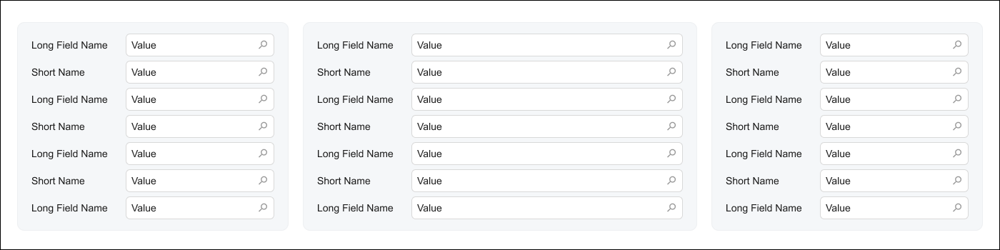

|
|`10-7-7`|Shows three slots; the first includes long elements.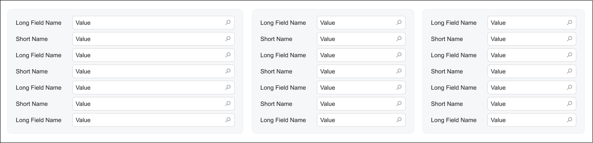

|
|`17-7`|Shows two slots; the first includes long elements.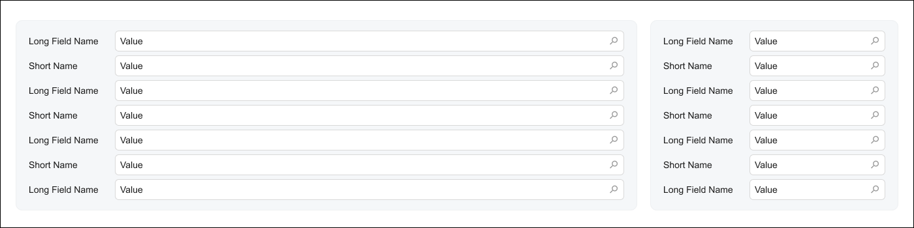

|
|`7-17`|Shows two slots; the second includes long elements.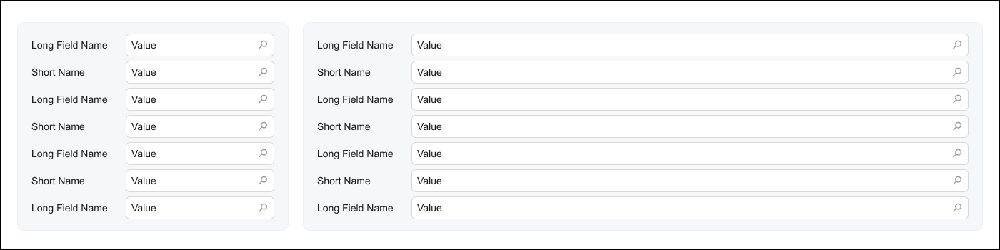

|
|`1-1-1`|Shows three slots with similar lengths of elements.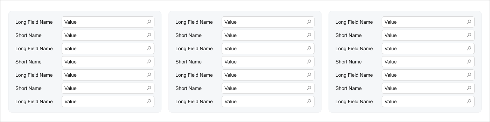

|
|`2-1`|Shows two slots; the first includes long elements.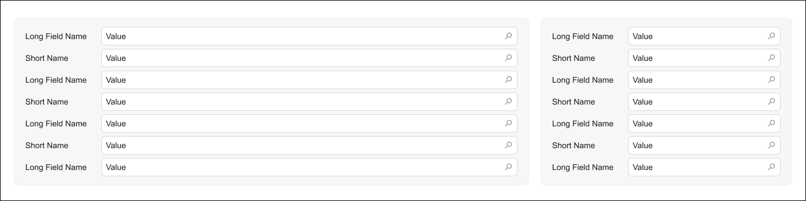

|
|`1-2`|Shows two slots; the second includes long elements.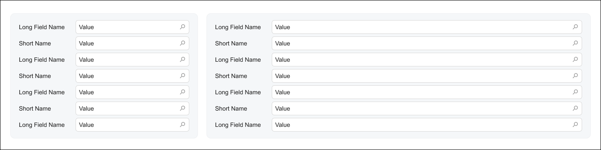

|
|`1-1`|Shows two slots with similar lengths of elements.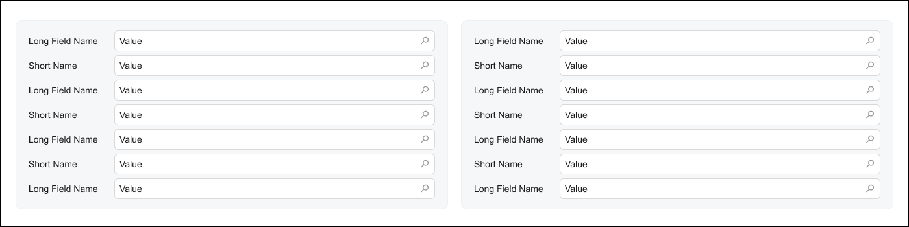

|
|`1`|Shows one slot with long elements.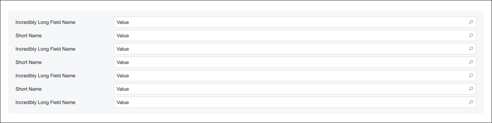

|

## Comparison of Templates { .section}

The following diagram compares the widths of the slots in templates.

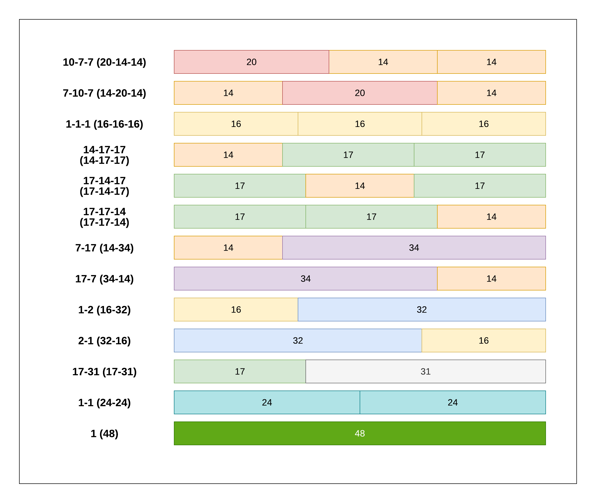

## The Forth Slot \(Column\) in the Template {#section_znj_c1v_djc .section}

All predefined templates can display up to three slots. Currently, the Modern UI does not support an ability to define custom templates. If you need to add a forth slot to the template, for example, for custom fields, you can use one of the following approaches:

-   Insert the "1-1" qp-template tag inside one of the slots.

    ``` {#codeblock_i15_n1v_djc}
    <qp-template name=“7-10-7”>
      <qp-template id=“.." slot="B" name="1-1" class="equal-height label-size-s">
        <qp-fieldset id=“.." slot="A" view.bind="Item">
          ...
        </qp-fieldset>
        <qp-fieldset id=“.." slot="B" view.bind="Item">
          ...
        </qp-fieldset>
      </qp-template>
    <qp-template>
    
    ```

-   Insert two span tags with the col-6 class each.

    ``` {#codeblock_ucc_41v_djc}
    <field ...>
      <span class="col-6">
        <qp-field>...
      </span>
      <span class="col-6">
        <qp-field>...
      </span>
    </field>
    ```


**Parent topic:**[Designing the Layout of an Acumatica ERP Form](../DeveloperGuide/UIDev_DesigningLayout_Mapref.md)

