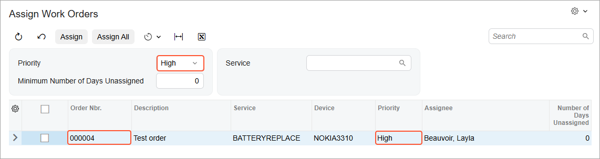
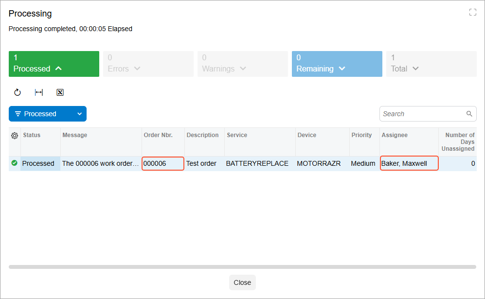
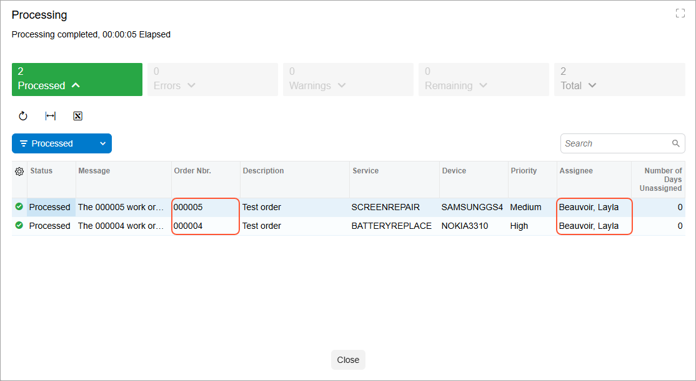

# Filtering Parameters:To Add a Filter for a Processing Form {#_5c4f3b3e-e7bb-4455-9b66-d941e5c475bb .task}

The following activity will walk you through the process of adding a filter for a processing form.

## Story { .section}

The Smart Fix company needed a custom Acumatica ERP form where the managers of the company will assign repair work orders to particular employees. Suppose that for this purpose, you’ve already implemented the custom Assign Work Orders \(RS501000\) processing form. Now you need to add filtering parameters to this form so that the managers can narrow the range of listed repair work orders before processing.

The Selection area of the form should contain the following UI elements:

-   **Priority**: If a user selects a priority in this box, the form’s table displays only the repair work orders with this priority. If no priority is selected, repair work orders with all priority values can be displayed in the table.
-   **Minimum Number of Days Unassigned**: If a user types a number in this box, the table displays only the repair work orders that have been unassigned for the specified number of days or longer.
-   **Service**: If a user selects a service in this box, the table displays only the repair work orders in which this service is selected.

You need to create filtering parameters for these UI elements.

In addition, you’ll add the **Number of Days Unassigned** column to the table on the form. This value should not be stored in the database; you should instead use the PXDBCalced attribute to calculate the value from the date when the repair work order was created.

You also need to define the **Assignee** column of the table to be editable so that a user of the form can use this column to select an assignee for any listed repair work order.

## Process Overview { .section}

You'll add filtering parameters to the Assign Work Orders \(RS501000\) processing form by performing the following steps:

1.  Extending the `RSSVWorkOrder` DAC with the new `TimeWithoutAction` field
2.  Defining the filter DAC
3.  Defining the data views for the form
4.  Adjusting the TypeScript and HTML files of the form

Finally, you'll test the filter.

## System Preparation { .section}

Before you begin performing the steps of this activity, do the following:

1.  Prepare an Acumatica ERP instance by performing the [Test Instance for Customization: To Deploy an Instance with a Custom Form that Implements a Workflow](../StudioDeveloperGuide/CodeCustomization_PrepareInstance_Activity_DeployInstanceT240.md) prerequisite activity.
2.  Create a processing form without filtering parameters by performing the [Processing Operations: To Implement a Processing Operation by Using a Delegate](../StudioDeveloperGuide/CodeCustomization_ProcessingOperations_Activity_CreateWithoutFilter_withDelegate.md) prerequisite activity.

## Step 1: Extending the DAC with a New Field \(Using PXDBCalced\) { .section}

In this step, you’ll add the `TimeWithoutAction` field, which holds the number of days that have passed from the date when the repair work order was created. In the `RSSVWorkOrder.cs` file, add the new field as follows:

1.  In the `RSSVWorkOrder` class, define the `TimeWithoutAction` field, as shown in the following code.

    ```language-csharp
            #region TimeWithoutAction
            [PXInt]
            [PXDBCalced(
                typeof(RSSVWorkOrder.dateCreated.Diff<Now>.Days),
                typeof(int))]
            [PXUIField(DisplayName = "Number of Days Unassigned")]
            public virtual int? TimeWithoutAction { get; set; }
            public abstract class timeWithoutAction :
            PX.Data.BQL.BqlInt.Field<timeWithoutAction>
            { }
            #endregion
    ```

    To calculate the value of the `TimeWithoutAction` field, you’ve used the PXDBCalced attribute. The field’s value is calculated during the retrieval of each `RSSVWorkOrder` record from the database. It’s calculated as the difference between the value of the `RSSVWorkOrder.DateCreated` field and the current date, for which you’ve used the Now BQL constant. For more information on the PXDBCalced attribute, see [Ad Hoc SQL for Fields](../StudioDeveloperGuide/BL__con_Attr_SQL_Adhoc.md#).

2.  Build the project.

## Step 2: Defining the Filter DAC { .section}

In this step, you'll define the `RSSVWorkOrderToAssignFilter` DAC, which will be used to display filtering parameters on the Assign Work Orders \(RS501000\) form. The DAC will contain three fields \(`ServiceID`, `TimeWithoutAction`, and `Priority`\) that correspond to the filtering parameters. To define the filter DAC, do the following:

1.  In the `RSSVAssignProcess` graph, define the `RSSVWorkOrderToAssignFilter` data access class as follows.

    ```language-csharp
            [PXHidden]
            public class RSSVWorkOrderToAssignFilter : PXBqlTable, IBqlTable
            {
                #region Priority
                [PXString(1, IsFixed = true)]
                [PXUIField(DisplayName = "Priority")]
                [PXStringList(
                new string[]
                {
                    WorkOrderPriorityConstants.High,
                    WorkOrderPriorityConstants.Medium,
                    WorkOrderPriorityConstants.Low
                },
                new string[]
                {
                    Messages.High,
                    Messages.Medium,
                    Messages.Low
                })]
                public virtual string? Priority { get; set; }
                public abstract class priority :
                PX.Data.BQL.BqlString.Field<priority>
                { }
                #endregion
    
                #region TimeWithoutAction
                [PXInt]
                [PXUnboundDefault(0)]
                [PXUIField(DisplayName = "Minimum Number of Days Unassigned")]
                public virtual int? TimeWithoutAction { get; set; }
                public abstract class timeWithoutAction :
                PX.Data.BQL.BqlInt.Field<timeWithoutAction>
                { }
                #endregion
    
                #region ServiceID
                [PXInt()]
                [PXUIField(DisplayName = "Service")]
                [PXSelector(typeof(Search<RSSVRepairService.serviceID>),
                    typeof(RSSVRepairService.serviceCD),
                    typeof(RSSVRepairService.description),
                    SubstituteKey = typeof(RSSVRepairService.serviceCD),
                    DescriptionField = typeof(RSSVRepairService.description))]
                public virtual int? ServiceID { get; set; }
                public abstract class serviceID :
                PX.Data.BQL.BqlInt.Field<serviceID>
                { }
                #endregion
            }
    ```

2.  Build the project.

## Step 3: Defining the Data Views \(with PXFilter and ProcessingView.FilteredBy\) { .section}

In this step, you’ll prepare the graph members that provide data for the form. Do the following:

1.  In the `RSSVAssignProcess` graph, define the `Filter` data view of the PXFilter type \(as shown below\), which provides the filtering parameters for the processing form.

    ```language-csharp
            public PXFilter<RSSVWorkOrderToAssignFilter> Filter = null!;
    ```

2.  Replace the definition of the `Cancel` action so that the action uses the filter DAC.

    ```language-csharp
            public PXCancel<RSSVWorkOrderToAssignFilter> Cancel = null!;
    ```

3.  Replace the definition of the `WorkOrders` data view with the following data view of the ProcessingView.FilteredBy&lt;Table&gt; type, which selects the repair work orders that match the values of the filtering parameters.

    ```language-csharp
            public 
                SelectFrom<RSSVWorkOrder>.
                Where<RSSVWorkOrder.status.IsEqual<
                    RSSVWorkOrderEntry_Workflow.States.readyForAssignment>.
                    And<RSSVWorkOrder.timeWithoutAction.IsGreaterEqual<
                        RSSVWorkOrderToAssignFilter.timeWithoutAction.
                            FromCurrent>.
                    And<RSSVWorkOrder.priority.IsEqual<
                        RSSVWorkOrderToAssignFilter.priority.FromCurrent>.
                        Or<RSSVWorkOrderToAssignFilter.priority.FromCurrent.
                            IsNull>>.
                    And<RSSVWorkOrder.serviceID.IsEqual<
                        RSSVWorkOrderToAssignFilter.serviceID.FromCurrent>.
                        Or<RSSVWorkOrderToAssignFilter.serviceID.FromCurrent.
                            IsNull>>>>.
               OrderBy<RSSVWorkOrder.timeWithoutAction.Desc,
                   RSSVWorkOrder.priority.Desc>.
               ProcessingView.
               FilteredBy<RSSVWorkOrderToAssignFilter> WorkOrders = null!;
    ```

4.  In the graph constructor, enable editing for the `Assignee` data field, as shown in the following code.

    ```language-csharp
                PXUIFieldAttribute.SetEnabled<RSSVWorkOrder.assignee>(
                    WorkOrders.Cache, null, true);
    ```

    Because you specified the Processing preset for the table in the TypeScript code \(in [Processing Form: To Create a Simple Processing Form](UIDev_ProcessingScreen_Activity_CreateWithoutFilter_UI.md)\), the columns of the table were not defined as being editable. In the graph constructor, you've made the values in the **Assignee** column of the table editable. You’ve enabled the editing of the column in the graph constructor \(instead of in RowSelected event handler\) because the column’s UI presentation logic doesn’t depend on the particular values of the data record.

5.  Override the IsDirty property of the graph, as the following code shows.

    ```language-csharp
            public override bool IsDirty => false;
    ```

    You have overridden the IsDirty property of the graph to make it always return *false*. You have multiple elements on the form that a user can modify, such as the filtering parameters on the form, the **Assignee** column, and the column with the unlabeled check box. That’s why you need to override the IsDirty property to omit the dialog box that confirms that the user wants to leave the form when it has been edited.

6.  Rebuild the project.

## Step 4: Adjusting the TypeScript and HTML Code { .section}

In this step, you’ll adjust the TypeScript and HTML files of the Assign Work Orders \(RS501000\) form to display the filter and the data to be available for processing. Adjust the `RS501000.ts` and `RS501000.html` files as follows:

**Tip:** You can perform the following instructions on the [Modern UI Files](../UserGuide/AU_20_46_00.md) page of the Customization Project Editor or edit the TypeScript and HTML files of the form in the `development` folder of your instance by using an external code editor, such as Visual Studio Code. For details on working with the [Modern UI Files](../UserGuide/AU_20_46_00.md) page or editing the code files in the `development` folder, see the *T200 Maintenance Forms* training course. The instructions below are presented in general terms to fit both methods.

1.  For the screen class in `RS501000.ts`, change the value of the `primaryView` property in the graphInfo decorator to *Filter*.
2.  Define the property for the data view of the Selection area of the form, as the following code shows. To initialize the data view of the Selection area of the form, use the createSingle method. It takes as the input parameter an instance of the view class, which you’ll define in the next step.

    ``` {#codeblock_txz_zjh_xfc .language-javascript}
    	@viewInfo({containerName: "Filter Parameters"})
    	Filter = createSingle(RSSVWorkOrderToAssignFilter);
    ```

    In the viewInfo decorator, you’ve specified the name of the container for the Selection area.

3.  You need to define a view class for the data view of the Selection area of the Assign Work Orders form, which is `Filter`.

    Proceed as follows:

    1.  In the `RS501000.ts` file, add createSingle to the list of import directives.
    2.  Define the `RSSVWorkOrderToAssignFilter` class as follows.

        ``` {#codeblock_lqx_1c3_xfc .language-javascript}
        export class RSSVWorkOrderToAssignFilter extends PXView {}
        ```

    3.  In the view class, specify the properties for all data fields of the data view that should be displayed in the UI, as shown below. You use the name of the data field as the property name.

        ``` {#codeblock_mqx_1c3_xfc .language-javascript}
        export class RSSVWorkOrderToAssignFilter extends PXView {
        	Priority: PXFieldState<PXFieldOptions.CommitChanges>;
        	TimeWithoutAction: PXFieldState<PXFieldOptions.CommitChanges>;
        	ServiceID: PXFieldState<PXFieldOptions.CommitChanges>;
        }
        ```

        All fields of the view should be defined so that changes are committed to the server; therefore, you’ve used the PXFieldOptions.CommitChanges option for the property type.

4.  In the `RS501000.html` file, define the layout of the Selection area by adding the qp-template tag with the 17-17-14 template within the template tag as follows:
    1.  For the first two slots, define a fieldset, as shown in the following code. To leave the third slot empty, do not specify any tags for it.

        ``` {#codeblock_nrq_qd3_xfc .language-xml}
          <qp-template
            id="form-Filter"
            name="17-17-14"
            class="equal-height"
          >
            <qp-fieldset
              id="fsColumnA-Filter"
              slot="A"
              view.bind="Filter"
              class="label-size-xm"
            >
                                            </qp-fieldset>
            <qp-fieldset id="fsColumnB-Filter" slot="B" view.bind="Filter">
                                            </qp-fieldset>
          </qp-template>
        
        ```

        Each fieldset has been bound to the same `Filter` view.

        For details about the qp-template tag and slots, see [Form Layout: Predefined Templates](UIDev_DesigningLayout_Templates.md).

    2.  In each fieldset, add the field tags for the fields that should be displayed in the corresponding fieldset, as the following code shows.

        ``` {#codeblock_orq_qd3_xfc .language-xml}
            <qp-fieldset
              id="fsColumnA-Filter"
              slot="A"
              view.bind="Filter"
              class="label-size-xm"
            >
              <field name="Priority"></field>
              <field name="TimeWithoutAction"></field>
            </qp-fieldset>
            <qp-fieldset id="fsColumnB-Filter" slot="B" view.bind="Filter">
              <field name="ServiceID"></field>
            </qp-fieldset>
        ```

        In the first fieldset, you’ve also specified the width of the labels by using the *label-size-xm* class. For more details about CSS classes, see [Form Layout: CSS Classes](UIDev_DesigningLayout_CSSClasses.md).

    3.  Save your changes.
5.  In the `RS501000.ts` file, add the `TimeWithoutAction` field to the `RSSVWorkOrder` view class, as shown below, so that the corresponding column is displayed in the table of the Assign Work Orders form. Also, specify that the changes in the `Assignee` field should be committed to the server by adding the PXFieldOptions.CommitChanges option for the property type.

    ``` {#codeblock_abl_rp3_xfc .language-xml}
    export class RSSVWorkOrder extends PXView {
        ...
                            	Assignee: PXFieldState<PXFieldOptions.CommitChanges>;
                            	TimeWithoutAction: PXFieldState;
    }
    ```

6.  Save your changes.
7.  If you used the `development` folder to modify the TypeScript and HTML files in the preceding instructions, you need to update these files in the customization project. You do this by using the **Detect Modified Files** button on the [Modern UI Files](../UserGuide/AU_20_46_00.md) page.
8.  Publish the customization project.

## Step 5: Testing the Filter { .section}

In this step, you'll test the filtering parameters you have implemented for the Assign Work Orders \(RS501000\) form. Do the following:

1.  On the Repair Work Orders \(RS301000\) form, create three repair work orders with the settings specified in the following table. Save each order and then click **Remove Hold**.

    | |Work Order 1|Work Order 2|Work Order 3|
    |---|------------|------------|------------|
    |**Customer ID**|*C000000001*|*C000000002*|*C000000001*|
    |**Service**|*Battery Replacement*|*Screen Repair*|*Battery Replacement*|
    |**Device**|*Nokia 3310*|*Samsung Galaxy S4*|*Motorola RAZR V3*|
    |**Assignee**|*Beauvoir, Layla*|Empty|*Baker, Maxwell*|
    |**Priority**|*High*|*Medium*|*Medium*|
    |**Description**|`Test order`|`Test order`|`Test order`|

    The created work orders have the *Ready for Assignment* status.

2.  On the Assign Work Orders form, test the filtering parameters as follows:
    1.  Make sure that the three work orders you have created are displayed on the form.
    2.  In the **Priority** box in the Selection area, select *High*. Make sure one of the created work orders is displayed in the table, as shown below.

        

    3.  Clear the filter by clicking Cancel on the form toolbar.
    4.  In the **Minimum Number of Days Unassigned** box, type `1`. No work orders are displayed in the table \(as long as you haven’t created work orders outside of the instructions of the guide\).
    5.  Change the value in the **Minimum Number of Days Unassigned** box to `0`. Three work orders are displayed.
    6.  In the **Service** box, select *Battery Replacement*. Two of the created work orders are displayed in the table.
    7.  In the **Priority** box, select *Medium*. Only one of the created work orders remains in the table.
    8.  On the form toolbar, click **Assign All**. The processing dialog box indicates that the work order has been processed. Make sure it has the *Assigned* status and is assigned to *Baker, Maxwell* \(the employee you’ve selected during creation\), as shown below.

        

3.  Test the **Assignee** column on the Assign Work Orders form as follows:
    1.  Clear all the boxes in the Selection area. Two of the created repair work orders are displayed.
    2.  For a work order with the default assignee \(which is *Becher, Joseph*\), in the **Assignee** column, select *Beauvoir, Layla*.
    3.  On the form toolbar, click **Assign All**. The processing dialog box shows that two repair work orders have been processed. Make sure that *Beauvoir, Layla* is the assignee of both orders, as shown below.

        


**Parent topic:**[Adding Filtering Parameters to a Form](../DeveloperGuide/UIDev_FilteringParameters_Mapref.md)

